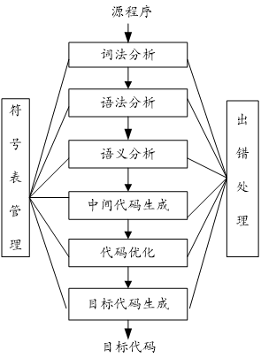
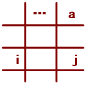
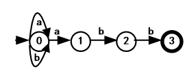
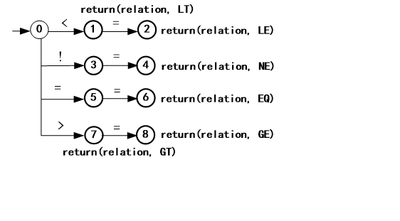
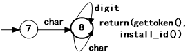
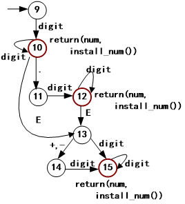
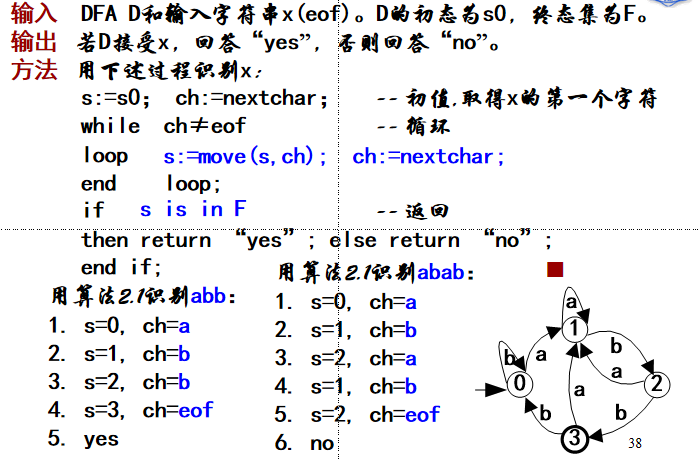
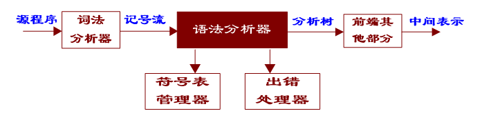
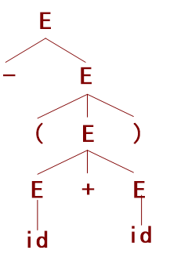
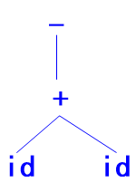

[TOC]
## 编译器与解释器

编译器与解释器

- 特点：
  - 编译器：工作效率高，即时间快、空间省；交互性与动态特性差、可移植性差。如C/C++等
  - 解释器：工作效率低，即时间慢、空间费；交互性与动态特性好、可移植性好。如Java、Python等
- 基本功能：二者相同
- 所采用的技术：从翻译的角度来讲，两种方式所涉及的原理、方法、技术相似

编译器框架

- 词法分析：识别单词，至少分以下几大类：关键字（保留字）、标识符、字面量、特殊符号；
- 语法分析：得到语言结构并以树的形式表示；
- 语义分析：考察结构正确的句子是否语义合法，修改树结构；
- 中间代码生成（可选）：生成一种既接近目标语言，又与具体机器无关的表示，便于优化与代码生成；

（到目前为止，编译器与解释器可以一致） 

- 中间代码优化（可选）:局部优化、循环优化、全局优化等；优化实际上是一个等价变换，变换前后的指令序列完成同样的功能，但在占用的空间上和程序执行的时间上都更省、更有效。
- 目标代码生成：不同形式的目标代码－汇编、可重定位、内存形式（Load-and-Go）;
- 符号表管理：合理组织符号，便于各阶段查找、填写等；
- 出错处理：错误的种类－词法错、语法错、静态语义错、动态语义错。

- 前端：语言结构和意义的分析； 
- 后端：语言意义处理；
- 中间代码：前端与后端的分界；

## 词法分析
### 词法分析的双重含义：
- 规定单词形成的规则(构词规则或词法规则): 规定什么样的输入序列是语言所允许的合法单词。
- 根据构词规则识别输入序列(词法分析): 根据规则识别出合法的单词和指出非法的输入序列。

### 词法分析器的作用与工作方式 
- 特征：
  - 编译器中唯一与源程序打交道的部分 
- 任务：
  - 滤掉源程序中的无用成分，如注释、空格、回车等
  - 处理与具体平台有关的输入(如文件结束符的不同表示等)
  - 根据模式识别记号，并将结果交给语法分析器。
  - 调用符号表管理器或出错处理器，进行相关处理 
- 工作方式：
  - 单独一遍扫描
  
  - 作为语法分析器的子程序
  
  - 并行方式
  

## 正规式
正规式与正规集

令Σ是一个有限字母表，则Σ上的正规式及其表示的集合递归定义如下:
  - 1. ε是正规式，它表示集合L(ε)={ε}
  - 2. 若a是Σ上的字符，则a是正规式，它表示集合L(a)={a}
  - 3. 若正规式r和s分别表示集合L(r)和L(s)，则
    - （a） r|s是正规式，表示集合L(r)∪L(s)，
    - （b） rs是正规式，表示集合L(r)L(s)，
    - （c） r*是正规式，表示集合(L(r))*，
    - （d）(r)是正规式，表示的集合仍然是L(r)。（加括弧改变优先级、结合性）

  可用正规式描述的语言称为正规语言或正规集。

若正规式P和Q表示了同一个正规集，则称P和Q是等价的，记为P=Q。

例，设字母表∑={a，b，c}，则∑上部分正规式和正规集如下：
|正规式      |    对应正规集|
|----|----|  
|a，b，c|   |{a}，{b}，{c} |
|a\|b，b\|a |{a}∪{b}={a，b} |
|a(a\|b)* |{a，aa，ab，aba，abb，aab，...}，a为首的ab字符串|
|∑*|{ε，a，b，c，aa，ab，ac，ba，bb，bc，abc，...}|

    例， 令 L(x)={a，b}，L(y)={c，d}，

    则 L(x|y)={a，b，c，d} 

    L(y|x)={a，b，c，d} 

正规式的代数性质
|公理|公理|
|----|----|
|r\|s = s\|r 		|	(rs)t = r(st)|
|r\|(s\|t) = (r\|s)\|t	|	εr = rε = r|
|r(s\|t) = rs\|rt	|	r* = (r+\|ε) 
|(s\|t)r = sr\|tr |		r** = r* 

正规式的简化

- (a) 正闭包 
  - 若r是表示L(r)的正规式，则r+是表示(L(r))+的正规式，且下述等式成立:
  
    r+ = rr* = r*r，r* = r+|ε

  - +与*具有相同的运算结合性和优先级
  - 例如： 
    
    (0|1|2|3|4|5|6|7|8|9)(0|1|2|3|4|5|6|7|8|9)*
    
    可以化简为：
    
    (0|1|2|3|4|5|6|7|8|9)+

- (b) 可缺省  
  - 若r是正规式，则r?是表示L(r)∪{ε}的正规式，且下述等式成立:
  
      r?=r|ε

  - ?也可以与*具有相同的运算结合性和优先级

  - 注意：引入算符？的主要目的是为了回避不可以直接通过键盘输入的字符ε。
  - 例如： E(+|-|ε)    可以改写为：E(+|-)?
- (c) 字符组 
  - 若r是仅由|运算构成的正规式，则可改写为[r']，其中r'可以有如下两种形式：
    - 枚举:      如[abc]，它等价于：a|b|c
    - 分段:   如[0-9a-z]    **注意：左边界小于右边界**
    - 它等价于：[0123456789abcdefghijklmnopqrstuvwxyz]
- (d) 非字符组  
  - 若[r]是一个字符组形式的正规式，则[^r]是表示∑- L(r)的正规式。 
  - 例如：若 ∑={a, b, c, d, e, f, g}，
    则 L([^abc]) = { d, e, f, g }

引入辅助定义

- 通俗地讲，辅助定义的作用是为复杂的或重复出现的正规式命名，并在以后的使用中用名字代替该正规式。
- 辅助定义的形式与正规式一样：

    >名字 = 正规式

- 但是辅助定义不与任何模式匹配。 
- 换句话说，作为辅助定义的正规式仅供内部使用，而不用于说明记号。

    >辅助定义： 内部名 = 正规式 
    >规则：     记号名 = 正规式

## 记号的识别——有限自动机
>模式的描述―正规式 
记号的识别―有限自动机（不确定、确定）

### 不确定的有限自动机（Nondeterministic Finite Automata, NFA） 

NFA是一个五元组（5-tuple）：
>M =（S，∑，move，s0，F），
    
其中：
- （1） S是有限个状态（state）的集合；
- （2） ∑是有限个输入字符（包括ε）的集合；
- （3） move是一个状态转移函数，move(si，ch)=sj表示，当前状态si下若遇到输入字符ch，则转移到状态sj；
- （4） s0是唯一的初态（也称开始状态）；
- （5） F是终态集（也称接受状态集），它是S的子集，包含了所有的终态。

#### 表示方式
- 状态转换图：用一个有向图来直观表示NFA 
  - NFA中的每个状态，对应转换图中的一个节点；
  - NFA中的每个move(si, a)=sj，对应转换图中的一条有向边；表示从节点si出发进入节点sj，字符a(或ε)是边上的标记。
  

- 状态转换矩阵：用一个矩阵来直观表示NFA。
  - 矩阵中，状态对应行，字符对应列；
  - 每个矩阵元素M[si,a]中的内容，是从状态si出发，经字符a(或ε)所到达的下一状态sj；
  - 在转换矩阵中，一般以矩阵第一行所对应的状态为初态，而终态需要特别指出。
  - 

例，识别正规式(a|b)*abb所描述正规集的NFA的三种表示形式分别如下。(其中转换矩阵表示中0为初态，3为终态)

    定义：
    S={0, 1, 2, 3}, 
    Σ={a, b}
    move={ move(0,a)=0, 
        move(0,a)=1, 
        move(0,b)=0,
        move(1,b)=2, 
        move(2,b)=3  }
    s0 = 0, 
    F={3}

状态转换矩阵

状态转换图

#### NFA如何识别记号

    对字符串，从初态开始，经一系列状态转移到达终态。

例如：对于字符串abb，有

定义：move(0,a)=1,move(1,b)=2,move(2,b)=3

转换矩阵：m[0,a]={0,1},m[1,b]=2,m[2,b]=3

转换图：0a1b2b3
    
    显然，转换图最直观，即每一个记号，实质上是从初态开始到某个终态的路径上的标记。

    move={move(0,a)=0, 
        move(0,a)=1, 
        move(0,b)=0,
        move(1,b)=2, 
        move(2,b)=3}

状态转换矩阵

状态转换图

例子，识别记号relation、id和num的转换图 
>relation = < | <= | != | > | >= | = =

>id = char(char|digit)*

    optional_fraction = ( . digits )?
    optional_exponent = ( E (+|-)? digits )?
    num = digits
        optional_fraction
        optional_exponent

- NFA （识别记号）的特点
  - NFA识别记号的最大特点是它的不确定性，即在当前状态下对同一字符有多于一个的下一状态转移。 
  - 具体体现：
    - 定义： move函数是1对多的；
    - 状态转换图：同一状态有多于一条边标记相同字符转移到不同的状态；
    - 状态转换矩阵： M[si,a]是一个状态的集合
- 不确定性识别记号的困惑
  - 识别输入序列时，在当前状态下遇到同一字符，应转移到哪个下一状态？  
- NFA识别输入序列的一般方法
  - 反复试探所有路径，直到到达终态，或者到达不了终态。

### 确定的有限自动机（Deterministic Finite Automaton, DFA） 
- DFA是NFA的一个特例，其中： 
  - （1）没有状态具有ε状态转移(ε-transition)，即状态转换图中没有标记ε的边；
  - （2）对每个状态s和每个字符a，最多有一个下一状态。
- 与NFA相比，DFA的特征（确定性） 
- 定义：        
  - move（si, a)函数是1对1的；
- 转换图：   
  - 从一个节点出发的边上标记均不相同； 
- 转换矩阵：
  - M[si,a]是一个状态。 
    且字母表不包括ε。

>对NFA施加两条限制： 
    限制1：没有ε状态转移 
    限制2：同一状态下没有重复字符的状态转移

例,正规式(a|b)*abb的DFA和识别输入序列abb和abab：  
识别abb：0a1b2b3，状态，接受 
识别abab：0a1b2a1b2，？

### 算法 模拟DFA

### 从正规式到NFA
 Thompson 算法

正规式与NFA

## 语法分析

- 词法分析：字母是元素，组成字符串，记号的集合，线性结构
- 语法分析：记号是元素，组成句子， 句子的集合，树结构
- 语法的双重含意：
  - 语法规则：上下文无关文法（子集－LL文法或LR文法）
  - 语法分析：下推自动机（LL或LR分析器），自上而下和自下而上分析 

- 语法分析器
  - 语法分析器是编译器前端的重要组成部分，许多编译器，特别是由自动生成工具构造的编译器，往往其前端的中心部件就是语法分析器。

语法分析器在编译器中的位置和作用：

作用：
- 根据词法分析器提供的记号流，为语法正确的输入构造分析树（或语法树），这是本章的重点，在以后各节中详细讨论；
- 检查输入中的语法（可能包括词法）错误，并调用出错处理器进行适当处理，下边简单介绍语法错误处理的基本原则，而在以后的讨论中忽略此问题。 

### 语法错误的处理原则
源程序中可能出现的错误 
- 语法（包括词法）错误
  - 词法错误如非法字符或拼写错关键字、标识符等
	@ 	intege	20times
  - 语法错误是指语法结构出错，如少分号、begin/end不配对等
	begin		x:=a+b	y:=x;
- 语义错误
  - 静态语义错误：如类型不一致、参数不匹配等
	a,b:integer;	x:array[1..10] of integer;
	x:=a+b;
  - 动态语义错误(逻辑错误)：如死循环、变量为零时作除数等
	while (t) { ...};		a:=a/b;

语法错误处理的目标
- 对语法错误的处理，一般希望达到以下基本目标：
  - 清楚而准确地报告错误的出现，地点正确、不漏报、不错报也不多报；
  - 迅速从每个错误中恢复过来（以便分析继续进行）；
  - 不应使对语法正确源程序的分析速度降低太多。

语法错误的基本恢复策略 
- 紧急方式恢复：抛弃若干输入，直到遇到同步记号。
- 短语级恢复：采用串替换的方式对剩余输入进行局部纠正（抛弃＋插入）。（用分号代替逗号，删除多余分号）
- 出错产生式：用出错产生式捕捉错误（预测错误）。预置型的短语级恢复方式。
- 全局纠正：对错误输入序列x，找相近序列y，使得x变换成y所需的修改、插入、删除次数最少。 

### 上下文无关文法(Context Free Grammar,CFG)
#### CFG的定义与表示 

- 定义1：CFG是一个四元组G =（N，T，P，S），其中
  - （1） N是非终结符（Nonterminals）的有限集合；
  - （2） T是终结符（Terminals）的有限集合，且N∩T=Φ；
  - （3） P是产生式（Productions）的有限集合，产生式形如：
  >A→α， 
  其中A∈N（左部），α∈(N∪T)*（右部）， 
  若α=ε，则称A→ε为空产生式（也可以记为A →）；
  - （4） S是非终结符，称为文法的开始符号（Start symbol）。

例，简单算术表达式的上下文无关文法可表示如下：
N = {E} T = {+，*，(，)，-，id} S = E 
P:   E → E + E       （1） 
     E → E * E       （2） 
     E →（E）        （3）         (G3.1) 
     E → -E          （4） 
     E → id          （5）  

- 产生式的一般读法
  - 可以将产生式中的记号→读作“定义为”或者“可导出”。
  - 更一般的，“E → E + E”可用自然语言表述为“算术表达式定义为两个算术表达式相加”。
  - 或者“一个算术表达式加上另一个算术表达式，仍然是一个算术表达式”。 
- 由产生式集表示CFG
  - 前提：若文法正确，第一个产生式的左部是文法开始符号S
  - 则：  	N是可以出现在产生式左边符号的集合，
      T是绝不出现在产生式左边符号的集合（记号）

        P: E → E + E  （1） 
        E → E * E  （2）S=E 
        E →（E）   （3）N={E} 
        E → -E     （4）T={+，*，(，)，-，id} 
        E → id     （5）

- 终结符与非终结符书写上的区分
  - (a) 用大小写区分：   E → id
  - (b) 用""区分：            E → "id"     E → E "+" E
  - (c) 用<>区分：          <E> → <E> + <E>  
  - 约定：
    - 大写英文字母A、B、C表示非终结符；
    - 小写英文字母a、b、c表示终结符；
    - 小写希腊字母α、β、δ表示任意文法符号序列。 
- 产生式的缩写形式
    - 当若干个产生式具有相同的左部非终结符时，可以将它们合并为一个产生式。
    - 该产生式的左部是此非终结符，
    - 右部是所有原来右部的或运算（并集合），
    - 产生式以该非终结符命名。

例3 G3.1可以重写为如下形式：

E → E + E       （1） 
    | E * E       （2） 
    |（E）        （3）  (G3.2) 
    | -E          （4） 
    | id          （5）

P: E → E + E  （1） 
   E → E * E  （2） 
   E →（E）   （3） 
   E → -E     （4） 
   E → id     （5）

称其为E产生式。  
用“|”连接的每个右部称为一个候选项，具有平等的权利。     
即id是一个表达式，-E也是一个表达式。

## CFG产生语言的基本方法－推导 
- CFG（产生式）通过推导的方法产生语言。
- 通俗地讲，产生式产生语言的过程是从开始符号S开始，对产生式左部的非终结符反复地使用产生式：
- 将产生式左部的非终结符替换为右部的文法符号序列(展开产生式，用标记=>表示)，直到得到一个终结符序列。 

例，用(G3.2)产生终结符序列-(id+id)可如下：

E → E + E   （1） 
   | E * E   （2） 
   |（E）    （3）  (G3.2) 
   | -E      （4） 
   | id      （5）

E => -E	  by(4) 
  => -(E) 	  by(3) 
  => -(E+E)   by(1) 
  => -(id+E)  by(5) 
  => -(id+id) by(5)

- 定义2:利用产生式产生句子的过程中，将产生式A→γ的右部代替文法符号序列αAβ中的A得到αγβ的过程，称αAβ直接推导出αγβ，记作：αAβ=>αγβ。  

  - 若对于任意文法符号序列α1，α2，...αn，均有α1=>α2=>...=>αn，则称此过程为零步或多步推导，记为：
  >α1=*>αn，其中α1=αn的情况为零步推导。

  - 若α1≠αn，即推导过程中至少使用一次产生式，则称此过程为至少一步推导，记为：α1=+>αn。

    - 定义2强调了两点：  
      - α，有α=*>α，即推导具有自反性；
      - 若α=*>β，β=*>γ，则α=*>γ，即推导具有传递性。

- 定义3:由CFG G所产生的语言L(G)被定义为:
    >L(G) = { ω┃S=+>ω and ω∈T* }，

    - L(G)称为上下文无关语言(Context Free Language, CFL)，ω称为句子。

    - 若S=*>α，α∈(N∪T)*，则称α为G的一个句型。

- 定义4:在推导过程中，若每次直接推导均替换句型中最左边的非终结符，则称为最左推导，由最左推导产生的句型被称为左句型。 						  

### 分析树和语法树

- 分析树：左部非终结符“产生出”右部文法符号序列；
- 

- 语法树：操作符（运算）“作用于”操作数（运算对象）；
- 

- 习惯上：它们分别被称为**具体语法树**和**抽象语法树**。 

### 消除二义性

 

/

    编译器解释器区别联系
    1.4编译器框架

    词法分析
    ：输出输入

    正规式的写法 描述

    2.4DFA 
    课后习题答案

    3

    语法分析重难点，提交多？
    语法处理原则，恢复策略
    上下文无关文法定义含义
    推导定义即做法

    不考有关文法

    自上而下，分析方法，消除左递归，清除左因子
    3.4.5

    自下而上 ，归约的过程，替换过程，如何剪句柄

    识别文法的DFA

    下推自动机
    预测规约
    3.8LR分析

    剪句柄

    4.2

    三元式和四元式

    写四则运算

    后缀式的值

    中缀式变后缀式