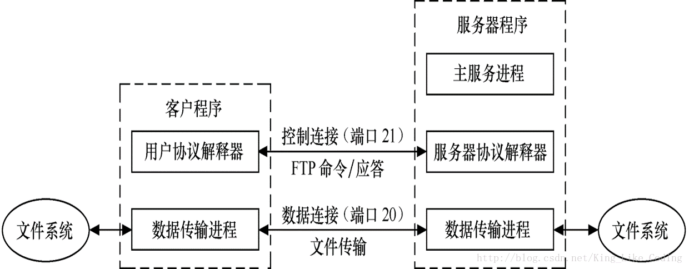
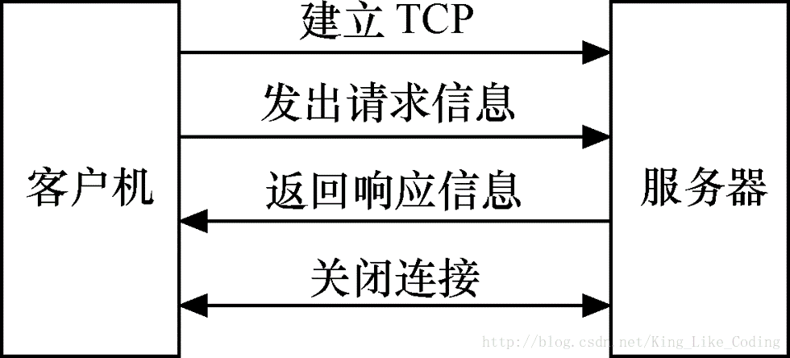

[TOC]
# 计算机网络
自下而上

## 网络模型
- OSI七层模型

|具体七层|数据格式|功能与连接方式|典型设备|协议规范|注|
|----|----|----|----|----|----|
|应用层 Application|数据ATPU|网络服务与使用者应用程序间的一个接口 【负责向用户提供服务】|终端设备（PC、手机、平板等）|HTTP、HTTPS、FTP、TELNET、SSH、SMTP、POP3等|提供应用程序间的通信|
|表示层 Presentation|数据PTPU	|数据表示、数据安全、数据压缩 【负责翻译、加密和数据压缩】|终端设备（PC、手机、平板等）||处理数据格式、数据加密等|
|会话层 Session|数据DTPU|会话层连接到传输层的映射；会话连接的流量控制；数据传输；会话连接恢复与释放；会话连接管理、差错控制 【负责对话控制和同步】|终端设备（PC、手机、平板等）||建立、维护和管理会话|
|传输层 Transport|数据组织成数据段Segment|用一个寻址机制来标识一个特定的应用程序（端口号） 【负责一个报文从一个进程到另一个进程的传递】|终端设备（PC、手机、平板等）||建立端到端连接|
|网络层 Network|分割和重新组合数据包Packet|基于网络层地址（IP地址）进行不同网络系统间的路径选择 【负责将各个分组从源地址传递到目的地址】|网关、路由器|IP、IPX、RIP、SOPF、ICMP、IGMP等|寻址和路由选择|
|数据链路层 Data Link|将比特信息封装成数据帧Frame |在物理层上建立、撤销、标识逻辑链接和链路复用 以及差错校验等功能。通过使用接收系统的硬件地址或物理地址来寻址 【负责帧从一跳(节点)到下一跳(节点)的传递】|网桥、交换机|SDLC、HDLC、PPP、STP、帧中继等|介质访问、链路管理|
|物理层Physical|传输比特（bit）流|建立、维护和取消物理连接 【负责位从一跳(节点)到下一跳(节点)的传递】|光纤、同轴电缆、双绞线、网卡、中继器、集线器|EIA/TIA RS-232、EIA/TIA RS-449、V.35、RJ-45|比特流传输|

- TCP/IP与OSI

TCP/IP协议与OSI模型对应图

- 地址
  - 物理地址（MAC地址）
    - 使用48位（6个字节）的物理地址，并且写成12个16进制的数字
        >例如：07:01:02:01:2C:4B
  - 注意：
    - 跳到跳时物理地址将改变，但是脱机地址通常不变
    - 跳到跳时物理地址将改变，但是逻辑地址保持不变
  - IP地址（见后）

---
# 《数据通信与网络》
---
# 物理层
- 波长
$$波长=传播速度周期传播速度频率$$
- 常见传输损伤
  - 衰减
  - 失真（时延）
  - 噪声
    - 信噪比
    定义如下：$$SNR=\frac{平均信号功率}{平均噪声功率}$$
    分贝单位表示法：$$SNR_{dB}=10log_{10}SNR$$
- 数据速率限制
  - 奈奎斯特比特率公式（无噪声通道理论最大比特率）
  $$比特率=2\times 带宽 \times log_2L$$
  $L$用于表示数据信号电平的数量
  增加信号电平数会减弱系统的可靠性
  - 香农容量定理（噪声通道理论最高传输速率）
  $$C=B\times log_2(1+SNR)$$
  $$通道容量=带宽\times log_2(1+SNR)$$
  $$C=W*log₂（1+S/N) （bit/s)$$
  - 香农容量定理给出数据速率的上限，奈奎斯特比特率公式给出所需的信号电平数。
- 信号传输
  - 数字信号传输
  - 模拟信号传输
  - 带宽利用——复用技术
    - 频分复用
    - 波分复用
    - 时分复用
    >eg: 时分多路复用传输模拟信号其帧为193位，每一帧持续的时间为1/8000秒，总数据速率为：193*8000=1.554Mbps

# 数据链路层
- 数据链路控制
  - 成帧
    - 固定长度成帧
    >eg：ATM广播域
    - 可变长度成帧
      - 面向字符协议
        - 字节填充： 当文本中存在一个标记和换义字符时，添加一个额外的字节的过程。
      - 面向位的协议：多数协议使用一个特殊的8位模式的标记01111110作为分隔符来标明帧的开始和结束。
        - 位填充： 在遇到1个0后面紧跟着5个1时便添加1个0的过程，使得接收方不会误认为01111110是一个标记
- 流量控制和差错控制
  - 流量控制：一系列程序，用来限制发送方在等到确认之前发送的数据数量
  - 差错控制：数据链路层的差错控制基于自动重复请求，即重传数据。
- 协议
  - 用于无噪声通道的协议
    - 最简单协议
    - 停止等待协议
      - 发送方会等待一个ACK（确认帧）再发送接下来的数据帧，或者超时重发
  - 用于有噪声通道的协议
    - 停止等待的ARQ协议
      - 增加了检测真是否被损坏，如果发现被损坏，忽略此帧
      - 使用序列号给数据帧编号，该序列号基于模2运算
      - 确认号总是以模2运算宣布期待收到下一个帧的编号
      - 它是一种窗口大小为1的特殊的回退N帧的ARQ协议
    - 回退N帧的ARQ协议
      - 序列号是模$2^m$，这里的m是以位为单位的序列号字段长度。
      - 发送窗口是一个抽象的概念，通过三个变量$S_f（最先待处理帧的序号）、S_n（分配给下一个将发送帧的序号）、S_{size}（窗口大小）$
      - 发送窗口的大小必须小于$2^m$，而接收窗口的大小始终是1
      - 有效确认到达之前，发送窗口能滑动一个或者多个时隙
      - 接收窗口是一个抽象概念，通过唯一变量$R_n$定义了一个大小为1的假象盒子。当一个正确的帧到达后，窗口滑动，但每次只滑动一个时隙。
    - 选择性重复ARQ协议
      - 发送窗口和接收窗口的大小最多只能是$2^m$的一半
- 高级链路控制协议
  - 面向位的数据链路控制协议（HDLC）
    - 差错控制机制：回退N帧，选择重发
  - 面向字节的数据链路控制协议（PPP）
    PPP帧的格式

    |标记|地址|控制|协议|有效载荷|帧校验序列|标记|
    |---|---|---|---|---|---|---|
    |1字节|1字节(广播地址:11111111)|1字节(效仿HDLC中的无编号帧11000000)|1到2字节(默认为2)|可变|2到4字节|1字节|

    - 字节填充
      - PPP是一个面向字节的协议，通过转义字符01111101来进行字节填充
    - 多路复用
      - PPP可以使用其它的一组协议来建立链路
        - 链路控制协议（LCP）
        - 两个鉴别协议（AP）
          -查询握手鉴别协议（CHAP）、口令鉴别协议（PAP）
        - 多个网络控制协议（NCP）
          - OSI CP、互联网络协议控制协议（IPCP）……
- 多路访问协议
  
  - 随机访问协议
    - ALOHA
      - 纯ALOHA脆弱时间$=2\times T_{fr}$，$T_{fr}表示一个冲突可能发生的时间$
      - 纯ALOHA的吞吐量是$S=G\times e^{-2G}, 当G=(1/2)$时，最大吞吐量$S_{max}=0.184$
      - 时隙ALOHA的脆弱时间$=T_{fr}$
      - 时隙ALOHA的吞吐量是$S=G\times e^{-G}, 当G=1$时，最大吞吐量$S_{max}=0.368$
    - CSMA
      - **持续方法**
        - 1-持续
          - 如果站点发现空闲就发送帧
          - 冲突几率高
        - 非持续
          - 侦听线路空闲便立即发送，不空闲等待随机时间再次侦听
          - 减少冲突概率，降低了网络的效率
        - p-持续
          - 综合以上优点，发现空闲时，
            - 概率是p，发送帧
            - 概率是q=1-p，等待下一个时隙再次检查线路
            - 如果空闲，返回p
            - 如果繁忙，视为一个冲突已经发生并使用补偿程序
    - CSMA/CD
      - **最小帧长**
        - 限定帧的长度，发送站点必须检测冲突如果有任何冲突要放弃传输
        - $最小帧长=带宽\times 帧的单向传播时间\times 2$
      - 吞吐量
        - 1-持续：G=1时最大，得到最大吞吐量的50%
        - 非持续：G在3～8之间，得到90%的最大吞吐量
        - p-持续：根据p的大小决定
    - CSMA/CA
      - IFS（帧间间隔）
        - 发现通道空闲不会进行传输，而是会等待一个IFS
        - IFS也可以用来定义一个站点或者一个帧的优先权
      - 如果通道繁忙，不重启竞争窗口的时钟，而是停止定时器并当通道空闲的时候再次重启定时器
  - 受控访问协议
    - 预约
    - 轮询
    - 令牌传递
  - 通道化协议
    - FDMA（频分多路访问）
    - TDMA（时分多路访问）
    - CDMA（码分多路访问）
- 无线线局域网
  - IEEE 802.11 mac协议中将数据链路层分层
    - LLC（Logical LinkControl，逻辑链路控制）子层
      - LLC子层实现数据链路层与硬件无关的功能，比如流量控制、差错恢复等
      - **纠错与检错**
        - 块编码
          - 汉明码
            - 为了保证检测出最多s个错误，块编码中最小汉明距离一定是$d_{min} = s + 1$
            - 为了保证最多能纠正t个差错，块码中最小汉明距离是$d_{min} = 2t + 1$
            - 最小汉明距离求法：是具有最小1的个数的非0有效码字中1的个数。
            - 汉明距离m与码字长n和数据字长k的关系为$n = 2^m − 1, k=n-m,r=n-k$
          - **(7,4)汉明码**
            - 码长：$n=2^m-1$
            - 信息位：$k=2^m-1-m$
            - 校验位：$m=n-k,m\ge 3$
            - 最小距离：$d_{min}=d_0=3$
            - 汉明码全部码字
            
          - 奇偶校验码
            - 简单的奇偶校验码是$n = k + 1$，且 $d_{min} = 2$的单比特检错码。
            - 奇偶校验只能检出奇数个错误，不能检出偶数个错误 
          - 循环冗余校验码简称CRC

    - MAC（Media Access Control，介质访问控制）子层
      - 较低的MAC子层提供LLC和物理层之间的接口
      - **功能**
        - 分布式协调功能（DCF）是数据传输的基本方式，作用于信道竞争期
        - 点协调功能（PCF）工作于非竞争期，两者总是交替出现的
      - MAC子层负责把物理层的“0”、“1”比特流组建成帧，并通过帧尾部的错误校验信息进行错误校验；提供对共享介质的访问方法，包括以太网的带冲突检测的载波侦听多路访问（CSMA/CD）、令牌环（Token Ring）、光纤分布式数据接口（FDDI）等。
      - MAC子层分配单独的局域网地址，就是通常所说的MAC地址（物理地址）。MAC子层将目标计算机的物理地址添加到数据帧上，当此数据帧传递到对端的MAC子层后，它检查该地址是否与自己的地址相匹配，如果帧中的地址与自己的地址不匹配，就将这一帧抛弃；如果相匹配，就将它发送到上一层中。
- 连接局域网、主干网和虚拟局域网
5类连接设备
  - TCP/IP
    - 中继器
      - 中继器连接一个局域网的各个网段
      - 中继器转发每一帧
      - 中继器没有过滤能力
      - 中继器是再生器, 不是放大器
    - 集线器
    - 网桥
      - 网桥不改变帧中所包含的物理（MAC）地址
      - 网桥内部结构
      
    - 二层交换机
      - 
    - 路由器、三层交换机
    - 网关
  - 虚拟局域网
    - 广播域
    - VLAN
- 虚电路与数据报
  - 网络层为接在网络上的主机所提供的服务可以有两大类：
    - 无连接的网络服务（数据报服务）UDP
      - 网络随时接受主机发送的分组（即数据报）
      - 网络为每个分组独立地选择路由。
      - 网络尽最大努力地将分组交付给目的主机，但网络对源主机没有任何承诺。
      - 网络不保证所传送的分组不丢失，也不保证按源主机发送分组的先后顺序，以及在时限内必须将分组交付给目的主机
      - 当网络发生拥塞时，网络中的结点可根据情况将一些分组丢弃
      - 数据报提供的服务是不可靠的，它不能保证服务质量。实际上“尽最大努力交付”的服务，就是没有质量保证的服务。
    - 面向连接的网络服务（虚电路服务）。TCP
      - 在虚电路建立后，网络向用户提供的服务就好像在两个主机之间建立了一对穿过网络的数字管道。所有发送的分组都按顺序进入管道，然后按照先进先出的原则沿着此管道传送到目的站主机。
      - 到达目的站的分组顺序就与发送时的顺序一致，因此网络提供虚电路服务对通信的服务质量 QoS (Quality of Service)有较好的保证。
      - **采用虚电路分组交换的网络有：X.25、帧中继、ATM**

# 网络层
- **网络层寻址**
  - IPV4地址
    - 地址为32位长，即4个字节
    - 地址空间是$2^{32}$
    - 点分十进制、二进制
    - ABCDE类地址
      - 0  |  即第一个字节：0～127
      - 10  |  即第一个字节：128～191
      - 110  |  即第一个字节：192～223
      - 1110  |  即第一个字节：224～239
      - 1111  |  即第一个字节：240～255
    - 掩码迅速找到网络号和主机号
  - 分类寻址时有大量的地址被浪费
    - （无类寻址）
      - CIDR记法
  - IPV6
    - 128位即8个字节，使用：隔开每个字节
    - 常用前缀
      - 010：基于提供者的单播地址
      - 100：基于地理的单波播地址
      - 1111111010：本地链路地址
      - 1111111011：站点本地地址
      - 11111111：多播地址
    - 版本 4 通信量 8 流标号 20 有效载荷长度 16 下一个首部8 跳数限制8 源地址128 目的地址 128
    - IPv6由当前IPv4的32位扩充到128位，总数3.4*1038
- IP协议
  - **IPv4数据报格式**
  
  - 数据的流向
  - 路由表
  
    - 目的网络：用于定义目的主机（特定主机）地址、目的网络（特定网络）地址或默认路由（0.0.0.0）。 
    - 子网掩码：用于定义网络掩码值，通过将子网掩码和IP数据报的目的IP地址进行逻辑与操作，可以获取目的主机所在的网络地址或子网地址
    - 下一跳地址：用于定义数据报在通往信宿的过程中当前必须走的下一跳IP地址。 
    - 输出接口：用于定义数据报传送时所对应接口的IP地址。路由器通过该接口将数据送往下一个路由器或信宿网络 
    - 度量：用于定义路由的度量值，度量从本节点出发去往信宿的距离。跨越的路由器个数，跳数。
  - 分片
    - 在IPv4中，这个功能被放置在因特网层，并且在IPv4路由器，这因此只需要这个层作为最高的一个在其设计中实现的处理。
    - IPv6的，下一代互联网协议的，不允许的路由器来执行分片; 发送数据包之前，主机必须确定路径MTU。
- 传递
- 转发
  - 构建路由表
    - 最小生成树

- 路由选择
  - 路由选择协议
    - 路由信息协议（RIP）是一个广泛使用的内部网关协议，采用距离向量算法。
      - RIP是一种基于距离向量的路由选择协议
      - 动态路由——距离向量路由算法
      - 三个要点：
        - 1，仅与相邻路由器减缓信息
        - 2， 交换本路由器所知道的全部信息
        - 3，按固定时间间隔交换信息
    - 内部网关协议IGP(Interior Gateway Protocol)，即在一个自治系统内部使用的路由选择协议。主要包括：
      - 路由信息协议(Routing Information Protocol, RIP）
      - 开放路径最短优先协议(Open Shortest Path First,OSPF)。
    - 外部网关协议EGP(External Gateway Protocol)，即自治系统之间使用的路由选择协议。
      - 目前使用最多的外部网关协议是边界网关协议第4版BGP-4 (Border Gateway Protocol v4) 。
  - 边界网关协议BGP
- 路由聚合
- 最长掩码匹配
- 划分子网后分组的转发举例
- IP层
  - 网际控制报文协议ICMP
    - IP是一种不可靠的，无连接的数据报传输协议，提供了一种尽力而为的点到点数据传输服务，但不能保证所有数据报都可以成功地从信源到达信宿。为此人们在网络层（也称为IP层）引入了另外一种协议——网际控制报文协议（InternetControl Message Protocol，ICMP）来实现IP层数据报传输过程中的差错控制。通过ICMP配合IP的使用，提高了数据报传递的成功率。
    - ICMP是IP的补充，用于IP层的差错报告、拥塞控制、路径控制以及路由器或主机信息的获取。
  - 因特网组管理协议IGMP
    - 帮助多播路由创建和更新与每个路由器接口有关的忠实成员的列表
  - Ping 是应用层直接使用网络层ICMP，没有通过TCP UDP
  - ARP&RARP
    
    - 地址解析协议（ARP）工作过程：广播请求获取目的主机的物理地址的数据报，目的主机以单播方式向发送请求物理地址的主机回送解析结果
    - ARP请求报文是以广播发送，而回答报文是以单波发送
    - ARP直接封装在数据链路层的数据报中
    
  - DHCP（动态主机配置协议）
    - 提供可以是人工或自动的静态或动态的地址配置

# 传输层
- 应用进程间的通信
- TCP
  - TCP数据报文格式
  
  - 面向字节流的传输服务
  - 提供一种面向连接的、可靠的数据传输服务，保证了端到端数据传输的可靠性
  - 服务过程
  
  - 差错控制：TCP利用差错控制提供可靠性，利用三种简单工具：校验和、确认和重传
  - 有缓存——作流量控制
  - 流量控制：通过流量控制来定义发送方在收到接收方的确认报文之前可以发送的数据量。滑动窗口是TCP实现流量控制的关键技术。TCP的滑动窗口同数据链路层讨论的滑动窗口的不同：
    - 1.TCP的滑动窗口面向字节的，数据链路层的则是面向帧的；
    - 2.TCP的滑动窗口是可变大小的，数据链路层的则是固定大小。
  - 滑动窗口的指针的位置
  - 避免拥塞|拥塞控制
    - MSS：max segment size 最大分段长度 bit
    - **慢开始（慢启动）**
      - 在建立连接时，发送方将拥塞窗口大小初始化为一个最大报文段的大小MSS，然后每收到一个接收方的对新报文段确认报文，拥塞窗口的大小就增加一个MSS，即对每一个发送方所发送的新报文段的确认都将使拥塞窗口的大小增加一个MSS。
    - **拥塞避免算法**
      - 为了避免拥塞窗口过快增长，尽量避免拥塞现象的出现。当拥塞窗口大小达到一个门限值时，便采取拥塞避免算法来改变拥塞窗口的大小，其方法是每收到一个确认报文，拥塞窗口大小增加一个MSS，即使该确认报文是针对多个报文段的，拥塞窗口也只增加一个MSS。“加法增大”是指执行拥塞避免算法后，当收到对所有报文段的确认就将拥塞窗口 cwnd增加一个 MSS 大小，使拥塞窗口缓慢增大，以防止网络过早出现拥塞。 
    - **快重传**
      - 当收到连续三个ACK就认为丢失然后进行重传
    - **快恢复**
      - (1)当发送端收到连续三个重复的 ACK 时，就重新设置慢开始门限 ssthresh。
      - (2) 与慢开始不同之处是拥塞窗口 cwnd 不是设置为 1，而是设置为 ssthresh + 3  MSS。 
      - (3) 若收到的重复的 ACK 为 n 个（n > 3），则将 cwnd 设置为 ssthresh + n  MSS。
      - (4) 若发送窗口值还容许发送报文段，就按拥塞避免算法继续发送报文段。
      - (5) 若收到了确认新的报文段的 ACK，就将 cwnd 缩小到 ssthresh。
- UDP
  - UDP提供的是一种无连接的、不可靠的数据传输方式，在数据传输过程中没有流量控制和确认机制，数据报可能会丢失、延迟、乱序到达信宿。
  - UDP只是提供了利用校验和检查数据完整性的简单差错控制，属于一种尽力而为的数据传输方式。
  - UDP数据报文格式
  

- 应用层
  - DNS域名系统(Domain Name System, DNS)是一种工作在TCP/IP的应用层的分布式网络目录服务系统，它通过一个遍布全球的分布式数据库，提供主机名称和IP地址之间的映射
    - DNS报文 ：查询和响应
  - Telnet(远程登录协议)
  - 应用Telnet协议能够把本地用户所使用的计算机变成远程主机系统的一个仿真终端，即实现对远程主机系统的远程登录，使本地用户可以访问远程资源。 
  - 工作在应用层的Telnet以TCP为传输层协议，使用的端口号是23，可在本地主机和远程主机之间以半双工方式进行通信。
  - 邮件传输协议
    - SMTP（Simple Mail Transfer Protocol）是简单邮件传输协议的缩写，是建立在传输层协议TCP上的可靠高效的邮件传输协议，采用请求/应答方式来实现。整个工作过程包括3个阶段：
      - 连接建立
      - 邮件传送
      - 连接释放
    - IMAP
  - 文件传输协议（FileTransfer Protocol，FTP）
    - FTP属于TCP/IP协议族的应用层协议，其传输层使用的是TCP，基于客户机/服务器模式工作，为数据传输提供了可靠保证。 
    
  - 超文本传输协议——HTTP
    

---
1 2 5 6 

# 概述
双工半全

- 网拓扑结构
- 协议
  - 语法语义
# 网络模型
- OSI的概念，作用
- TCP/IP
- 层次中哪些是点对点、哪些是端对端，
  - 点：物理层
  - 端：网络层、传输层（提供可靠的网络服务、流量|差错|拥塞控制）
  - 

# 物理层与介质
- 带宽计算
- 基带传输
- 比特率（数据传输速率）、波特率（信号传递速率）
- 奈奎斯特比特率（噪声xx数据传输最大速率）l

# 数字传输

# 编码方案
- 单极
- 极性的

*87

传输同步异步

# 模拟传输

*99

- PSK

…………

# 5 了解

# 23 
- 面向无连接的服务：UDP
- 面向连接的服务：TCP
- 可靠服务
- 不可靠服务

23.19、23.20

CRC
# 25 DNS
25.3
