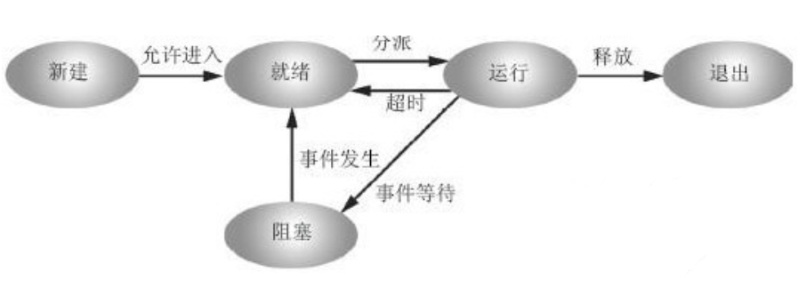
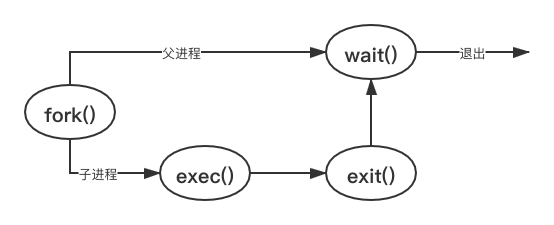

[TOC]

<center>操作系统原理</center>

[课程原址](https://www.coursera.org/learn/os-pku)

[笔记原址](http://jennica.space/2017/03/21/os-principle/)

目录：
- [1.操作系统概述](#1操作系统概述)
  - [执行程序](#执行程序)
  - [功能](#功能)
  - [作用](#作用)
  - [特征](#特征)
  - [分类](#分类)
- [2.操作系统运行环境](#2操作系统运行环境)
  - [CPU](#cpu)
  - [CPU状态](#cpu状态)
  - [中断／异常机制](#中断异常机制)
  - [事件](#事件)
  - [中断响应（硬件）](#中断响应硬件)
  - [中断处理程序（软件）](#中断处理程序软件)
  - [系统调用](#系统调用)
  - [程序调用](#程序调用)
  - [系统调用设计](#系统调用设计)
  - [系统调用过程](#系统调用过程)
- [3.进程线程模型](#3进程线程模型)
  - [并发环境](#并发环境)
  - [进程 Process](#进程-process)
  - [进程控制块PCB](#进程控制块pcb)
  - [进程状态](#进程状态)
  - [进程队列](#进程队列)
  - [进程控制](#进程控制)
  - [Unix进程控制操作](#unix进程控制操作)
  - [进程层次结构](#进程层次结构)
  - [进程地址空间](#进程地址空间)
  - [进程映像(快照)](#进程映像快照)
  - [上下文context切换](#上下文context切换)
  - [引入线程](#引入线程)
  - [线程与进程](#线程与进程)
  - [线程属性](#线程属性)
  - [线程的实现](#线程的实现)
  - [Pthread](#pthread)
  - [小结：进程特性](#小结进程特性)
  - [小结：线程](#小结线程)
- [4.处理器调度](#4处理器调度)
  - [CPU调度](#cpu调度)
  - [调度时机](#调度时机)
  - [进程切换](#进程切换)
  - [上下文切换的开销](#上下文切换的开销)
  - [调度算法考虑](#调度算法考虑)
  - [不同系统的调度算法](#不同系统的调度算法)
  - [优先级反转](#优先级反转)
  - [多级反馈队列](#多级反馈队列)
  - [调度算法对比](#调度算法对比)
  - [系统调度算法](#系统调度算法)
  - [Windows线程调度](#windows线程调度)
  - [线程优先级提升的情况](#线程优先级提升的情况)
- [5.同步机制](#5同步机制)
  - [进程的基本特性](#进程的基本特性)
  - [竞争条件](#竞争条件)
  - [进程互斥](#进程互斥)
  - [临界区](#临界区)
  - [软件解决互斥](#软件解决互斥)
  - [硬件解决互斥](#硬件解决互斥)
  - [忙等待](#忙等待)
  - [进程同步](#进程同步)
  - [生产者/消费者问题](#生产者消费者问题)
  - [信号量](#信号量)
  - [PV解决互斥](#pv解决互斥)
  - [PV解决生产者/消费者](#pv解决生产者消费者)
  - [PV解决读者/写者问题](#pv解决读者写者问题)
  - [回信投递](#回信投递)
  - [Linux读写锁](#linux读写锁)
  - [管程](#管程)
  - [管程内多进程的解决](#管程内多进程的解决)
  - [管程应用](#管程应用)
  - [Hoare管程](#hoare管程)
  - [Mesa管程](#mesa管程)
  - [Pthread中的同步机制](#pthread中的同步机制)
  - [进程间通信](#进程间通信)
  - [消息传递](#消息传递)
  - [共享内存](#共享内存)
  - [管道](#管道)
  - [Linux内核同步机制](#linux内核同步机制)
- [6.存储模型](#6存储模型)
  - [地址重定位](#地址重定位)
  - [物理内存管理](#物理内存管理)
  - [伙伴系统](#伙伴系统)
  - [基本内存管理方案](#基本内存管理方案)
  - [紧缩技术](#紧缩技术)
  - [覆盖技术](#覆盖技术)
  - [交换技术](#交换技术)
  - [空间增长](#空间增长)
  - [虚拟存储](#虚拟存储)
  - [地址保护](#地址保护)
  - [虚拟页式Paging](#虚拟页式paging)
  - [页式映射](#页式映射)
  - [反转页表](#反转页表)
  - [内存管理单元MMU](#内存管理单元mmu)
  - [块表TLB](#块表tlb)
  - [页错误](#页错误)
  - [驻留集](#驻留集)
  - [置换策略](#置换策略)
  - [清除策略](#清除策略)
  - [页面置换算法](#页面置换算法)
  - [影响缺页次数](#影响缺页次数)
  - [Belady现象](#belady现象)
  - [内存映射文件](#内存映射文件)
  - [写时复制](#写时复制)
- [7.文件系统](#7文件系统)
  - [文件](#文件)
  - [文件系统](#文件系统)
  - [文件分类](#文件分类)
  - [逻辑结构](#逻辑结构)
  - [物理快（块block、簇cluster）](#物理快块block簇cluster)
  - [磁盘结构](#磁盘结构)
  - [磁盘中文件相关数据结构](#磁盘中文件相关数据结构)
  - [文件控制块FCB](#文件控制块fcb)
  - [文件目录](#文件目录)
  - [物理结构](#物理结构)
  - [索引表的组织](#索引表的组织)
  - [文件卷](#文件卷)
  - [分区内容](#分区内容)
  - [Unix文件系统布局](#unix文件系统布局)
  - [Windows中FAT系统布局](#windows中fat系统布局)
  - [内存中文件相关数据结构](#内存中文件相关数据结构)
  - [目录项分解](#目录项分解)
  - [Unix文件查找/a/b/c](#unix文件查找abc)
  - [FAT文件系统](#fat文件系统)
  - [解决长文件名](#解决长文件名)
  - [文件操作](#文件操作)
  - [一致性](#一致性)
  - [写入策略](#写入策略)
  - [访问控制](#访问控制)
  - [提高性能](#提高性能)
  - [磁盘调度算法](#磁盘调度算法)
  - [RAID](#raid)
- [8.I/O系统](#8io系统)
  - [I/O管理](#io管理)
  - [设备分类](#设备分类)
  - [管理目标](#管理目标)
  - [硬件组成](#硬件组成)
  - [I/O地址](#io地址)
  - [控制方式](#控制方式)
  - [I/O演化](#io演化)
  - [软件层次](#软件层次)
  - [设备独立性](#设备独立性)
  - [缓冲技术](#缓冲技术)
  - [缓冲区](#缓冲区)
  - [设备管理数据结构](#设备管理数据结构)
  - [驱动程序](#驱动程序)
  - [I/O进程](#io进程)
  - [提高性能](#提高性能-1)
  - [缓冲](#缓冲)
  - [异步I/O](#异步io)
  - [DMA](#dma)
- [9.死锁](#9死锁)
  - [可重用资源](#可重用资源)
  - [死锁](#死锁)
  - [死锁条件](#死锁条件)
  - [资源分配图](#资源分配图)
  - [死锁定理](#死锁定理)
  - [资源分配图简化](#资源分配图简化)
  - [解决死锁](#解决死锁)
  - [死锁预防](#死锁预防)
  - [死锁避免](#死锁避免)
  - [安全序列](#安全序列)
  - [银行家算法](#银行家算法)
  - [死锁检测](#死锁检测)
  - [哲学家就餐](#哲学家就餐)


# 1.操作系统概述

## 执行程序
通过调度选中程序开始执行，在执行过程中，不断陷入操作系统提供各种服务支持，再调度选中程序，直到完成

## 功能
- 有效（充分利用CPU、内存、磁盘等资源）
- 合理（公平的资源管理策略）
- 易用（用户界面和编程接口）

## 作用
- 管理资源（硬件资源、软件资源）
  - 通过数据结构跟踪记录资源使用
  - 分配资源策略算法(静态、动态)
  - 资源回收与利用率
  - 协调资源使用的冲突
  - 基本功能（进程线程管理、存储管理、文件管理、设备管理、用户接口）
- 向用户提供服务（创建、执行、IO、统计）
- 对硬件机器扩展（屏蔽硬件细节、提供虚拟机器界面）

## 特征
- 并发（concurrency, 处理多个同时性活动）
  - 注意区分并发与并行(parallel, 与并发相似，但多指不同程序同时在多个硬件部件上执行)
- 共享（sharing, 互斥共享、同时共享有限系统资源）
- 虚拟（一个物理实体映射为若干逻辑实体: 分时和分空间）
- 随机（不可预知运行次序）
- 
- 典型架构（内核态、用户态）
  - Windows 简单抽象[计算机硬件、操作系统、系统功能调用、应用程序]
    - 内核态：[硬件抽象、设备驱动、内核、图形窗口、执行体、内核态可调用接口、服务分发器]
    - 用户态：[DLL、系统进程、服务进程、用户进程、环境子系统]
  - Unix（硬件控制层、调度、进程间通信、存储管理、内存管理、文件系统、设备驱动(块设备和字符设备)、系统调用接口）
  - Linux（进程、调度、虚拟内存、物理内存管理、各种设备驱动、网络模块、陷入&异常模块、中断处理模块、系统调用接口）
  - Android（Linux内核、系统库和Android运行时系统、应用程序框架、应用程序）

## 分类
传统分类
- 批处理（Spooling缓存I/O到磁盘，现在常用的设备是打印机）
- 分时（时间片、追求响应时间、交互式）
- 实时（严格时间、高可靠）
- 个人计算机（使用方便）
- 网络（通信、资源共享）
- 分布式（多机协同完成一项任务）
- 嵌入式（特定装置中的软硬件系统）


# 2.操作系统运行环境
## CPU
运算器、控制器、通用寄存器、控制和状态寄存器（PC、IR、PSW）、高速缓存
## CPU状态
操作系统需要的两个状态
- 内核态（特权指令R0）
  - I/O、内存清零、修改程序状态字、设置时钟、允许/禁止中断、停机
- 用户态（非特权指令R3）
  - 控制转移、算数运算、访管指令、取数指令
- R1：设备驱动程序、I/O处理的例程
- R2：受保护的共享的代码比如语言编译环境

## 中断／异常机制
用户态$\rightarrow$内核态

## 事件
- 中断响应外部事件，异步处理，总是返回下一条指令
  - 如I/O、时钟、硬件故障
- 异常源于内部正在执行的程序，同步处理
  - 分为陷入、故障、终止，如系统调用、页故障、断点、权限保护、程序

## 中断响应（硬件）
- 指令周期末扫描中断寄存器
- CPU切换到内核态
- 保存现场（PSW+PC）
- 通过中断码查中断向量表（中断处理程序入口+处理机状态字）
- 推送中断处理程序入口到寄存器

## 中断处理程序（软件）
- 执行中断处理程序
  - 保存相关寄存器信息
  - 分析中断/异常的具体原因
  - 执行对应的处理功能
  - 回复现场，返回被事件打断的程序
  
## 系统调用
- 用户在编程时可以调用的操作系统功能
  - 如进程控制、通信、文件使用、目录操作、设备管理、信息维护
- 系统调用是操作系统提供给编程人员的唯一接口
- 使得CPU状态从用户态陷入内核态

## 程序调用
应用程序可以通过库函数和API进入系统调用，也可直接引发系统调用，系统调用再调用对应内核函数

## 系统调用设计
- 中断／异常机制（支持系统调用服务的实现）
- 陷入指令（引发异常，用户态切换到内核态）
- 系统调用号和参数（不同系统调用的编号）
- 系统调用表（服务程序的入口地址）
- 参数传递（陷入指令自带、通用寄存器、内存中专用堆栈区）

## 系统调用过程
- CPU执行到特殊的陷入指令时：
- 中断硬件保护现场，通过门描述符（段选择符+偏移量）查系统调用表
- 转入查到的系统调用总入口程序，保护现场，保存参数到内核堆栈，通过系统调用号查系统调用表
- 执行查到的系统调用例程
- 恢复现场，返回用户程序

# 3.进程线程模型
## 并发环境
一段时间内，单处理器上多个程序同时处于开始运行但未结束状态，且次序不是事先确定的

## 进程 Process
- 程序的一次执行的过程
- 正在运行程序的抽象
- 将CPU虚拟为多个
- 系统资源分配单位
- 每个具有独立地址空间
- 操作系统将CPU调度给进程

## 进程控制块PCB
- 进程描述（PID、用户标识、进程组关系）
- 进程控制（状态、优先级、入口地址、队列指针）
- 资源和使用状况（存储空间、文件）
- CPU现场（进程不执行时保存寄存器值、指向进程页表的指针）

## 进程状态
进行的三种基本状态
- 运行（占用CPU）
- 就绪（CPU不空闲）
- 等待／阻塞（等待某事）

其他状态
- 创建（信息设置完但资源有限）
- 终止（统计信息、回收资源）
- 挂起（分就绪挂起和阻塞挂起，回收内存存磁盘，条件允许后可激活）



状态转换
- 就绪 $\rightarrow$ 运行：调度程序选择一个新的进程运行
- 运行 $\rightarrow$ 就绪：运行程序用完了时间片；一个高优先级的进程进入就绪态，抢占了当前正在运行的进程
- 运行$\rightarrow$等待：当进程等待某个事件的发生(比如请求OS服务、资源尚不可访问、等待I/O结果、等待另一进程提供信息)
- 等待$\rightarrow$就绪：所等待的事件发生了

## 进程队列
- 每类进程状态有一个或多个队列
- 元素为PCB
- 进程状态改变就是换队

## 进程控制
- 利用完成某种功能的不允许中断的控制**原语**，转换进程状态
- 原语在执行过程中不可分割或不可中断

常用的操作
- 进程的创建
  - PID和PCB
  - 分配地址空间
  - 初始化PCB
  - 设置队列指针
- 进程的撤销
  - 回收资源
  - 收回PCB
- 进程的阻塞
## Unix进程控制操作
- fork（复制调用进程创建）



- exec（新代码覆盖原地址空间创建）
- wait（主动阻塞）
- exit（撤销，回收资源和PCB）

## 进程层次结构
- 进程由其他进程创建
- Unix进程家族树以init为根
- Windows中各进程的地位相同

## 进程地址空间
内核地址空间、用户地址空间（代码段、数据段、堆、共享库、栈）

## 进程映像(快照)
进程地址空间、硬件寄存器、PCB及各种数据结构、进入进程时所需的内核栈

## 上下文context切换
CPU硬件状态从一个进程换到另一个，运行的进程硬件状态保存在CPU寄存器上，不运行时保存在PCB中，之后可推送至CPU寄存器

## 引入线程
- 应用需要（如Web服务器）
- 减少开销（创建和切换花费时间少，通信无需内核）
- 提升性能（多处理器）

## 线程与进程
线程是进程中的运行实体，CPU的调度单位，增加了多个执行序列

## 线程属性
- ID
- 状态
- 上下文
- 栈指针
- 共享进程的地址空间和其他资源
- 程序以单线程进程开始
- 线程可由线程创建和撤销

## 线程的实现
- Unix是用户级线程，内核无法感知线程存在，切换较快，但同进程的线程不能分到多CPU上，阻塞会阻塞整个进程
  - 优点
    - 切换快
    - 调度算法是程序特定的
    - 可以运行在任何操作系统（需要实现线程库
  - 缺点
    - 同一进程中的两个线程不能同时运行在两个CPU上
    - 大多数系统调用是阻塞的，因此由于内核阻塞进程，进程中的所有线程也被阻塞
- Windows是内核级线程，内核中包含线程表，调度以线程为单位
- Solaris为混合模型，线程创建在用户空间，调度在内核

## Pthread
POSIX多线程编程接口，线程协商谁上CPU；如yield函数主动让出CPU

## 小结：进程特性
- 并发（任何进程都可和其他同时推进）
- 动态（生命周期中切换状态）
- 独立（资源分配）
- 交互（进程间产生关系）
- 异步（进程独立不可预知的推进）
- 进程映像（程序+数据+栈+PCB）

## 小结：线程
- 应用场景
- 概念和属性
- 实现机制
- 可重入程序(可以被多个进程同时调用的程序)
  - 纯代码，执行不改变，调用它的进程提供数据区；大部分进程和线程只有可重入程序才可以运行

# 4.处理器调度
## CPU调度
- 在合适的调度时机
- 按调度算法
- 调度就绪队列中的进程进CPU

## 调度时机
内核对中断／异常／系统调用处理后，就绪队列改变引发重新调度（如进程终止、创建、运行转入阻塞、运行转入就绪）

## 进程切换
- 切换全局页目录加载新的地址空间
- 切换内核栈和硬件上下文

举例：进程A切换到B
- 保存A上下文环境
- 更新A的PCB
- A移至合适队列
- B设为运行态
- 从B的PCB恢复上下文

## 上下文切换的开销
- 直接开销
  - 保存和恢复寄存器
  - 切换地址空间（相关指令比较昂贵）
- 间接开销
  - 高速缓存（Cache）
  - 缓冲区缓存（Buffer Cache）
  - TLB（Translation Lookup Buffer）

## 调度算法考虑
- 优先级与优先数？
- 多级就绪队列如何组织？
- 是否抢占？
- I/O密集或CPU密集友好？
- 时间片长度？

## 不同系统的调度算法
- 批处理系统：处理看重吞吐量、周转时间、CPU利用率、平衡
  - 先来先服务FCFS
    - 优点
      - 公平
      - 实现简单
    - 缺点
      - 长进程后面的短进程需要等很长时间，不利于用户的体验
  - 最短作业优先SJF
    - 优点
      - 最快的平均周转时间
    - 缺点
      - 使得长任务产生“饥饿”
  - 最短剩余时间优先SRTN
    - SJF的抢占式版本
  - 最高响应比优先HRRN
$$
\begin{aligned}
响应比 R =& 周转时间/处理时间\\
=&(处理时间+等待时间)/处理时间\\
=&1+(等待时间/处理时间)
\end{aligned}
$$
- 交互式系统：看重响应时间、平衡
  - 轮转调度Round-Robin
    - 优点
      - 公平
      - 利于交互式计算
      - 对于不同大小的进程是有力的
    - 缺点
      - 由于进程切换，时间片轮转算法要花费较高的开销
      - I/O型和CPU型进程相对不公平（设计虚拟轮转法，对I/O进程设置了单独对辅助队列，与就绪队列不同）
  - 最高优先级调度HPF
    - 出现对问题，[优先级反转](#优先级反转)
    - 实现简单但是不公平
  - 多级反馈队列Feedback
  - 最短进程优先SPN（类似SJF）

## 优先级反转
抢占式最高优先级调度时，

高优先级受制于低优先级（如临界区等待），

而低优先级被运行时间较长的中优先级进程抢占，

导致高优先级无法上CPU

- 影响
  - 系统错误
  - 高优先级进程停滞不前，导致系统性能降低
- 解决方案
  - 设置优先级上限
  - 优先级继承
  - 使用中断禁止

## 多级反馈队列
- 多个就绪队列，顺次优先级递减
- 时间片递增，每个队列内部按时间片轮转
- 新建进程进一级队列，用完时间片进下一级就绪队列
- 因阻塞进入等待队列的进程在等待完毕后，回到原级别的就绪队列，但可设置时间片是否重新分配，加入队首或队尾
- 以上非抢占式，也可以设计抢占CPU的情况

## 调度算法对比

|调度算法	|是否抢占CPU	|吞吐量	|响应时间	|开销	|对进程的影响	|饥饿问题|
|----|----|----|----|----|----|----|
|FCFS	|N	|不强调	|可能很长	|小	|对短进程和I/O不利	|无|
|SJF	|N	|高	|短	|大	|对长进程不利	|有|
|SRTN	|Y	|高	|短	|大	|对长进程不利	|有|
|HRRN	|N	|高	|短	|大	|很好的平衡	|无|
|Round-Robin	|Y	|时间片小则低	|短	|小	|公平	|无|
|Feedback	|Y	|高	|不强调	|大	|对I/O型有利	|有|

## 系统调度算法
- Unix动态优先数
- 5.3BSD多级反馈队列
- Linux抢占式调度
- Windows基于优先级的抢占式多任务调度
- Solaris综合调度算法

## Windows线程调度
- 调度单位是线程
- 采用基于动态优先级的抢占式调度，结合时间配额的调整
  - 就绪线程按照优先级进入队列
  - 总是选择最高优先级的就绪线程运行
  - 同一优先级按照时间片轮转进行调度
  - 多CPU系统中允许多个线程并行
- 引发调度的条件
  - 线程终止、创建、运行转入阻塞、运行转入就绪
  - 还有线程优先级改变和亲和处理机集合改变
- 调度策略
  - 主动切换
  - 抢占
  - 时间配额用完

## 线程优先级提升的情况
- I/O完成
- 信号量或事件等待结束
- 前台进程的线程完成等待
- 窗口被唤醒
- 饥饿超时

# 5.同步机制
## 进程的基本特性
- 并发：进程的执行是间断的、相对运行速度不可预测
- 共享：共享资源带来制约性
- 不确定性：进程执行的结果与其执行的相对速度有关，是不确定的

## 竞争条件
多个进程读写共享数据时，结果取决于进程的精确时序

## 进程互斥
- 多个进程的临界区代码对临界资源的使用需要排他性
- 各进程间竞争使用这些共享资源

## 临界区
- 临界区空则可进入，但临界区中至多一个进程，临界区外的进程不能阻塞其他进程进临界区，不能让想进临界区的进程无限等待

## 软件解决互斥
- 临界区空闲标志（free）
- 进区的用户（turn）
- 各自进区标志（pturn+qturn）
- dekker算法（turn+pturn+qturn）
- peterson（enter_region+leave_region/turn+interest[]）

## 硬件解决互斥
- 开关中断指令（特权指令、中断屏蔽限制CPU并发、不适合多CPU）
- 测试并加锁指令（对总线加锁）
- 交换指令（交换寄存器与锁变量）

## 忙等待
进程在得到临界区访问权前，在CPU持续测试而不做别的事；多处理器中使用自旋锁测试，让其他CPU改锁状态，切换代价反而比持续测试大

## 进程同步
多进程中发生的事件存在时序关系，需要协作完成任务

## 生产者/消费者问题
有界缓冲区问题

生产者写入缓冲区，消费者从缓冲区取数据，不能同时消费和生产，缓冲区空不能消费，缓冲区满不能生产

## 信号量
- 用于进程间传递信息的整数值，包含队列
- 操作包括初始化（非负数），原语操作P（减）V（增）
- 二元信号量解决互斥，多值信号量解决同步

## PV解决互斥
划定临界区，初始化mutex为1，进临界区前执行P申请资源，出临界区后执行V唤醒等待

P:-1

V:+1

## PV解决生产者/消费者
初始化mutex为1，empty为空位，full为0；用mutex对缓冲区进行PV解决互斥，用empty和full进行PV解决同步

```c
#define N 100
typedef int semaphore;
semaphore mutex = 1;
semaphore empty = N;
semaphore full = 0;

//生产者
void producer(void){
  int item;
  while(TRUE){
    item = producter_item();
    
    P(&empty);
    P(&mutex);
    insert_item();
    V(&mutex);
    V(&full);
  }
}

//消费者
void producer(void){
  int item;
  while(TRUE){
    P(&full);
    P(&mutex);
    remove_item();
    V(&mutex);
    V(&empty);
    consume_item(item);
  }
}
```

## PV解决读者/写者问题
- 允许多个读者同时读，不允许同时读写
- 针对w信号，第一个读前P，最后一个读完V，写前后PV
- 针对读者序列rc，也需要在修改或判断前后用PV保护


```c
/*读者优先*/

//读
void reader(void){
  while(TRUE){
    P(mutex)
    rc = rc+1;
    if (rc==1) P(W);//第一个读者
    V(mutex)
    
    read;
    
    P(mutex)
    rc = rc-1;
    if (rc==0) V(W);最后一个读者
    V(mutex)
  }
}

void writer(void){
  while(TRUE){
    P(W);
    write;
    V(W);
  }
}
```
## 回信投递
```c
semaphore Full_A = x;           //Full_A表示A的信箱中的邮件数量
semaphore Empty_A = M-x;        //Empty_A表示A的信箱中还可存放的邮件数量
semaphore Full_B = y;           //Full_B表示B的信箱中的邮件数量
semaphore Empty_B = N-y;        //Empty_B表示B的信箱中还可存放的邮件数量
semaphore mutex_A = 1;          //mutex_A用于A的信箱互斥
semaphore mutex_B = 1;          //mutex_B用于B的信箱互斥

A{

  while(TRUE){

    P(Full_A);

    P(mutex_A);

    从A的信箱中取出一个邮件;

    V(mutex_A);

    V(Empty_A);

    回答问题并提出一个新问题;

    P(Empty_B);

    P(mutex_B);

    将新邮件放入B的信箱;

    V(mutex_B);

    V(Full_B);

  }

}

B{

  while(TRUE){

    P(Full_B);

    P(mutex_B);

    从B的信箱中取出一个邮件;

    V(mutex_B);

    V(Empty_B);

    回答问题并提出一个新问题;

    P(Empty_A);

    P(mutex_A);

    将新邮件放入A的信箱;

    V(mutex_A);

    V(Full_A);

  }

}
```

## Linux读写锁
每个执行实体对临界区的访问或读或写，不会同时读写，此时可应用读者/写者模型；如路由表中的读写锁

## 管程
- 有自己名字的特殊模块
- 由关于共享资源的数据结构和在其上的操作过程组成
- 进程可调用管程的过程以操作管程中的数据结构
- 编译器复杂管程的互斥
- 设置条件变量及“等待/唤醒”操作解决同步问题

## 管程内多进程的解决
若P唤醒Q，则管程中同时存在活跃状态的P和Q两个进程
- 处理方法有
  - Hoare（P等待Q）
  - Mesa（Q等待P）
  - Hansen并发pascal（让唤醒是管程中最后可执行操作）

## 管程应用
直接构造条件变量恰当的管程，用已有的同步机制间接构造；C++不支持管程，Java支持类似管程

## Hoare管程
管程入口设置入口等待队列，内部设置紧急等待队列放置唤醒进程，P唤醒Q则P等待Q；wait(c)优先唤醒紧急队列队首，再将进程加入c链尾，signal(c)优先唤醒c链首进入紧急等待队列

## Mesa管程
P唤醒Q则Q等待P，避免额外进程切换开销；signal衍化到notify，进程调度执行前再次检查条件，每个条件原语关联监视计时器超时即就绪，再衍化到broadcast使所有该条件队列上等待的进程进入就绪队列；Mesa优于Hoare

## Pthread中的同步机制
- 互斥变量保护临界区: `Pthread_mutex_[init/destroy/lock/unlock/trylock]`
- 条件变量解决同步: `Pthread_cond_[init/destroy/wait/signal/broadcast]`

## 进程间通信
- 消息传递
- 共享内存
- 管道
- 用于网络分布式系统的**套接字**和远程过程调用

## 消息传递
- 发送原语
- 陷入内核
- 操作系统复制到消息缓冲区
- 并挂接消息到接受进程的消息队列指针
- 接收原语
- 操作系统将消息复制到接收进程的地址空间

## 共享内存
物理内存中建立一块能够共享的内存空间，将物理内存空间映射到两个进程的地址空间；利用读者/写者问题解决互斥

## 管道
- 利用缓冲传输介质内存或文件连接两个进程
- 按字符流读写，先进先出，解决互斥同步

## Linux内核同步机制
- 原子操作（不可分割）
- 屏障（一组线程都到达汇合点后再一起推进）
- 自旋锁
- 信号量
- 完成变量
- 互斥体
- ……


# 6.存储模型
## 地址重定位
地址转换、地址映射、地址翻译
- 将逻辑／相对／虚拟地址，映射到物理／绝对／实地址
- 程序加载时用软件**静态重定位**
- 执行每条指令时用内存管理单元(MMU) **动态重定位**

## 物理内存管理
- 数据结构（位图、空闲+已分配区表、空闲块链表）
- 分配算法（首次适配、下次适配、最佳适配、最差适配）
- 回收算法（上相邻、下相邻、上下都相邻、上下都不相邻）

## 伙伴系统
- Linux底层内存分配算法
- 内存按2的整数次幂划分，组成空闲块链表，在链表中查找长度大于等于申请空间且不大于其一半的空闲块
- 内存回收时递归合并空闲伙伴

## 基本内存管理方案
- 占据内存连续空间（单一连续区、固定分区、可变分区）
- 分布在内存中不连续区域（页式、段式、段页式）
- 
- 单一连续区：单一程序独占内存，总是被加载到同一内存地址
- 固定分区：将内存分割为若干连续分区，大小可不同但必须固定不变，每个分区装载一个进程
- 可变分区：根据进程需要，动态分割出分区分配给进程
  - 碎片问题：很小的不容易利用的空闲区
  - [紧缩技术](#紧缩技术)（压缩技术，紧致技术、搬家技术）
- 
- 页式
  - 用户地址空间划分为大小相等的页，内存空间按页大小划分为多个页框，分配单位是页
  - 逻辑地址
    - 页号+页内地址
    - 通过页表将逻辑页地址映射到物理页地址，内容是页表项（记录逻辑页号与页框号的对应关系）
  - 内碎片
- 段式
  - 用户地址空间按自身逻辑划分为若干段，内存空间划分为若干个长度不同的区域（可变分区），分配单位是段
  - 逻辑地址
    - 段号+段内地址
  - 通过段表将逻辑段地址映射到物理段地址，内容是段表项（记录逻辑段号、段首地址和段长度之间段关系）
  - 外碎片
- 段页式
  - 用户程序地址空间是段式，每段内含有多页，内存空间是页式，分配单位是页
    - 即：进程划分是先按照段划分、每一段在按照页面划分（段号+段内地址（页号+页内地址））
      - 内存划分、内存分配、空闲区管理和内存的分配和回收都与页式存储管理方案相同
## 紧缩技术
在内存中移动程序，将所有小的碎片合并为较大的空闲区，不能解决页式管理造成的内碎片

## 覆盖技术
将不会同时执行的程序段共享同一块内存，需要程序员显式编程，现在很少用

## 交换技术
将程序内存中的堆栈（静态数据一直在磁盘），在很少使用或内存不够时，暂时移动到磁盘上的交换区（swap／pagefile），让外存中的程序占据其原有内存

## 空间增长
进程的数据段和栈段会持续增长（堆向上，栈向下），可预留一些空间供给它们同向或反向增长

## 虚拟存储
进程运行时先将部分装入内存，另一部分暂留在磁盘，执行指令或访问数据时按需从磁盘调入内存；虚存构建在存储体系上，由操作系统调度各存储器的使用；虚存大小与机器位数和磁盘大小有关

## 地址保护
- 每个进程有独立地址空间
- 访问合法地址范围
- 权限合法

## 虚拟页式Paging
- 虚拟存储技术结合页式存储管理（动态装入页面）
- 方式
  - 请求调页
  - 预先调页

## 页式映射
递归查找多级页表起始地址，与页内偏移拼接为物理地址；页表项中有效位代表是否已存入内存

## 反转页表
以物理内存大小建立页表，将虚拟地址的页号部分哈希，指向反转页表的某个位置，借助链表解决冲突

## 内存管理单元MMU
查页表和页表项的功能位，将虚拟地址转换为物理地址

## 块表TLB
- 由cache组成
- 是按内容并行查找的相联存储器
- 保存部分页表项
- MMU先查快表
- 没命中再查页表

## 页错误
地址转换过程中硬件产生异常
- 缺页
- 违反权限
- 地址指向未定义

## 驻留集
给每个进程分配的页框数
- 可根据进程类型和需要的固定分配
- 依据缺页率评估的动态分配
  - 缺页率高，增加页框数
  - 缺页率低，减少页框数
  - 系统开销

## 置换策略
- 置换范围
- 局部置换
  - 当前进程的驻留集
- 全局置换
  - 内存中所有未锁定页面都为候选
- 局部、全局置换结合固定、动态分配策略共产生三种方案
  - 局部固定
  - 全局固定
  - 全局动态

## 清除策略
从进程驻留集中收回页框
- 分页守护程序，保证系统中总有一定数量的空页框
- 页缓冲技术，不丢弃置换页而是加入修改页链表中，定期批量写回磁盘

## 页面置换算法
- OPT（未来最远使用）（不可实现，但可以作为基准）
- NRU（LRU的粗略近似）
- **FIFO（先进先出）**（可能置换出重要的页面）（出现[Belady现象](#Belady现象)）
- 第二次机会SCR（第一次先放队尾）（改善FIFO）
- 时钟CLOCK（在环上移动指针）（刚好的实现）
- LRU（优秀但开销大）
  - NFU（LRU粗略近似）
  - 老化Ageing（左置右移）（近似LRU的有效算法）
  - 工作集（保持活跃页面的集合）（开销大）

## 影响缺页次数
- 置换（磁盘调度页面比运行时间多产生颠簸）
- 页面大小（最优值为2倍的程序规模乘页表项再开根）
- 程序编制方法（多维数组）
- 驻留集（平衡点）

## Belady现象
FIFO算法，驻留集增大，缺页率可能反而增加

## 内存映射文件
用系统调用将文件映射到虚拟地址空间，访问文件就像访问大数组

## 写时复制
父进程创建子进程后共享一块标记为写时复制的虚拟空间，当子进程执行自己代码数据时，操作系统为其分配新的空间

# 7.文件系统
## 文件
标识为文件名，对用户而言有完整的逻辑含义，对操作系统而言是信息项的序列

## 文件系统
管理磁盘空间，实现按名存取（名字空间到磁盘空间的转换），共享及保护，向用户和I/O提供接口

## 文件分类
- 普通文件（包含用户信息的ASCII或二进制文件）
- 目录文件（管理文件系统的系统文件）
- 特殊文件（字符／块设备）
- 管道文件
- 套接字

## 逻辑结构
- 流式文件（字符）
- 记录式文件（记录）

## 物理快（块block、簇cluster）
信息存储、分配、传输的独立物理块单元

## 磁盘结构
物理地址由磁头／盘面号、磁道／柱面号、扇区号构成

扇区包括10B标题、512B数据、12~16B的ECC纠错信息

## 磁盘中文件相关数据结构
- 位图（设置0/1）
- 空闲块表（起始块号和空闲长度）
- 空闲块链表（每个节点含下一个指针）
- 成组链接法（从专用块出发，每组首个空闲块记录下组的空闲块号和块数）

## 文件控制块FCB
包含管理文件所需的文件属性或元数据，包括名字、时间、地址、标志等

## 文件目录
- 统一管理每个文件的元数据，完成名字到地址转换
- 文件目录以目录文件的形式存储在磁盘；目录项是FCB

## 物理结构
- 顺序结构
  - 简单、支持顺序存取和随机存取
  - 寻道次数和寻道时间最少
  - 可以同时读入多个块
  - 检索一个块也容易
  - 
  - 文件不能动态增长（考虑预留空间，浪费或需要重新分配移动）
  - 不利于文件的插入和删除
  - 产生外碎片
- 链接结构
  - 提高磁盘空间利用率，不存在外碎片问题
  - 有利于文件的插入和删除
  - 有利于文件的动态扩充
  - 
  - 存取速度慢，不适用随机存取
  - 可靠性问题，如指针出错
  - 更多的寻道次数和寻道时间
  - 链接指针占用一定的空间

  变形：[文件分配表FAT](#Windows中FAT系统布局)

- 索引结构（存放索引表的索引块地址放在FBC中）
  - 保持了链接结构的优点，又解决其优点
  - 但造成较多的寻道次数和寻道时间
  - 索引表本身带来了系统开销（如内存、磁盘空间、存取时间）

## 索引表的组织
索引表很大，需要多个物理快存储时，采用方式
- 链接方式，链接多个块
- 多级索引方式，上级索引表每个表项放置下级索引表地址
- 两者结合的综合模式，直接索引方式和间接索引方式相结合

## 文件卷
磁盘逻辑分区，由一个或多个蔟组成，包含2的整数次幂个扇区；格式化就是在文件卷上初始化元数据，建立文件系统

## 分区内容
引导区（引导操作系统所需信息，第一扇区）、卷信息（总蔟数、空闲蔟数和指针、空闲FCP数量和指针等）、目录文件（根目录及其他目录文件）、用户文件

## Unix文件系统布局
引导区、超级数据块（文件系统结构信息）、空闲区管理（空闲表或相关结构）、i节点区、根目录区

## Windows中FAT系统布局
引导区（文件系统数据记录）、文件分配表1（蔟的分配状态、标注下一簇）、文件分配表2（1的镜像）、根目录、其他目录和文件

## 内存中文件相关数据结构
系统打开文件表，整个系统一张，包括FCB（i节点）信息、引用计数、修改标记；用户打开文件表，保存在每个进程的PCB中，包括文件描述符、打开方式、读写指针、系统打开文件表索引

## 目录项分解
把FCB分为2部分，符号目录项（文件名、文件号）和基本目录项（除文件名外所有字段，描述文件相关信息）；Unix中FCB=目录项+i节点，每个文件由目录项、i节点、若干磁盘块构成

## Unix文件查找/a/b/c
超级数据块中得到根目录文件地址，根目录文件中得到a的i节点地址，a的i节点中得到a目录文件地址，a目录文件中得到b的i节点地址，b的i节点中得到b目录文件地址，b目录文件中得到c的i节点地址，c的i节点中得到文件物理地址

## FAT文件系统
按FAT表项字节数分为FAT12、FAT16、FAT32；FAT16根目录大小固定，不支持Unicode；目录项都为32B，包含文件属性和起始蔟号
文件分配表FAT：可看作整数数组，每个整数代表磁盘分区的一个蔟号，记录状态和下一组蔟号

## 解决长文件名
使用不固定长度的目录项，添加长度和结束标志；名字统一在堆存放，目录项中包含指向堆内的指针；FAT32的每个长目录项可保存13字符，长目录项前必须有一个普通的短目录项

## 文件操作
- 创建（建FCB，分配存储空间）
- 打开（找目录项，更新共享计数，获取文件描述符）
- 指针定位（fd查用户打开文件表找表项，设置读写指针）
- 读文件（由文件描述符找FCB，转换为物理块，申请缓冲区，进行I/O）
- 重命名（修改FCB中的名字）

## 一致性
磁盘块写回内存前出现故障，元数据一致性被破坏；Unix中用两个表记录使用中的块和空闲块，对比修复一致性

## 写入策略
同时考虑速度和一致性；通写、延迟写、可恢复写（日志，如NTFS、ext3）

## 访问控制
- 访问控制表（每个文件能被哪些用户操作）
- 能力表（每个用户能操作哪些文件）
- 用户（owner、group、other）
- 操作（r、w、x、-）

## 提高性能
目录项分解、当前目录、磁盘碎片整理、块高速缓存（一式三份存在于磁盘、内存、缓存）、提前读取、合理分配磁盘空间（FCB与蔟同组）、磁盘调度、信息的优化分布（磁道排列方式）、记录的成组与分解（若干逻辑记录组成一块）、RAID等

## 磁盘调度算法
- FCFS
- 最短寻道时间优先
- SCAN（电梯）
- C-SCAN（总是从0号向内）
- N-step-SCAN（每次服务n长子队列）
- FSCAN（两个队列，新请求入另一个队列）
- 旋转调度（旋转延迟）

## RAID
独立磁盘冗余矩阵，文件卷跨盘，用数据分条（如RAID0）并行I/O提高性能、用镜像（如RAID1）和校验（如RAID4）提供容错

# 8.I/O系统
## I/O管理
建立设备和内存间的数据通道，从应用程序或文件系统获得请求，交由设备硬件响应，过程由CPU控制

## 设备分类
- 块设备（以块寻址）
- 字符设备（速率低）
- 独享设备（单进程使用，可静态或动态分配）
- 共享设备（多进程排队分时共享）
- 虚设备（共享设备模拟的独占设备，如Spooling技术）

## 管理目标
按照用户请求，控制设备完成与内存间的数据交换；建立方便、统一的独立于设备的接口；提高CPU与设备、设备与设备的并行工作能力；保护数据的安全性、完整性、保密性

## 硬件组成
机械部分是设备本身，物理装置；电子部分是设备控制器，完成端口编址、信号处理、缓冲

## I/O地址
独立编址，端口与内存地址空间完全独立，分配给I/O地址空间很少，操作不灵活；内存映像编址，将I/O端口看作存储单元，与内存空间统一编址，不能对控制寄存器高速缓存

## 控制方式
- 可编程（轮询，CPU忙等待）
- 中断驱动（操作结束后用中断主动通知驱动）
- DMA（直接存储器访问，不通过CPU）

## I/O演化
CPU控制->轮询->中断->DMA->单独的处理器->拥有局部存储器（本身已是计算机）

## 软件层次
- 用户进程I/O（用户层执行输入输出系统调用，准备假脱机）
- 逻辑I/O（驱动程序的统一接口，错误报告，缓冲，分配和释放设备）
- 设备驱动程序（设置寄存器，检查执行状态）
- 中断处理程序（完成后唤醒设备驱动）

## 设备独立性
用户编写程序时使用逻辑设备名，由系统实现逻辑设备到物理设备的映射；操作系统设计I/O软件时，除直接与设备打交道的底层软件外不依赖于硬件；设备分配灵活，易于实现I/O重定向

## 缓冲技术
解决到达与离开速度不匹配的问题，提高CPU与I/O设备的并行性
- 按缓冲区位置
  - 硬缓冲、软缓冲
- 按缓冲池个数
  - 单缓冲、双缓冲、缓冲池

## 缓冲区
由缓冲控制块和缓冲数据区组成，相关数据结构有空闲缓冲区队列av链和设备缓冲队列b链；开始时在av链，开始I/O请求时在I/O请求队列和b链，完成I/O后在av链和b链

## 设备管理数据结构
描述设备的表格、建立同类资源的队列、面向I/O进程的动态数据结构、建立I/O的队列

## 驱动程序
每个设备驱动程序管理一类设备，从上层接受并释放命令，监督执行时可让进程等待也可以不等待；与操作系统、用于初始化的系统引导、设备都有接口
## I/O进程
- 系统级进程，优先级高
- 对于I/O请求，用户通过send发送给I/O进程，阻塞自己直到I/O完成并被唤醒，操作系统通过wakeup唤醒I/O进程，完成时用户要求的任务
- 对于I/O中断，操作系统判断为正常中断则交给I/O进程，异常则交给错误处理程序

## 提高性能
## 缓冲
（减少CPU和I/O的速度差距）
## 异步I/O
（等待I/O期间CPU可进行其他操作）
## DMA
（CPU摆脱I/O）

# 9.死锁

## 可重用资源
- 可重用资源
  - 可被多个进程多次使用
  - 分为可抢占与不可抢占资源
  - 处理器、I/O部件、内存、文件、数据库、信号量
- 可消耗资源
  - 只可使用一次、可创建和销毁的资源


## 死锁
- 死锁：每个进程无限等待被该组进程中另一进程占有的资源；
- 活锁：先加锁再轮询不阻塞不推进
- 饥饿：由于资源分配策略如优先级导致得不到资源

## 死锁条件
- 互斥使用（资源独占）
- 占有且等待（请求和保持、部分分配）
- 不可抢占（不可剥夺）
- 循环等待（进程等待环路）

## 资源分配图
- 进程是圆，资源类是方，资源实例是方框中黑点
- 申请边（进程，资源类）表示进程请求某类资源
- 分配边（资源实例，进程）表示资源分配给某进程

## 死锁定理
在资源分配图中
- 无环路必无死锁
- 有环路可能有死锁
- 有环且资源类只包含一个实例必有死锁

## 资源分配图简化
找只有分配边的资源，去掉边分配给需要的进程，自己变成孤点；重复上述步骤，若最后所有都是孤点则无死锁，否则有死锁

## 解决死锁
- 鸵鸟算法（不考虑死锁）
- [死锁预防（静态分配）](#死锁预防)
- [死锁避免（动态评估）](#死锁避免)
- 死锁检测和解除

## 死锁预防
破坏死锁必要条件
- 1.独占转为共享资源（破坏资源独占条件）
- 2.1一次性申请和分配（破坏占有并等待条件）
  - 资源利用率低，会产生饥饿
- 2.2主动释放部分分配（破坏占有并等待条件）
- 3.操作系统帮助抢占（破坏不可抢占条件）
  - 适用于状态易于保存和恢复的资源（CPU、内存）
- 4.资源有序分配法（破坏循环等待条件）
  - （资源按热度编号，进程按资源号增序请求）

## 死锁避免
对进程发出的每一个能满足的资源申请进行动态检查，根据分配后系统是否为不安全状态（死锁）决定是否分配

## 安全序列
进程序列中任意进程，它还需要的资源不超过当前系统剩余资源与它之前的所有进程占有资源的和；此时系统为安全状态，一定无死锁，若不存在任何安全序列则为不安全状态，一定导致死锁

## 银行家算法
五类数组 `available`, `max[i]`, `allocation[i]`, `need[i]`, `request[i]`；当进程i提出`request[i]`时，若不大于`available`则将`allocation[i]`加`request[i]`、`available`和`need[i]`减`request[i]`，此时判断新状态是否安全，安全则分配否则等待

## 死锁检测
允许死锁发生，在资源不足、利用率下降时或周期性检测系统进展判断是否真的有死锁发生；死锁后解除死锁并以最小的代价恢复系统运行，可通过撤销死锁进程组、回退再启动、按某种原则逐一撤销进程或剥夺资源

## 哲学家就餐
同步互斥问题，五个哲学家日常行为是思考，两两间放一只筷子，饥饿时要从左右取两只筷子才可吃饭，都先拿右边筷子时出现死锁；解决方法包括最多允许四个哲学家、利用管程一次性拿两只筷子、设置哲学家的三种状态结合检测和PV操作、每个哲学家按筷子增序拿、由银行家算法将最后的筷子分配给已拿到一只的人