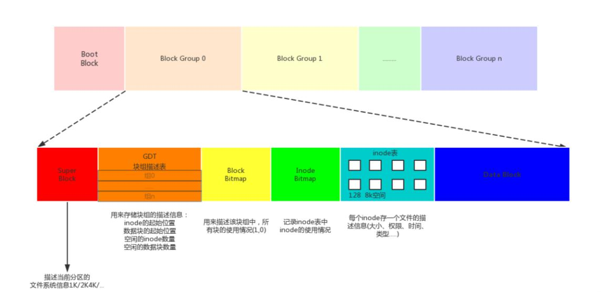

# 实验一  Linux系统学习
##文件系统

在主流linux发行版系统中默认的文件系统是 ext4，它是 ext3 文件系统的升级版。ext4 文件系统在性能、伸缩性和可靠性方面进行了大量改进。ext4 文件系统的变化可以说是翻天覆地的，比如：

- 向下兼容 ext3；
- 最大 1EB 文件系统和16TB文件；
- 无限数量子目录；
- Extents 连续数据块概念；
- 多块分配、延迟分配、持久预分配；
- 快速 FSCK、日志校验、无日志模式、在线碎片整理、inode 增强、默认启用barrier等；
ext4 文件系统是由 Theodore Tso（ext3 的维护者）领导的开发团队实现的，并引入 2.6.19 内核中。

那么，文件系统到底是如何运作的呢？文件系统中除要保存文件的数据外，还要保存文件的属性，如文件的权限、所有者、属组和时间参数等内容。文件系统把文件的数据和属性分开存放，把文件的数据放入 date block 中（数据块，保存文件的具体数据。类似衣柜的隔断，用来真正保存衣物），把文件的属性保存在 inode  中（i 节点，保存文件属性，如权限、所有者、属组和时间参数等。类似衣柜门上贴的标签，标签中写入衣物的特性）。每个 block 和 inode 都有序列号，用来区分和编码。另外，还有一个 super block（超级块）用于记录整个文件系统的信息，如 inode 和 block 的总量、已经使用量和剩余量。

数据存储总结：

- super block（超级块）：记录整个文件系统的信息，包括 block 与 inode 的总量、已经使用的 inode 和 block 的数量、未使用的 inode 和 block 的数量、block 与 inode 的大小、文件系统的挂载时间、最近一次的写入时间、最近一次的磁盘检验时间等。

- date block（数据块，也称作block）：用来实际保存数据（柜子的隔断），block 的大小（1KB、2KB 或 4KB）和数量在格式化后就已经决定，不能改变，除非重新格式化。每个 block 只能保存一个文件的数据，如果文件数据小于一个 block 块，那么这个 block 的剩余空间不能被其他文件使用；如果文件数据大于一个 block 块，则要占用多个 block 块。Windows 中磁盘碎片整理工具的原理就是把一个文件占用的多个 block 块尽量整理到一起，这样可以加快读写速度。

- inode（i 节点，柜门上的标签）：用来记录文件的权限（r、w、x）、文件的所有者和属组、文件的大小、文件的状态改变时间（ctime）、文件的最近一次读取时间（atime）、文件的最近一次修改时间（mtime）、文件的数据真正保存的 block 编号。每个文件需要占用一个 inode。

		注意：在 inode 中并没有保存文件的文件名，那是因为文件名是文件所在目录的数据，所以保存在上一级目录的 block 中。前面章节中在讲权限命令的时候说过，要对文件的上一级目录拥有 w 权限，才能删除目录中的文件，就是因为文件名是保存在目录的 block 中的。

## 

## Linux支持的常见文件系统
Linux 系统能够支持的文件系统非常多，除 Linux 默认文件系统 ext2、ext3 和 ext4 之外，还能支持 fat16、fat32、NTFS（需要重新编译内核）等 Windows 文件系统。也就是说，Linux 可以通过挂载的方式使用Windows 文件系统中的数据。Linux 所能够支持的文件系统在/usr/src/kemels/当前系统版本/fs"目录中（需要在安装时选择），该目录中的每个子目录都是一个可以识别的文件系统。我们介绍较为常见的 Linux 支持的文件系统，如下表所示：

|文件系统|描述|
|---|---|
|ext|	Linux 中最早的文件系统，由于在性能和兼容性上具有很多缺陷，现在已经很少使用|
|ext2|	是 ext 文件系统的升级版本，Red Hat Linux 7.2 版本以前的系统默认都是 ext2 文件系统。于 1993 年发布，支持最大 16TB 的分区和最大 2TB 的文件（1TB=1024GB=1024x1024KB)|
|ext3|	是 ext2 文件系统的升级版本，最大的区别就是带日志功能，以便在系统突然停止时提高文件系统的可靠性。支持最大 16TB 的分区和最大 2TB 的文件|
|ext4|	是 ext3 文件系统的升级版。ext4 在性能、伸缩性和可靠性方面进行了大量改进。ext4 的变化可以说是翻天覆地的，比如向下兼容 ext3、最大 1EB 文件系统和 16TB 文件、无限数量子目录、Extents 连续数据块 概念、多块分配、延迟分配、持久预分配、快速 FSCK、日志校验、无日志模式、在线碎片整理、inode 增强、默认启用 barrier 等。它是主流linux发行版的默认文件系统|
|swap|	swap 是 Linux 中用于交换分区的文件系统（类似于 Windows 中的虚拟内存)，当内存不够用时，使用交换分区暂时替代内存。一般大小为内存的 2 倍，但是不要超过 2GB。它是 Linux 的必需分区|
|NFS|	NFS 是网络文件系统（Network File System）的缩写，是用来实现不同主机之间文件共享的一种网络服务，本地主机可以通过挂载的方式使用远程共享的资源|
|iso9660|	光盘的标准文件系统。Linux 要想使用光盘，必须支持 iso9660 文件系统|
|fat|	就是 Windows 下的 fatl6 文件系统，在 Linux 中识别为 fat|
|vfat|	就是 Windows 下的 fat32 文件系统，在 Linux 中识别为 vfat。支持最大 32GB 的分区和最大 4GB 的文件|
|NTFS|	就是 Windows 下的 NTFS 文件系统，不过 Linux 默认是不能识别 NTFS 文件系统的，如果需要识别，则需要重新编译内核才能支持。它比 fat32 文件系统更加安全，速度更快，支持最大 2TB 的分区和最大 64GB 的文件|
|ufs|	Sun 公司的操作系统 Solaris 和 SunOS 所采用的文件系统|
|proc|	Linux 中基于内存的虚拟文件系统，用来管理内存存储目录 /proc|
|sysfs|	和 proc —样，也是基于内存的虚拟文件系统，用来管理内存存储目录 /sysfs|
|tmpfs|	也是一种基于内存的虚拟文件系统，不过也可以使用 swap 交换分区|

## 补充：
什么是虚拟文件系统？什么是虚拟文件系统界面？

- 1)将各种不同文件系统的操作和管理纳入到一个统一的框架中，使得用户程序可以通过同一个文件系统界面，也就是同一组系统调用，对各种不同的文件系统以及文件进行操作；用户程序可以不关心不同文件系统的实现细节，而使用系统提供的统一、抽象、虚拟的文件系统界面；这种统一的框架就是所谓的虚拟文件系统转换，一般简称虚拟文件系统(VFS)；
- 2)VFS的对象类型包括：超级块(superblock)对象、索引节点(inode)对象、目录项(dentry)对象和文件(file)对象；
- 3)虚拟文件系统界面是虚拟文件系统所提供的抽象界面，它主要由一组标准的、抽象的操作构成，这些函数(操作)以系统调用的形式供用户调用。