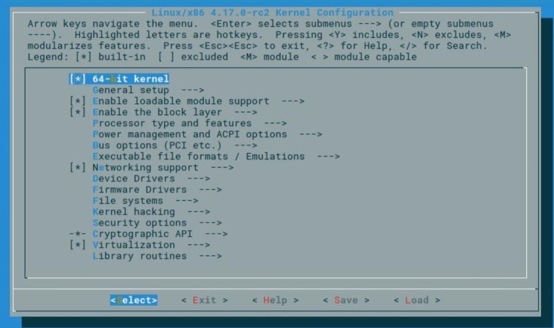
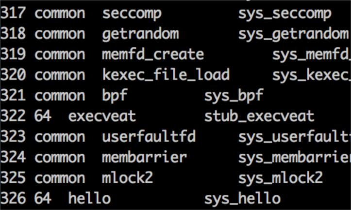
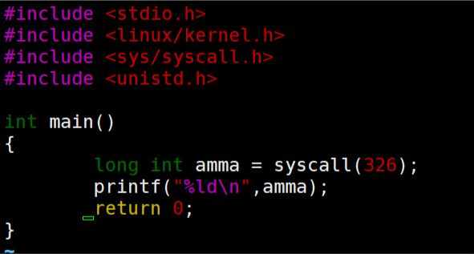

# 实验七  Linux内核与系统调用
## 实验目的
- 1.编译Linux内核
- 2.探究Linux启动过程
- 3.Linux系统调用实现分析增加一个系统调用
## 实验原理：
- 1.Linux内核归结起来是用不规范C语言编写的编程支持程序。内核的编译类似于C语言中的gcc(为了提高效率以及编译的方便时使用的make和makefile)，同时需要进行一些配置文件的更改，以及部分链接文件的扩展。
- 2.系统调用就是由内核给用户空间的一组相对统一的文件(设备和资源)操作的接口，用于完成用户空间和内核的交互。而内核对系统调用提供了保护，linux内核C库对所有系统调用做了封装，需要切换到内核状态才能调用，x86通过C库调用系统调用时先通过软中断int 0x80来跳转到相应的中断处理服务程序(系统调用服务程序)，系统根据系统调用好来查找系统调用服务程序地址并调用。因此增加系统调用需要如下步骤：
  - (1)命名增加的系统调用 
  - (2)按linux规范定义系统调用服务程序 
  - (3)在系统调用表中添加系统调用号和系统调用的对应关系 
  - (4)编译内核

### 实验：
- (1)准备Linux环境：
  - VMware下Ubuntu16.04虚拟机
  - linux-4.17内核
- (2)下载Linux内核源码
  - 由于https://git.kernel.org/网站在国内延时卡顿较重，先将压缩包下载再解压到虚拟机里面
    >sudo tar -xavf linux-4.17.tar.xz
- (3)安装编译工具

命令如下：
>sudo apt-get install gcc make libncurses5-dev openssl libssl-dev\
sudo apt-get install build-essential\ 
sudo apt-get install pkg-config\
sudo apt-get install libc6-dev\
sudo apt-get install bison\
sudo apt-get install flex\
sudo apt-get install libelf-dev

- 准备编译
    >cd /usr/src/linux-4.17/\
sudo cp /boot/config-4.15.0-38-generic .config\
sudo make menuconfig

>make modules_install && make install

- 后续操作
  - 启用内核作为引导
    >update-initramfs -c -k 4.17-rc2

  - 使用如下命令来更新 grub：
    >update-grub

  - 可以重启系统并且选择新安装的内核了。

- 添加系统调用

  - (1)添加系统调用号 
    >vim /usr/src/linux-4.17/arch/x86/entry/syscalls/syscall_64.tbl

    
    在后面添加了两个系统调用函数，sys_hello和326就是系统调用号

  - (2)声明系统调用函数原型
    >vim include/linux/syscalls.h 
    
    其中的asmlinkage用在大多数的系统调用中。有一些情况下是需要明确的告诉编译器，我们是使用stack来传递参数的，比如X86中的系统调用，是先将参数压入stack以后调用sys_\*函数的，所以所有的sys_\*函数都有asmlinkage来告诉编译器不要使用寄存器来编译。

  - (3)添加系统调用函数的定义 
    >vim /usr/src/linux-4.17/kernel/sys.c \
    printk(“Hello,world”);\
    return 1;

  - (4)编译内核 
    >sudo menuconfig 直接选择save，然后退出即可，生成.config \
    sudo make 编译开始，**可以使用make -j4 启用多线程。** \
    sudo make modules_install 安装模块 \
    sudo make install 安装内核 

  - (5)重启系统并在高级选项中选择刚编译完的内核版本，之前的版本会在其末尾添加一个.old

  - (6)测试系统调用
    - syscall的参数为系统调用号。 
    
    

    - 由于sys_hello里面有一条printf语句，该语句会将此输出作为系统的日志，通过dmesg命令查看。 