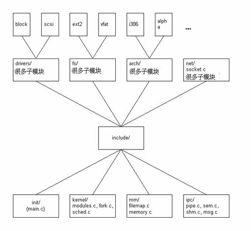
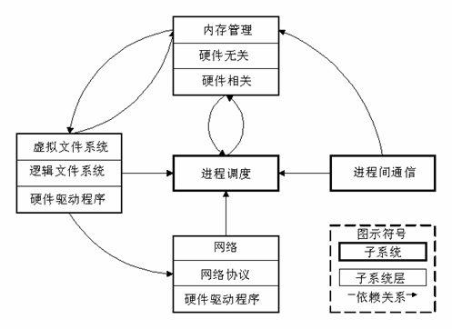
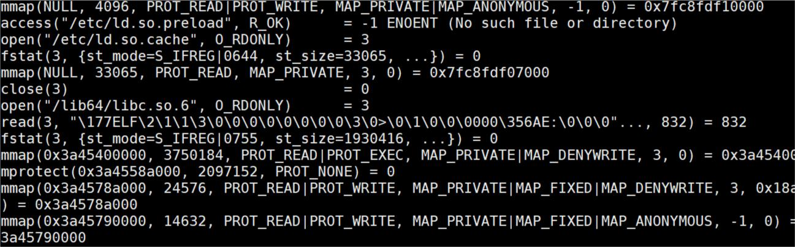

# 实验三  Linux内核模块编程
## 实验目的
- Linux内核代码结构
- Linux内核模块编程示例
- 完成教材P96编程题目

### Linux内核结构
- Linux内核源代码的结构
  - Linux内核源代码位于/usr/src/linux目录下，其结构分布如下图所示，每一个目录或子目录可以看作一个模块，其目录之间的连线表示“子目录或子模块”的关系。
  
    

  - 下面是对每一个目录的简单描述。

    |目录名|含义|
    |----|----|
    |include/|子目录包含了建立内核代码时所需的大部分包含文件，这个模块利用其它模块重建内核。|
    |init/| 子目录包含了内核的初始化代码，这是内核开始工作的起点。|
    |arch/|子目录包含了所有硬件结构特定的内核代码 arch/ 子目录下有i386和alpha模块等等。|
    |drivers/| 目录包含了内核中所有的设备驱动程序，如块设备，scsi 设备驱动程序等等。|
    |fs/| 目录包含了所有文件系统的代码，如：ext2, vfat模块的代码等等|
    |net/| 目录包含了内核的连网代码。|
    |mm/| 目录包含了所有的内存管理代码。|
    |ipc/| 目录包含了进程间通信的代码。|
    |kernel/ | 目录包含了主内核代码|  

  - linux内核由5个主要的子系统组成：

    

- 程序实现
  - 此程序涉及多次文件路径的拼接，因此最大的难题就是C语言中对于字符串的处理。C语言中是没有字符串的概念，仅有字符数组，与指向这个字符数组的首位置的指针的概念。用char \*path;配合path=(char\*)malloc(512);相当于搞出一个，指向长达512的空字符数组的指针，此时path你可以理解为字符串。这样使用的strcat函数，不停地给path进行拼接，就不会出现段错误的内存溢出错误。
  - 接下去用了大量的代码用于源与目标文件路径与文件名的拼接，其实完成的功能很简单，如果是其它语言，可能string file_source_path;string filename->d_name;之后就一句file_source_path+filename->d_name;

  - 源程序如下：
```c
#include<stdio.h>
#include<stdlib.h>
#include<string.h>
#include<dirent.h>//输出文件信息
#include<sys/stat.h>//判断是否目录
int is_dir(char* path){//判断是否是目录
	struct stat st;
	stat(path,&st);
	if(S_ISDIR(st.st_mode)){
		return 1;
	}
	else{
		return 0;
	}
}
/*字符串处理函数*/
int endwith(char* s,char c){//用于判断字符串结尾是否为“/”
	if(s[strlen(s)-1]==c){
		return 1;
	}
	else{
		return 0;
	}
}
char* str_contact(char* str1,char* str2){//字符串连接
	char* result;
	result=(char*)malloc(strlen(str1)+strlen(str2)+1);//str1的长度+str2的长度+\0;
	if(!result){//如果内存动态分配失败
		printf("字符串连接时，内存动态分配失败\n");
		exit(1);
	}
	strcat(result,str1);
	strcat(result,str2);//字符串拼接
	return result;
}
/*复制函数*/
void copy_file(char* source_path,char *destination_path){//复制文件
	char buffer[1024];
	FILE *in,*out;//定义两个文件流，分别用于文件的读取和写入int len;
	if((in=fopen(source_path,"r"))==NULL){//打开源文件的文件流
		printf("源文件打开失败！\n");
		exit(1);
	}
	if((out=fopen(destination_path,"w"))==NULL){//打开目标文件的文件流
		printf("目标文件创建失败！\n");
		exit(1);
	}
	int len;//len为fread读到的字节长
	while((len=fread(buffer,1,1024,in))>0){//从源文件中读取数据并放到缓冲区中，第二个参数1也可以写成sizeof(char)
		fwrite(buffer,1,len,out);//将缓冲区的数据写到目标文件中
	}
	fclose(out);
	fclose(in);
}
void copy_folder(char* source_path,char *destination_path){//复制文件夹
	if(!opendir(destination_path)){
		if (mkdir(destination_path,0777))//如果不存在就用mkdir函数来创建
		{
		    printf("创建文件夹失败！");
		}
	}
	char *path;
	path=(char*)malloc(512);//相当于其它语言的String path=""，纯C环境下的字符串必须自己管理大小，这里为path直接申请512的位置的空间，用于目录的拼接
	path=str_contact(path,source_path);//这三句，相当于path=source_path
	struct dirent* filename;
	DIR* dp=opendir(path);//用DIR指针指向这个文件夹
	while(filename=readdir(dp)){//遍历DIR指针指向的文件夹，也就是文件数组。
		memset(path,0,sizeof(path));
		path=str_contact(path,source_path);
		//如果source_path,destination_path以路径分隔符结尾，那么source_path/,destination_path/直接作路径即可 
		//否则要在source_path,destination_path后面补个路径分隔符再加文件名，谁知道你传递过来的参数是f:/a还是f:/a/啊？
		char *file_source_path;
		file_source_path=(char*)malloc(512);
		if(!endwith(source_path,'/')){
			file_source_path=str_contact(file_source_path,source_path);
			file_source_path=str_contact(source_path,"/");
		}
		else{
			file_source_path=str_contact(file_source_path,source_path);
		}
		char *file_destination_path;
		file_destination_path=(char*)malloc(512);
		if(!endwith(destination_path,'/')){
			file_destination_path=str_contact(file_destination_path,destination_path);
			file_destination_path=str_contact(destination_path,"/");
		}
		else{
			file_destination_path=str_contact(file_destination_path,destination_path);
		}
		//取文件名与当前文件夹拼接成一个完整的路径
		file_source_path=str_contact(file_source_path,filename->d_name);
		file_destination_path=str_contact(file_destination_path,filename->d_name);
		if(is_dir(file_source_path)){//如果是目录
			if(!endwith(file_source_path,'.')){//同时并不以.结尾，因为Linux在所有文件夹都有一个.文件夹用于连接上一级目录，必须剔除，否则进行递归的话，后果无法相像
				copy_folder(file_source_path,file_destination_path);//进行递归调用，相当于进入这个文件夹进行复制～
			}		
		}
		else{
			copy_file(file_source_path,file_destination_path);//否则按照单一文件的复制方法进行复制。
			printf("复制%s到%s成功！\n",file_source_path,file_destination_path);
		}
	}	
}
/*主函数*/
int main(int argc,char *argv[]){
	if(argv[1]==NULL||argv[1]==NULL){
		printf("请输入两个文件夹路径，第一个为源，第二个为目的！\n");
		exit(1);
	}
	char* source_path=argv[1];//取用户输入的第一个参数
	char* destination_path=argv[2];//取用户输入的第二个参数
	DIR* source=opendir(source_path);
	DIR* destination=opendir(destination_path);
	if(!source||!destination){
		printf("你输入的一个参数或者第二个参数不是文件夹！\n");
	}
	copy_folder(source_path,destination_path);//进行文件夹的拷贝
	return 0;
}
```

- 调用跟踪
