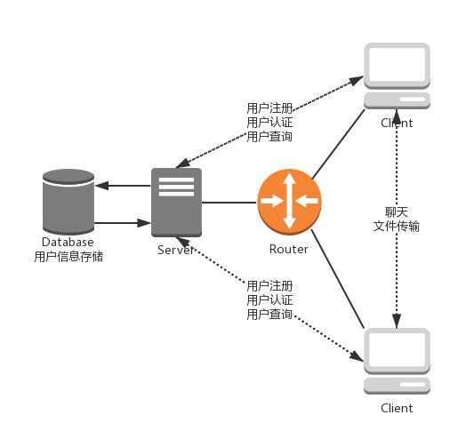
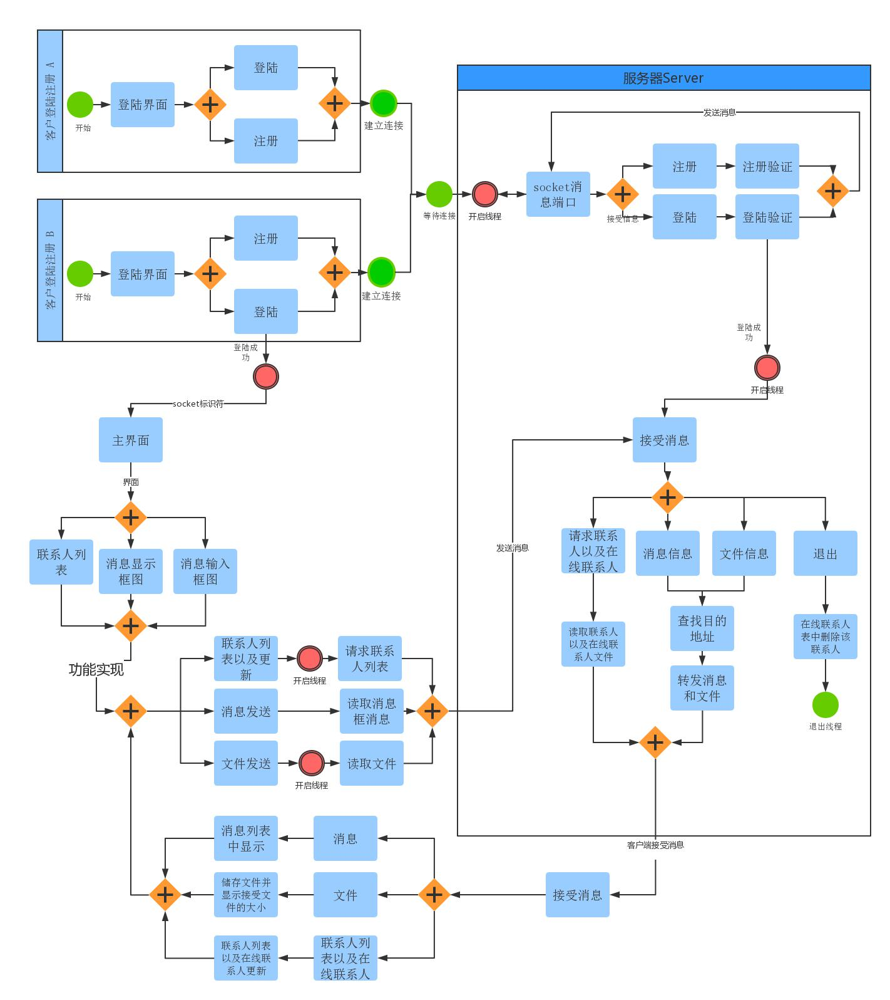
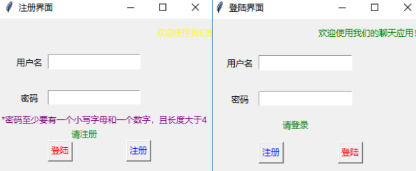
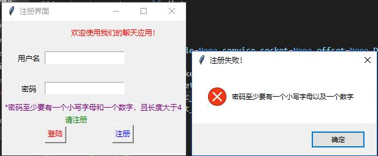
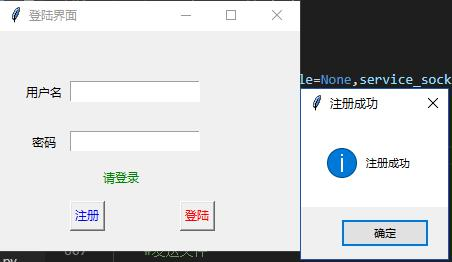
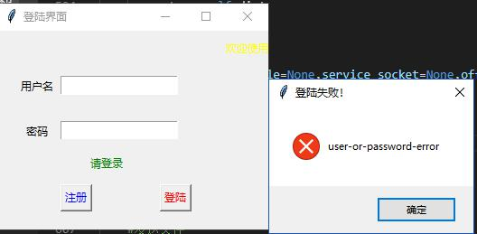
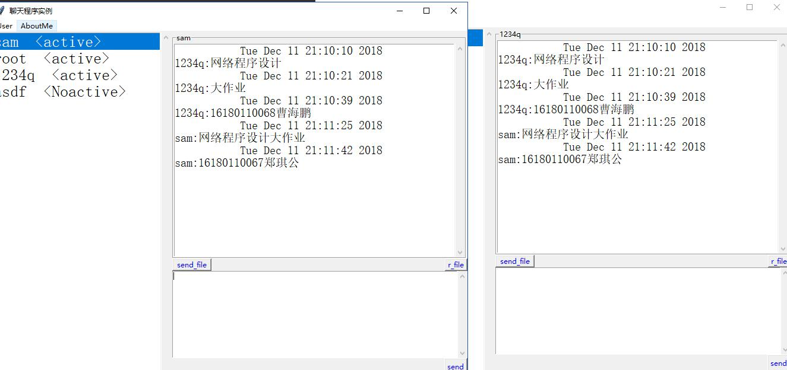
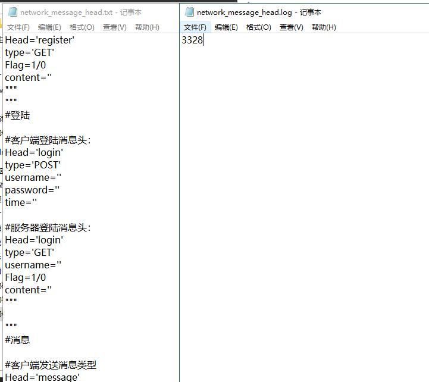
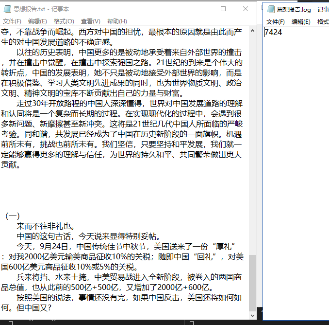
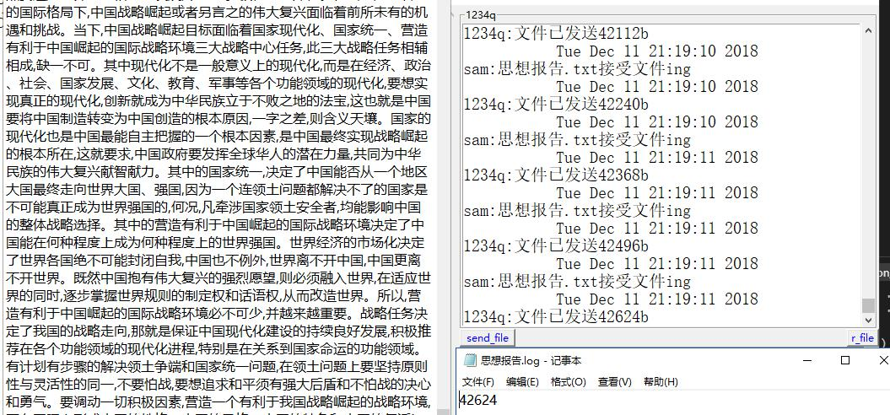

# 实验四  Web服务器并发编程
- 功能：
  - ①　新用户注册
  - ②　用户登陆与退出
  - ③　聊天服务
  - ④　在线用户查询
  - ⑤　文件传送服务
  - ⑥　文件断点续传

- 项目总体设计
- 1．网络拓扑

    

- 2．信息流

    


- 消息结构说明（协议设计）

    

- 功能相关代码以及运行截图
- 新用户注册与登陆
- 客户端

```python
    class Login_reginster_Page(object):
        def __init__(self,master=None):
            self.root=master   #内部变量
            self.root.geometry('%dx%d'%(300,220))
            self.username=tk.StringVar()
            self.password=tk.StringVar()
            self.service_socket=None
            self.LoginPage()
        
        #登陆界面
        def LoginPage(self):
            self.root.title("登陆界面")
            self.page1=tk.Frame(self.root,height=120,width=300)   ##frame框架的大小必须写
            self.page1.place(x=0,y=0)
            self.page2=tk.Frame(self.root,height=100,width=300)
            self.page2.place(x=0,y=120)
            ##滚动标题
            self.remove=0
            self.colour=['green','blue','red','organe','yellow','purple']
            #self.page1['bg']=colour[x]
            title=tk.Label(self.page1,text='欢迎使用我们的聊天应用！')
            #滚动标题的动态效果
            def foo():
                self.remove=self.remove+10
                if self.remove>300:
                    self.remove=0
                title.place(x=self.remove,y=8)
                title['fg']=self.colour[self.remove%(len(self.colour))]
                self.page1.after(500,foo)
            self.page1.after(500,foo)
            #登陆框界面设计
            tk.Label(self.page1,width=6,text='用户名').place(x=20,y=50)
            self.user=tk.Entry(self.page1,width=18,textvariable=self.username)
            self.user.place(x=70,y=50)
            tk.Label(self.page1,width=6,text='密码').place(x=20,y=100)
            self.pw=tk.Entry(self.page1,width=18,show='*',textvariable=self.password)
            self.pw.place(x=70,y=100)
            tk.Button(self.page2,text='注册',fg='blue',command=self.RegisterChange).place(x=70,y=50)
            tk.Button(self.page2,text='登陆',fg='red',command=self.loginCheck).place(x=180,y=50)
            tk.Label(self.page2,text='请登录',fg='green').place(x=100,y=15)
        
        #注册界面
        def RegisterPage(self):
            self.root.title("注册界面")
            self.page3=tk.Frame(self.root,height=100,width=300)
            self.page3.place(x=0,y=120)
            tk.Button(self.page3,text='登陆',fg='red',command=self.LoginChange).place(x=70,y=50)
            tk.Button(self.page3,text='注册',fg='blue',command=self.RegisterCheck).place(x=180,y=50)
            tk.Label(self.page3,text="*密码至少要有一个小写字母和一个数字，且长度大于4",fg='purple').place(x=2,y=10)
            tk.Label(self.page3,text='请注册',fg='green').place(x=100,y=30)
        #注册界面切换为登陆界面    
        def LoginChange(self):
            self.page3.destroy()
            self.pw.delete(0,tk.END)
            self.user.delete(0,tk.END)
            self.LoginPage()        
        #登陆界面切换为注册界面
        def RegisterChange(self):
            self.page2.destroy()
            self.pw.delete(0,tk.END)
            self.user.delete(0,tk.END)
            self.RegisterPage()
        #注册命令           
        def RegisterCheck(self):
            self.dict=require_data_type().registr_type(self.username.get(),self.password.get())
            if self.dict['username'] and self.dict['password']:
                try:
                    #self.state=send.send_register_login(self.dict)    这种类的函数引用错去
                    #a=send(self.dict)
                    #self.state=a.send_register_login()
                    #self.state=a.return_message
                    self.state=send_register_login(self.dict).register_updata()
                    print(self.state)
                except:
                    tk_msg.showwarning(title='注册失败',message="网络连接不好")
                else:
                    if self.state['Flag']:
                        self.LoginChange()
                        if self.state['content']:
                            tk_msg.showinfo(title="注册成功",message=self.state['content'])
                    else:
                        #注册失败后，清空消息框，和已经发送消息内容
                        del self.dict
                        self.pw.delete(0,tk.END)
                        self.user.delete(0,tk.END)
                        if self.state['content']:
                            tk_msg.showerror(title="注册失败！",message=self.state['content'])
            else:
                tk_msg.showerror(message='你没有输入用户名或密码！')
        
        #登陆命令
        def loginCheck(self):
            self.dict=require_data_type().login_type(self.username.get(),self.password.get())
            if self.dict['username'] and self.dict['password']:
                try:
                    #self.state=send(self.dict)    这种也错误，类本身没有返回值
                    #self.state=send(self.dict).send_register_login()                
                    self.state,self.service_socket=send_register_login(self.dict).login_updata()
                    #类的函数两种不同的引用方式
                except:
                    tk_msg.showwarning(title='登陆失败',message="网络连接不好")
                else:
                    if self.state['Flag']:
                        self.page1.destroy()
                        self.page2.destroy()
                        #time.sleep(2)
                        MainPage(self.root,self.service_socket,self.username.get())
                    else:
                        #登陆失败后，清空消息框，和已经发送消息的内容
                        del self.dict
                        self.pw.delete(0,tk.END)
                        self.user.delete(0,tk.END)
                        if self.state['content']:
                            tk_msg.showerror(title="登陆失败！",message=self.state['content'])
            else:
                tk_msg.showerror(title='登陆失败',message='你没有输入用户名或密码！')

    #与服务器通信进行注册和登陆
    class send_register_login(object):
        def __init__(self,master=None):
            self.message=str(master)
            self.host='127.0.0.1'
            self.port=28956
            self.addr=(self.host,self.port)
            self.service_socket=None
            #self.send_register_login()
        
        #登陆消息发送
        def login_updata(self):
            self.s=sk.socket(sk.AF_INET,sk.SOCK_STREAM)
            self.s.connect(self.addr)
            self.s.send(self.message.encode('utf-8'))
            self.return_message=eval(self.s.recv(1024).decode('utf-8'))
            self.service_socket=self.s
            return self.return_message,self.service_socket

        #注册消息发送
        def register_updata(self):
            self.s=sk.socket(sk.AF_INET,sk.SOCK_STREAM)
            self.s.connect(self.addr)
            self.s.send(self.message.encode('utf-8'))
            self.return_message=eval(self.s.recv(1024).decode('utf-8'))
            self.s.close()
            self.service_socket=None
            return self.return_message
```


注册界面和登陆界面



注册不符合注册规则



注册成功，转跳到登陆界面



登陆失败


    
- 服务端


```python
def register(db):# 注册
    # print(db)    
    name = db['username'] 
    passwd = db['password']
    username = name #input('输入你的用户名\n')
    # user_file = open('account.txt','r')  # 打开读取用户文件
    user_file = open('Userform', 'r')
    # temp_file = open('Usernow','w') # 将在线用户写入一个表
    jsuser = user_file.read()
    dict_userold = json.loads(jsuser) # 导入旧表
    # dict.update(dict2) # 这个函数可以更新字典
    user_file.close()
    dict_register = {}
    dict_register['Head'] = 'register'
    dict_register['type'] = 'GET'
    flag = 0
    for i in range(len(dict_userold)):
        if dict_userold['user'+ str(i)]['name'] == username:            
            dict_register['Flag'] = 0
            dict_register['content'] = '用户已存在'
            #send_back(dict_register)
            print('用户名已存在')
            break
        elif dict_userold['user'+ str(len(dict_userold)-1)]['name'] != username:
            flag = 1
            break
        else:
            continue
    if flag:
        secret = passwd # input('输入你的密码:\n')
        dicta = {'number': 0, 'lower': 0, 'upper': 0, 'other': 0}
        for item in secret:
            if item.isdigit():
                dicta['number'] += 1
            elif item.islower():
                dicta['lower'] += 1
            elif item.isupper():
                dicta['upper'] += 1
            else:
                dicta['other'] += 1
        if dicta['number'] + dicta['lower'] + dicta['upper'] + dicta['other'] < 4:
            dict_register['Flag'] = 0
            dict_register['content'] = '密码至少大于四位'
            #send_back(dict_register)
            print('密码至少大于四位')
        elif dicta['lower'] < 1 or dicta['number'] < 1 : # or dicta['upper'] < 1 or dicta['other'] < 1: 
            dict_register['Flag'] = 0
            dict_register['content'] = '密码至少要有一个小写字母以及一个数字'
            #send_back(dict_register)
            print('密码至少要有一个小写字母以及一个数字')
        else:
            dict_register['Flag'] = 1
            dict_register['content'] = '注册成功'
            #send_back(dict_register)
            print('注册成功')
            # 存入表单
            dict_add = {
                'user'+str(len(dict_userold)):{
                        'name': username,
                        'password': secret
                        }
                }
            dict_userold.update(dict_add)
            jsuser_add = json.dumps(dict_userold)
            user_file2 = open('Userform', 'w') 
            user_file2.write(jsuser_add)
            user_file2.close()
    return dict_register
```
```
# 注册成功写入用户总表
# 登陆
def verify(db,hostport):
    print(db)    
    name = db['username'] 
    passwd = db['password']
    # user_file = open('account.txt','r')  # 打开读取用户文件
    user_file = open('Userform', 'r')
    # temp_file = open('Usernow','a+') # 将登陆用户写入一个表
    jsuser = user_file.read()
    dict_userold = json.loads(jsuser) # 导入旧表
    dict_passverify = {}
    dict_passverify['Head'] = 'login'
    dict_passverify['type'] = 'GET' 
    dict_passverify['username']=name
    print(len(dict_userold))
    flag = len(dict_userold)
    for i in range(len(dict_userold)):
        # print(dict_userold['user'+ str(i)]['name'])
        if name == dict_userold['user'+ str(i)]['name'] and passwd == dict_userold['user'+ str(i)]['password']:                      
            if name in onlinedict():
                flag = 0
                break  
            dict_passverify['Flag'] = 1
            dict_passverify['content'] = 'welcome'
            #send_back(dict_passverify)
            print('welcome')
            add_onlist(db,hostport)
            break
        else:
            flag -= 1
            continue
    if flag == 0:
            dict_passverify['Flag'] = 0
            dict_passverify['content'] = 'user-or-password-error'
            #send_back(dict_passverify)
            print('user-or-password-error')
    return dict_passverify
# 登陆写入在线表
def add_onlist(dic,hostport):
    username = dic['username'] #input('输入你的用户名\n')
    # user_file = open('account.txt','r')  # 打开读取用户文件
    user_file = open('Usernow', 'r+')
    # temp_file = open('Usernow','w') # 将在线用户写入一个表
    jsuser = user_file.read()
    dict_userold = json.loads(jsuser) # 导入旧表
    # dict.update(dict2) # 这个函数可以更新字典
    user_file.close()
    dict_add = {
        username:hostport
        }
    dict_userold.update(dict_add)
    jsuser_add = json.dumps(dict_userold)
    user_file2 = open('Usernow', 'r+') 
    user_file2.write(jsuser_add)
    user_file2.close()
# 登陆成功开一个子线程
        elif dicData['Head'] == 'login':
            a=verify(dicData,addr)
            mysocket.send(str(a).encode('utf-8'))
            print(a)
            if a['Flag'] == 1:
                username = a['username']
                clients[username] = mysocket
                t = threading.Thread(target=run, args=(mysocket,addr))
                t.start()
```

- 用户退出
  - 客户端


```python
class About_me(tk.Frame):
    def __init__(self,master=None,service=None,myself=None):
        tk.Frame.__init__(self)
        self.root=master
        self.service_socket=service
        self.Main_AboutMe_page()
        self.myself=myself
     #退出界面   
    def Main_AboutMe_page(self):
        tk.Label(self,text='正在更新！'.rjust(30),font=('Fixdsys',20),fg='red').pack(side=tk.TOP,anchor=tk.N)
        tk.Button(self,text='qiut',command=self.page_close).pack()
     #退出命令   
    def page_close(self):
network_send_message(self.service_socket,require_data_type().quit_message(self.myself)).send_qiut_message()
        print(require_data_type().quit_message(self.myself))
        self.root.destroy()
        time.sleep(1)
        self.service_socket.close()
        #print(require_data_type().quit_message())
        sys.exit(0)```
  - 服务端


```python
# 删除用户在线信息
def del_onlist(username):
    user_file = open('Usernow', 'r+')
    jsuser = user_file.read()
    dict_userold = json.loads(jsuser) # 导入旧表
    user_file.close()
    del dict_userold[str(username)]
    jsuser_add = json.dumps(dict_userold)
    user_file2 = open('Usernow', 'w+') 
    user_file2.write(jsuser_add)
    user_file2.close()
        
退出
elif dicData['Head']=='quit':
            print(dicData['Src_name'])
            del_onlist(dicData['Src_name'])# 删除在线表信息
            mysocket.send(str(dicData).encode('utf-8'))
            mysocket.close()# 关闭线程
            print('%s logout' % dicData['Src_name'])
            break  ```

- 聊天服务
  - 客户端


```python
    #发消息命令
    def send_messsage_command(self):
        self.message=self.text.get(0.0,tk.END)
        self.dict=require_data_type().message_type(self.myself_name,self.user_name,self.message)
        try:
            #print(self.service_socket,self.dict)
            #print(str(self.dict).encode('utf-8'))
            #self.service_socket.send(str(self.dict).encode('utf-8'))
            #self.send=network_send_message(self.service_socket,self.dict)
            #self.send_thread=threading.Thread(target=self.send.send_message())
            network_send_message(self.service_socket,self.dict).send_message()
            print(self.dict)
        except:
            tk_msg.showerror(title='发送失败',message='发送失败')
        else:
            self.message_list.insert(tk.END,"%s"%ctime().rjust(35))
            self.message_list.insert(tk.END,self.myself_name+":"+self.message)
            self.text.delete(0.0,tk.END)
#接受消息
    def message_update(self):
        while True:
            try:
                self.message=network_reciver_meaasge(self.service_socket).message
                print(self.message)
            except:
                tk_msg.showinfo(title='网络连接不好',message='请检查你的网络，或服务器是否正常使用')
                self.user__list_frame.destroy()
                self.root.destroy()
                sys.exit(0)
                if True:
                    break
                #self.update_user_thread.join()
                #self.updata_message_thread.join()
            else:
                #print(self.message)
                if self.message['Head']=='message':
                    #更新消息
                    for i in range(len(self.message_page)):
                        if eval(self.var.get())[i].split(' ')[0]==self.message['Src_name']:  									self.message_page[i].message_list.insert(tk.END,ctime().rjust(35))
                                    self.message_page[i].message_list.insert(tk.END,self.message['Src_name']+':'+self.message['msg'])
                            break```

接受与发送消息：



  - 服务端

```python
# 消息转发
        elif dicData['Head']=='message':
            #community(mysocket)
            recvData = eval(recvmsg.decode('utf-8'))
            sendto = {
                'Head':'message',
                'type':'GET',
                'Src_name':recvData['Src_name'],
                'Dst_name':recvData['Dst_name'],
                'Size':recvData['Size'],
                'msg':recvData['msg']            
            }
            print(sendto)
            if recvData['Dst_name'] in clients.keys():   
                clients[recvData['Dst_name']].send(str(sendto).encode("utf-8"))
4．在线用户查询
（1）客户端
```python
    #向服务器请求更新用户信息
    def require_user_data(self):
        #print(require_data_type().user_name_updata_type())
        network_send_message(self.service_socket,require_data_type().user_name_updata_type()).user_name_updata()
        #print(require_data_type().user_name_updata_type())
        self.user__list_frame.after(5000,self.require_user_data)
    #向服务器发送更新消息
    def message_update(self):
        while True:
            try:
                self.message=network_reciver_meaasge(self.service_socket).message
                print(self.message)
            except:
                tk_msg.showinfo(title='网络连接不好',message='请检查你的网络，或服务器是否正常使用')
                self.user__list_frame.destroy()
                self.root.destroy()
                sys.exit(0)
                if True:
                    break
                #self.update_user_thread.join()
                #self.updata_message_thread.join()
            else:
if self.message['Head']=='UserNameList':
                                   #更新联系人
     self.active_add,self.active_delete=set(eval(self.message['ActiveUserList']))-set(self.active_user),set(self.active_user)-set(eval(self.message['ActiveUserList']))
                    self.active_user=eval(self.message['ActiveUserList'])  
                    #print(self.active_user)
                    self.whole_add,self.whole_delete=set(eval(self.message['WholeUserList']))-set(self.whole_user),set(self.whole_user)-set(eval(self.message['WholeUserList']))
                    self.whole_user=eval(self.message['WholeUserList'])
                    #threard_update_user_list=threading.Thread(target=self.user_name_list_updata)
                    #threard_update_user_list.start()
                    for i in range(len(self.message_page)):
                        if eval(self.var.get())[i].split(' ')[0]==self.message['Src_name']:
                            self.message_page[i].message_list.insert(tk.END,ctime().rjust(35))
                            self.message_page[i].message_list.insert(tk.END,self.message['Src_name']+':'+self.message['msg'])
                            break
```

用户列表以及用户状态截图：


  - 服务端

```python
        if dicData['Head'] == 'UserNameList':
            a = relist_all()
            mysocket.send(str(a).encode('utf-8'))
            print(a)
# 总用户表
def relist_all():
    # 总表
    file = open('Userform', 'r') 
    js = file.read()
    dic = json.loads(js)
    dicn = {}
    for i in range(len(dic)):
        dicte = {
            dic['user'+ str(i)]['name']:str(i)
        }
        dicn.update(dicte)
    L1 = list(dicn.keys())
    # 在线表
    file = open('Usernow', 'r') 
    js = file.read()
    dicnow = json.loads(js)
    L1 = list(dicn.keys())
    L2 = list(dicnow.keys())
    dict_back = {}
    dict_back['Head'] = 'UserNameList'
    dict_back['type'] = 'GET'
    dict_back['ActiveUserList'] = str(L2)
    dict_back['WholeUserList'] = str(L1)
    # return L1,L2
    return dict_back
# 在线表
def onlinedict():
    pass
    file = open('Usernow', 'r') 
    js = file.read()
    dicnow = json.loads(js)
    file.close()
    return dicnow
```


- 文件传送服务与断点续传
  - 客户端

```python
    #发文件命令
    def openfile(self):
        #显示打开文件对话框，返回文件名以及路径
        self.filename=filedialog.askopenfilename(title='选择发送的文件',filetypes=[('txt','*.txt'),('Python','*.py *.pyw')])
        self.file_message_thread=threading.Thread(target=file_send,args=(self.filename,self.service_socket,0,self.user_name,self.myself_name))
        self.file_message_thread.start()
        #file_send(self.filename,self.service_socket,0,self.user_name,self.myself_name)
        print("file")
        #print(self.filename)
#文件发送
class file_send(object):
    def __init__(self,file=None,service_socket=None,offset=None,Dst_name=None,Src_name=None):
        self.file=file
        self.service_socket=service_socket
        self.offset=offset
        self.Src_name=Src_name
        self.Dst_name=Dst_name
        self.send()
        print('21')
    #发送文件
    def send(self):
        with open(self.file,'rb') as fd:
            read_lenght=128
            if self.offset:
                while True:
                    send_data=fd.read(128)
                    #当当前文件已读   从偏移量开始发送
                    if send_data and read_lenght==int(self.offset):
                        print('1222')
                        send_data
                        send_message=require_data_type().file_message_type(self.file,os.path.getsize(self.file),self.Src_name,self.Dst_name,str(send_data))
                        network_send_message(self.service_socket,send_message).send_file_message()
                        print(send_message)
                        break
                    elif send_data:
                        read_lenght=read_lenght+len(send_data)
                        #send_data=fd.read(512)
                    else:
                        break
            else:
                send_data=''
                send_message=require_data_type().file_message_type(self.file,os.path.getsize(self.file),self.Src_name,self.Dst_name,send_data)
                network_send_message(self.service_socket,send_message).send_file_message()
                print('12220')       
class file_reciver(object):
    def __init__(self,data,service_socket):
        self.data=data
        self.service_socket=service_socket
        self.file_path='E:/'
        self.filename = '/'.join((self.file_path, os.path.basename(self.data['filename'])))
        self.log="%s.%s" % (self.filename.split('.')[0],'log')#指定记录偏移日志文件名
        self.reciver()
    def reciver(self):
        if os.path.exists(self.filename):
            if os.path.getsize(self.filename) == self.data['filesize']:
                #sk.send('已完整存在')
                self.message=require_data_type().file_reciver_type(self.data['Dst_name'],self.data['Src_name'],self.data['filename'],None,1)   
            elif os.path.getsize(self.filename) < self.data['filesize']:#需要断点续传
                with open(self.log) as f:
                    offset = f.read().strip()   #读取偏移量
                    # 发送offset
                total_len = int(offset)
                recv_data = self.data['content']
                total_len += 128
                if recv_data:
                    with open(self.filename,'ab') as fd:    #以追加的方式写入文件
                        fd.write(eval(recv_data))
                with open(self.log,'w') as f:   #把已接收到的数据长度写入日志
                    f.write(str(total_len))
                self.message=require_data_type().file_reciver_type(self.data['Src_name'],self.data['Dst_name'],self.data['filename'],total_len,2)   
            else:
                print('filerror')
        else: 
            total_len = 0
            recv_data = self.data['content']
            total_len = total_len+128
            with open(self.filename,'w') as fd:    #以追加的方式写入文件
                fd.write(recv_data)
            with open(self.log,'w') as f:   #把已接收到的数据长度写入日志
                f.write(str(total_len))
            self.message=require_data_type().file_reciver_type(self.data['Src_name'],self.data['Dst_name'],self.data['filename'],total_len,0)
        network_send_message(self.service_socket,self.message).send_file_message()  
```


截图：

传输成功后，打开文件夹有发送文件和储存偏移量的log文件



传输中断后，文件内容和偏移量大小：



续传后的文件，显示内容和偏移量：



  - 服务端


```python
    # 同消息一样，文件直接转发不做处理
        elif dicData['Head']=='file':
            if dicData['Dst_name'] in clients.keys():   
                clients[dicData['Dst_name']].send(recvmsg)
```


## 附录：源代码
```python
客户端：

from tkinter import messagebox as tk_msg
from tkinter import filedialog
from tkinter import scrolledtext
from tkinter import ttk
from tkinter import font
import tkinter as tk
import time

from time import ctime
import socket as sk
import sys
import threading
import os

class Login_reginster_Page(object):
    def __init__(self,master=None):
        self.root=master   #内部变量
        self.root.geometry('%dx%d'%(300,220))
        self.username=tk.StringVar()
        self.password=tk.StringVar()
        self.service_socket=None
        self.LoginPage()
    
    #登陆界面
    def LoginPage(self):
        self.root.title("登陆界面")
        self.page1=tk.Frame(self.root,height=120,width=300)   ##frame框架的大小必须写
        self.page1.place(x=0,y=0)
        self.page2=tk.Frame(self.root,height=100,width=300)
        self.page2.place(x=0,y=120)
        ##滚动标题
        self.remove=0
        self.colour=['green','blue','red','organe','yellow','purple']
        #self.page1['bg']=colour[x]
        title=tk.Label(self.page1,text='欢迎使用我们的聊天应用！')
        #滚动标题的动态效果
        def foo():
            self.remove=self.remove+10
            if self.remove>300:
                self.remove=0
            title.place(x=self.remove,y=8)
            title['fg']=self.colour[self.remove%(len(self.colour))]
            self.page1.after(500,foo)
        self.page1.after(500,foo)
        #登陆框界面设计
        tk.Label(self.page1,width=6,text='用户名').place(x=20,y=50)
        self.user=tk.Entry(self.page1,width=18,textvariable=self.username)
        self.user.place(x=70,y=50)
        tk.Label(self.page1,width=6,text='密码').place(x=20,y=100)
        self.pw=tk.Entry(self.page1,width=18,show='*',textvariable=self.password)
        self.pw.place(x=70,y=100)
        tk.Button(self.page2,text='注册',fg='blue',command=self.RegisterChange).place(x=70,y=50)
        tk.Button(self.page2,text='登陆',fg='red',command=self.loginCheck).place(x=180,y=50)
        tk.Label(self.page2,text='请登录',fg='green').place(x=100,y=15)
    
    #注册界面
    def RegisterPage(self):
        self.root.title("注册界面")
        self.page3=tk.Frame(self.root,height=100,width=300)
        self.page3.place(x=0,y=120)
        tk.Button(self.page3,text='登陆',fg='red',command=self.LoginChange).place(x=70,y=50)
        tk.Button(self.page3,text='注册',fg='blue',command=self.RegisterCheck).place(x=180,y=50)
        tk.Label(self.page3,text="*密码至少要有一个小写字母和一个数字，且长度大于4",fg='purple').place(x=2,y=10)
        tk.Label(self.page3,text='请注册',fg='green').place(x=100,y=30)
        
    def LoginChange(self):
        self.page3.destroy()
        self.pw.delete(0,tk.END)
        self.user.delete(0,tk.END)
        self.LoginPage()        
    
    def RegisterChange(self):
        self.page2.destroy()
        self.pw.delete(0,tk.END)
        self.user.delete(0,tk.END)
        self.RegisterPage()
                
    def RegisterCheck(self):
        self.dict=require_data_type().registr_type(self.username.get(),self.password.get())
        if self.dict['username'] and self.dict['password']:
            try:
                #self.state=send.send_register_login(self.dict)    这种类的函数引用错去
                #a=send(self.dict)
                #self.state=a.send_register_login()
                #self.state=a.return_message
                self.state=send_register_login(self.dict).register_updata()
                print(self.state)
            except:
                tk_msg.showwarning(title='注册失败',message="网络连接不好")
            else:
                if self.state['Flag']:
                    self.LoginChange()
                    if self.state['content']:
                        tk_msg.showinfo(title="注册成功",message=self.state['content'])
                else:
                    #注册失败后，清空消息框，和已经发送消息内容
                    del self.dict
                    self.pw.delete(0,tk.END)
                    self.user.delete(0,tk.END)
                    if self.state['content']:
                        tk_msg.showerror(title="注册失败！",message=self.state['content'])
        else:
            tk_msg.showerror(message='你没有输入用户名或密码！')
    
    #登陆命令
    def loginCheck(self):
        self.dict=require_data_type().login_type(self.username.get(),self.password.get())
        if self.dict['username'] and self.dict['password']:
            try:
                #self.state=send(self.dict)    这种也错误，类本身没有返回值
                #self.state=send(self.dict).send_register_login()                
                self.state,self.service_socket=send_register_login(self.dict).login_updata()
                #类的函数两种不同的引用方式
            except:
                tk_msg.showwarning(title='登陆失败',message="网络连接不好")
            else:
                if self.state['Flag']:
                    self.page1.destroy()
                    self.page2.destroy()
                    #time.sleep(2)
                    MainPage(self.root,self.service_socket,self.username.get())
                else:
                    #登陆失败后，清空消息框，和已经发送消息的内容
                    del self.dict
                    self.pw.delete(0,tk.END)
                    self.user.delete(0,tk.END)
                    if self.state['content']:
                        tk_msg.showerror(title="登陆失败！",message=self.state['content'])
        else:
            tk_msg.showerror(title='登陆失败',message='你没有输入用户名或密码！')

#与服务器通信进行注册和登陆
class send_register_login(object):
    def __init__(self,master=None):
        self.message=str(master)
        self.host='127.0.0.1'
        self.port=28956
        self.addr=(self.host,self.port)
        self.service_socket=None
        #self.send_register_login()
    
    #登陆消息发送
    def login_updata(self):
        self.s=sk.socket(sk.AF_INET,sk.SOCK_STREAM)
        self.s.connect(self.addr)
        self.s.send(self.message.encode('utf-8'))
        self.return_message=eval(self.s.recv(1024).decode('utf-8'))
        self.service_socket=self.s
        return self.return_message,self.service_socket

    #注册消息发送
    def register_updata(self):
        self.s=sk.socket(sk.AF_INET,sk.SOCK_STREAM)
        self.s.connect(self.addr)
        self.s.send(self.message.encode('utf-8'))
        self.return_message=eval(self.s.recv(1024).decode('utf-8'))
        self.s.close()
        self.service_socket=None
        return self.return_message


#登陆后的界面
class MainPage(object):
    def __init__(self,master=None,service_socket=None,myself=None):
        self.service_socket=service_socket
        self.root=master
        self.myself_name=myself
        self.root.geometry("%dx%d"%(800,600))
        self.root.title("聊天程序实例")
        self.Main_user_Page()
    
    #登陆后的界面设计——————菜单
    def Main_user_Page(self):
        #self.active_user_Page=active_user_frame(self.root)    #创建frame类
        #self.whole_user_Page=whole_user_frame(self.root)
        #self.AboutMe_Page=about_frame(self.root)
        #self.active_user_Page.place(x=0,y=0)
        self.user_page=user_frame(self.root,self.service_socket,self.myself_name)
        self.message_page=self.user_page.message_page
        self.AboutMe_Page=About_me(self.root,self.service_socket,self.myself_name)
        #self.message_page=message_frame(self.root,'root',self.service_socket,self.myself_name)
        self.user_page.place(x=0,y=0)
        menubar=tk.Menu(self.root)
        menubar.add_command(label='User',command=self.user_data)
        menubar.add_command(label='AboutMe',command=self.about_data)
        self.root['menu']=menubar
    
    #联系人界面    
    def user_data(self):
        #self.AboutMe_Page.destroy()
        #self.user_page=user_frame(self.root,self.service_socket,self.myself_name)
        self.user_page.place(x=0,y=0)
        self.AboutMe_Page.place_forget()   
        
    #关于该软件 
    def about_data(self):
        #self.user_page.destroy()
        #self.AboutMe_Page=About_me(self.root,self.service_socket)
        
        #BEDUG
        self.AboutMe_Page.place(x=0,y=0)
        self.user_page.place_forget()
        #self.message_page.place_forget()
        for i in self.message_page:
            i.pack_forget()
        

#联系人界面----消息界面 
class user_frame(tk.Frame):   #继承frame类
    def __init__(self,master=None,service_socket=None,myself=None):
        tk.Frame.__init__(self,width=800,height=600)
        self.root=master
        self.myself_name=myself
        self.user__list_frame=tk.Frame(self)
        self.user__list_frame.pack(side=tk.LEFT,fill='y',expand=1)
        self.var=tk.StringVar()
        self.message_page=[]
        self.active_user=[]
        self.whole_user=[]
        #与服务器联系的socket
        self.service_socket=service_socket
        self.Main_active_Page()
               
    
    #联系人框
    def Main_active_Page(self):
        #self.ft=font.Font(size=20,weight='bold')
        self.user_list=tk.Listbox(self.user__list_frame,height=21,selectmode=tk.BROWSE,listvariable=self.var,font=('Fixdsys',20))
        self.user_list.pack(side=tk.LEFT,fill='y',expand=1) 
        self.user_list.bind("<ButtonRelease-1>",self.change_send_message_user)
        self.user_bar=tk.Scrollbar(self.user__list_frame)
        self.user_bar.pack(side=tk.RIGHT,fill=tk.Y)
        self.user_list.configure(yscrollcommand=self.user_bar.set)
        self.user_bar['command']=self.user_list.yview
        self.updata()

    #运行更新
    def updata(self):
        #运行线程---联系人在线情况更新
        time.sleep(1)
        #time.sleep(1)
        self.update_user_thread=threading.Thread(target=self.require_user_data)
        self.update_user_thread.setDaemon(False)
        self.update_user_thread.start()
        
        time.sleep(1)
        self.updata_message_thread=threading.Thread(target=self.message_update)
        self.updata_message_thread.setDaemon(False)
        self.updata_message_thread.start()
        
        #self.require_user_data()


         
    #联系人的框更新
    def user_name_list_updata(self):
        print('0',self.active_add,self.active_delete)
        print('1',self.whole_add,self.whole_delete)
        for user in self.whole_add:
            #新的用户注册
            #print('11',user)
            self.user_list.insert(tk.END,user+"  <Noactive>")
            self.message_page.append(message_frame(self,user,self.service_socket,self.myself_name))
        for user in self.whole_delete:
            #当用户从注销该账号
            for i in range(len(eval(self.var.get()))):
                if eval(self.var.get())[i].split(' ')[0]==user:
                    self.user_list.delete(i)
                    del self.message_page[i]
                    break
        for user in self.active_add:
            #用户又非在线状态变为在线状态
            #print(self.var.get())
            #print('size:',len(self.var.get()))
            #print('type:',type(eval(self.var.get())))
            for i in range(len(eval(self.var.get()))):
                #print(i)
                #print(self.var.get())
                #print(self.var.get()[i])
                #print(self.var.get()[i].split(' ')[0])
                if eval(self.var.get())[i].split(' ')[0]==user:
                    #print('00',self.var.get()[i])
                    self.user_list.delete(i)
                    del self.message_page[i]
                    self.user_list.insert(0,user+"  <active>")
                    self.message_page.insert(0,message_frame(self,user,self.service_socket,self.myself_name))
                    break
        for user in self.active_delete:
            #用户有在线状态变为非在线状态
            for i in range(len(eval(self.var.get()))):
                if eval(self.var.get())[i].split(' ')[0]==user:
                    self.user_list.delete(i)
                    del self.message_page[i]
                    self.user_list.insert(tk.END,user+"  <Noactive>")
                    self.message_page.append(message_frame(self,user,self.service_socket,self.myself_name))
                    break

                        
                
    #向服务器请求更新用户信息
    def require_user_data(self):
        #print(require_data_type().user_name_updata_type())
        network_send_message(self.service_socket,require_data_type().user_name_updata_type()).user_name_updata()
        #print(require_data_type().user_name_updata_type())
        self.user__list_frame.after(5000,self.require_user_data)
    
    #点击切换联系人（或用户）
    def change_send_message_user(self,event):    #event的作用
        for i in self.user_list.curselection():
            print("02")
            #print(self.user_list.get(i))
            #page=message_frame(self,self.user_list.get(i).split()[0])
            self.message_page[i].pack(side=tk.RIGHT)
            for j in range(len(self.whole_user)):
                if j!=i:
                    self.message_page[j].pack_forget()
    


    
    #向服务器发送更新消息
    def message_update(self):
        while True:
            try:
                self.message=network_reciver_meaasge(self.service_socket).message
                print(self.message)
            except:
                if True:
                    break
                tk_msg.showinfo(title='网络连接不好',message='请检查你的网络，或服务器是否正常使用')
                self.user__list_frame.destroy()
                self.root.destroy()
                sys.exit(0)
                #self.update_user_thread.join()
                #self.updata_message_thread.join()
            else:
                #print(self.message)
                if self.message['Head']=='message':
                    #更新消息
                    for i in range(len(self.message_page)):
                        if eval(self.var.get())[i].split(' ')[0]==self.message['Src_name']:
                            self.message_page[i].message_list.insert(tk.END,ctime().rjust(35))
                            self.message_page[i].message_list.insert(tk.END,self.message['Src_name']+':'+self.message['msg'])
                            break
                    #for i in self.whole_user:
                        #if i==self.message['Src_name']:
                            #self.message_page[i].message_list.insert(tk.END,ctime())
                elif self.message['Head']=='UserNameList':
                    #更新联系人
                    self.active_add,self.active_delete=set(eval(self.message['ActiveUserList']))-set(self.active_user),set(self.active_user)-set(eval(self.message['ActiveUserList']))
                    self.active_user=eval(self.message['ActiveUserList'])  
                    #print(self.active_user)
                    self.whole_add,self.whole_delete=set(eval(self.message['WholeUserList']))-set(self.whole_user),set(self.whole_user)-set(eval(self.message['WholeUserList']))
                    self.whole_user=eval(self.message['WholeUserList'])
                    self.user_name_list_updata()
                elif self.message['Head']=='file' and self.message['type']=='GET':
                    if self.message['Flag']==1:
                        for i in range(len(self.message_page)):
                            if eval(self.var.get())[i].split(' ')[0]==self.message['Src_name']:
                                self.message_page[i].message_list.insert(tk.END,ctime().rjust(35))
                                self.message_page[i].message_list.insert(tk.END,self.message['Src_name']+':'+'发送文件完成!')
                                break
                    elif self.message['Flag']==2 or self.message['Flag']==0:
                        for i in range(len(self.message_page)):
                            if eval(self.var.get())[i].split(' ')[0]==self.message['Src_name']:
                                self.message_page[i].message_list.insert(tk.END,ctime().rjust(35))
                                self.message_page[i].message_list.insert(tk.END,self.message['Src_name']+':'+'文件已发送%sb'%self.message['offset'])
                                self.file_message_thread=threading.Thread(target=file_send,args=(self.message['filename'],self.service_socket,self.message['offset'],self.message['Dst_name'],self.message['Src_name']))
                                self.file_message_thread.start()
                                print('1000001')
                                break
                elif self.message['Head']=='file' and self.message['type']=='POST':
                    for i in range(len(self.message_page)):
                        if eval(self.var.get())[i].split(' ')[0]==self.message['Src_name']:
                            self.message_page[i].message_list.insert(tk.END,ctime().rjust(35))
                            self.message_page[i].message_list.insert(tk.END,self.message['Dst_name']+':'+os.path.basename(self.message['filename'])+'接受文件ing')
                            break
                    file_reciver(self.message,self.service_socket)
        #self.message_page[i].show_message_frame.after(500,self.message_update)
"""
def file():
    filepath='c:'
    if message['Head']=='file':
       filename='/'.join((filepath, os.path.basename(message['filename'])))
       if os.path.exists(filename):
           if os.path.getsize(filename)==eval(message['file_size']):
               sk.send('已完整存在')   1
            else:
                sk.send('偏移量')    2
        else:
            sk.send()    0
"""

"""
        self.dict['Head']='file'
        self.dict['type']='GET'
        self.dict['Flag']=1/0/2
        self.dict['file']=file   #文件路径
        self.dict['offset']=offset

            def file_message_type(self,file,size,Src_name,Dst_name):
        self.dict['Head']='file'
        self.dict['type']='POST'
        self.dict['Src_name']=Src_name
        self.dict['Dst_name']=Dst_name
        self.dict['filename']=file
        self.dict['filesize']=size
        self.dict['content']=content
        return self.dict
"""


#消息框与文本框界面设计
class message_frame(tk.Frame):
    def __init__(self,master=None,name=None,service_socket=None,myself=None):
        tk.Frame.__init__(self)
        self.frame=master
        self.user_name=name
        self.service_socket=service_socket
        self.myself_name=myself
        self.Main_message_page()
    
    #消息框与文本框界面    
    def Main_message_page(self):
        self.show_message_frame=tk.LabelFrame(self,text=self.user_name,width=200,height=600)
        self.message_bar=tk.Scrollbar(self.show_message_frame)
        self.message_bar.pack(side=tk.RIGHT,fill=tk.Y,expand=1)
        self.message_list=tk.Listbox(self.show_message_frame,width=47,height=17,selectmode=tk.BROWSE,font=('Fixdsys',15))
        self.message_list.configure(yscrollcommand=self.message_bar.set)
        self.message_list.pack(anchor=tk.W,fill=tk.Y,expand=1)
        self.message_bar['command']=self.message_list.yview()
        self.show_message_frame.pack(anchor=tk.W,side=tk.TOP)       #顺序
        self.button_send=tk.Button(self,text='send',fg='blue',command=self.send_messsage_command)
        self.button_send.pack(side=tk.BOTTOM,anchor=tk.E)
        self.text=scrolledtext.ScrolledText(self,width=68,height=11,wrap=tk.WORD)
        self.text.pack(side=tk.BOTTOM)
        self.file_button=tk.Button(self,text='send_file',fg='blue',height=1,width=8,command=self.openfile)   #dia
        self.file_button.pack(side=tk.LEFT)
        self.file_button=tk.Button(self,text='r_file',fg='blue',height=1,width=4,command=self.re_file)   #dia
        self.file_button.pack(side=tk.RIGHT)
    
    #发文件命令
    def openfile(self):
        #显示打开文件对话框，返回文件名以及路径
        self.filename=filedialog.askopenfilename(title='选择发送的文件',filetypes=[('txt','*.txt'),('Python','*.py *.pyw'),('*','*.*')])
        self.file_message_thread=threading.Thread(target=file_send,args=(self.filename,self.service_socket,0,self.user_name,self.myself_name))
        self.file_message_thread.start()
        #file_send(self.filename,self.service_socket,0,self.user_name,self.myself_name)
        print("file")
        #print(self.filename)
    
            
    #发消息命令
    def send_messsage_command(self):
        self.message=self.text.get(0.0,tk.END)
        self.dict=require_data_type().message_type(self.myself_name,self.user_name,self.message)
        try:
            #print(self.service_socket,self.dict)
            #print(str(self.dict).encode('utf-8'))
            #self.service_socket.send(str(self.dict).encode('utf-8'))
            #self.send=network_send_message(self.service_socket,self.dict)
            #self.send_thread=threading.Thread(target=self.send.send_message())
            network_send_message(self.service_socket,self.dict).send_message()
            print(self.dict)
        except:
            tk_msg.showerror(title='发送失败',message='发送失败')
        else:
            self.message_list.insert(tk.END,"%s"%ctime().rjust(35))
            self.message_list.insert(tk.END,self.myself_name+":"+self.message)
            self.text.delete(0.0,tk.END)

    def re_file(self):
        fd=filedialog.asksaveasfilename(title='接受文件',initialdir='D:/',initialfile='hello.py')
        print(fd)
####当发送与其他如联系人更新时冲突是，会发生什么     不会冲突，因为发送和接受是不同的线程  
            
            
            
"""
def savefile():
    #显示保存文件对话框
    r=asksaveasfilename(title='',initialdir='/home/happen/Desktop',initialfile='hello.py')
    print(r)
"""
        
class About_me(tk.Frame):
    def __init__(self,master=None,service=None,myself=None):
        tk.Frame.__init__(self)
        self.root=master
        self.service_socket=service
        self.Main_AboutMe_page()
        self.myself=myself
        
    def Main_AboutMe_page(self):
        tk.Label(self,text='正在更新！'.rjust(30),font=('Fixdsys',20),fg='red').pack(side=tk.TOP,anchor=tk.N)
        tk.Button(self,text='qiut',command=self.page_close).pack()
        
    def page_close(self):
        print('exiting')
        network_send_message(self.service_socket,require_data_type().quit_message(self.myself)).send_qiut_message()
        print(require_data_type().quit_message(self.myself))
        self.root.destroy()
        time.sleep(1)
        self.service_socket.close()
        #print(require_data_type().quit_message())
        sys.exit(0)


#登陆后与服务器进行发送消息
#class network_message(object):
class network_send_message(object):    
    def __init__(self,master=None,message=None):
        self.service_socket=master
        self.message=message
        #print('1')
    
    def user_name_updata(self):
        self.service_socket.send(str(self.message).encode('utf-8'))
        #self.return_message=eval(self.service_socket.recv(1024).decode('utf-8'))
        #return self.return_message

    def send_message(self):
        #print('2')
        self.service_socket.send(str(self.message).encode('utf-8'))

    def send_file_message(self):
        self.service_socket.send(str(self.message).encode('utf-8'))
        
    def send_qiut_message(self):
        self.service_socket.send(str(self.message).encode('utf-8'))

#登陆后服务器接受消息
class network_reciver_meaasge(object):
    def __init__(self,master=None):
        self.service_socket=master
        self.message=self.reciver_message()
        
    def reciver_message(self):
        self.return_message=eval(self.service_socket.recv(1024).decode('utf-8'))
        return self.return_message

#向服务器请求的数据类型
class require_data_type(object):
    def __init__(self):
        self.dict={}

    #请求联系人消息
    def user_name_updata_type(self):
        self.dict['Head']='UserNameList'
        self.dict['type']='POST'
        return self.dict

    #通信信息信息
    def message_type(self,Src_name,Dst_name,msg):
        self.dict['Head']='message'
        self.dict['type']='POST'
        self.dict['Src_name']=Src_name
        self.dict['Dst_name']=Dst_name
        self.dict['msg']=msg
        self.dict['Size']=sys.getsizeof(str(self.dict).encode('utf-8'))   #一个对象的字节大小
        return self.dict
    
    #登陆消息
    def login_type(self,username,password):
        self.dict['Head']='login'
        self.dict['username']=username    #注册或登陆的用户名
        self.dict['password']=password    #注册或登陆的密码
        self.dict['time']=ctime()     #注册或登陆时的时间
        self.dict['type']='POST'      #消息类型        
        return self.dict

    #注册消息
    def registr_type(self,username,password):
        self.dict['Head']='register'
        self.dict['username']=username    #注册或登陆的用户名
        self.dict['password']=password    #注册或登陆的密码
        self.dict['time']=ctime()     #注册或登陆时的时间
        self.dict['type']='POST'      #消息类型 
        return self.dict
    
    #文件消息
    def file_message_type(self,file,size,Src_name,Dst_name,content):
        self.dict['Head']='file'
        self.dict['type']='POST'
        self.dict['Src_name']=Src_name
        self.dict['Dst_name']=Dst_name
        self.dict['filename']=file
        self.dict['filesize']=size
        self.dict['content']=content
        return self.dict
    
    #退出消息
    def quit_message(self,Src_name):
        self.dict['Head']='quit'
        self.dict['type']='POST'
        self.dict['Src_name']=Src_name
        return self.dict

    def file_reciver_type(self,Src_name,Dst_name,file,offset,flag):
        self.dict['Head']='file'
        self.dict['type']='GET'
        self.dict['Flag']=flag
        self.dict['offset']=offset
        self.dict['filename']=file
        self.dict['Src_name']=Src_name
        self.dict['Dst_name']=Dst_name
        return self.dict

#文件发送
class file_send(object):
    def __init__(self,file=None,service_socket=None,offset=None,Dst_name=None,Src_name=None):
        self.file=file
        self.service_socket=service_socket
        self.offset=offset
        self.Src_name=Src_name
        self.Dst_name=Dst_name
        self.send()
        print('21')
    
    #发送文件
    def send(self):
        with open(self.file,'rb') as fd:
            read_lenght=128
            if self.offset:
                while True:
                    send_data=fd.read(128)
                    #当当前文件已读   从偏移量开始发送
                    if send_data and read_lenght==int(self.offset):
                        print('1222')
                        send_data
                        send_message=require_data_type().file_message_type(self.file,os.path.getsize(self.file),self.Src_name,self.Dst_name,str(send_data))
                        network_send_message(self.service_socket,send_message).send_file_message()
                        print(send_message)
                        break
                    elif send_data:
                        read_lenght=read_lenght+len(send_data)
                        #send_data=fd.read(512)
                    else:
                        break
            else:
                send_data=''
                send_message=require_data_type().file_message_type(self.file,os.path.getsize(self.file),self.Src_name,self.Dst_name,send_data)
                network_send_message(self.service_socket,send_message).send_file_message()
                print('12220')       

class file_reciver(object):
    def __init__(self,data,service_socket):
        self.data=data
        self.service_socket=service_socket
        self.file_path='D:/'
        self.filename = '/'.join((self.file_path, os.path.basename(self.data['filename'])))
        self.log="%s.%s" % (self.filename.split('.')[0],'log')#指定记录偏移日志文件名
        self.reciver()

    def reciver(self):
        if os.path.exists(self.filename):
            if os.path.getsize(self.filename) == self.data['filesize']:
                #sk.send('已完整存在')
                self.message=require_data_type().file_reciver_type(self.data['Dst_name'],self.data['Src_name'],self.data['filename'],None,1)   
            elif os.path.getsize(self.filename) < self.data['filesize']:#需要断点续传
                with open(self.log) as f:
                    offset = f.read().strip()   #读取偏移量
                    # 发送offset
                total_len = int(offset)
                recv_data = self.data['content']
                total_len += 128
                if recv_data:
                    with open(self.filename,'ab') as fd:    #以追加的方式写入文件
                        fd.write(eval(recv_data))
                with open(self.log,'w') as f:   #把已接收到的数据长度写入日志
                    f.write(str(total_len))
                self.message=require_data_type().file_reciver_type(self.data['Src_name'],self.data['Dst_name'],self.data['filename'],total_len,2)   
            else:
                print('filerror')
        else: 
            total_len = 0
            recv_data = self.data['content']
            total_len = total_len+128
            with open(self.filename,'w') as fd:    #以追加的方式写入文件
                fd.write(recv_data)
            with open(self.log,'w') as f:   #把已接收到的数据长度写入日志
                f.write(str(total_len))
            self.message=require_data_type().file_reciver_type(self.data['Src_name'],self.data['Dst_name'],self.data['filename'],total_len,0)
        network_send_message(self.service_socket,self.message).send_file_message()  

if __name__=="__main__":
    root=tk.Tk()
    Login_reginster_Page(root)
    #MainPage(root)
    root.mainloop()
        

#  服务端
import hashlib
import sys,os
# from PIL import Image, ImageFont, ImageDraw, ImageFilter
# import random
import socket, threading
import json
import re
import socketserver
import codecs
clients = {}    #提供 用户名->socket 映射
# file_path = os.path.join(os.path.abspath('.'),'file')
def add_onlist(dic,hostport):
    username = dic['username'] #input('输入你的用户名\n')
    # user_file = open('account.txt','r')  # 打开读取用户文件
    user_file = open('Usernow', 'r+')
    # temp_file = open('Usernow','w') # 将在线用户写入一个表
    jsuser = user_file.read()
    dict_userold = json.loads(jsuser) # 导入旧表
    # dict.update(dict2) # 这个函数可以更新字典
    user_file.close()
    dict_add = {
        username:hostport
        }
    dict_userold.update(dict_add)
    jsuser_add = json.dumps(dict_userold)
    user_file2 = open('Usernow', 'r+') 
    user_file2.write(jsuser_add)
    user_file2.close()
def del_onlist(username):
    user_file = open('Usernow', 'r+')
    jsuser = user_file.read()
    dict_userold = json.loads(jsuser) # 导入旧表
    user_file.close()
    del dict_userold[str(username)]
    jsuser_add = json.dumps(dict_userold)
    user_file2 = open('Usernow', 'w+') 
    user_file2.write(jsuser_add)
    user_file2.close()
def onlinedict():
    pass
    file = open('Usernow', 'r') 
    js = file.read()
    dicnow = json.loads(js)
    file.close()
    return dicnow

def relist_all():
    # 总表
    file = open('Userform', 'r') 
    js = file.read()
    dic = json.loads(js)
    dicn = {}
    for i in range(len(dic)):
        dicte = {
            dic['user'+ str(i)]['name']:str(i)
        }
        dicn.update(dicte)
    L1 = list(dicn.keys())
    # 在线表
    file = open('Usernow', 'r') 
    js = file.read()
    dicnow = json.loads(js)

    L1 = list(dicn.keys())
    L2 = list(dicnow.keys())
    dict_back = {}
    dict_back['Head'] = 'UserNameList'
    dict_back['type'] = 'GET'
    dict_back['ActiveUserList'] = str(L2)
    dict_back['WholeUserList'] = str(L1)
    # return L1,L2
    return dict_back

def verify(db,hostport):
    print(db)    
    name = db['username'] 
    passwd = db['password']
    # user_file = open('account.txt','r')  # 打开读取用户文件
    user_file = open('Userform', 'r')
    # temp_file = open('Usernow','a+') # 将登陆用户写入一个表
    jsuser = user_file.read()
    dict_userold = json.loads(jsuser) # 导入旧表
    dict_passverify = {}
    dict_passverify['Head'] = 'login'
    dict_passverify['type'] = 'GET' 
    dict_passverify['username']=name
    print(len(dict_userold))
    flag = len(dict_userold)
    for i in range(len(dict_userold)):
        # print(dict_userold['user'+ str(i)]['name'])
        if name == dict_userold['user'+ str(i)]['name'] and passwd == dict_userold['user'+ str(i)]['password']:                      
            if name in onlinedict():
                flag = 0
                break  
            dict_passverify['Flag'] = 1
            dict_passverify['content'] = 'welcome'
            #send_back(dict_passverify)
            print('welcome')
            add_onlist(db,hostport)
            break
        else:
            flag -= 1
            continue
    if flag == 0:
            dict_passverify['Flag'] = 0
            dict_passverify['content'] = 'user-or-password-error'
            #send_back(dict_passverify)
            print('user-or-password-error')
    return dict_passverify

def register(db):
    # print(db)    
    name = db['username'] 
    passwd = db['password']
    username = name #input('输入你的用户名\n')
    # user_file = open('account.txt','r')  # 打开读取用户文件
    user_file = open('Userform', 'r')
    # temp_file = open('Usernow','w') # 将在线用户写入一个表
    jsuser = user_file.read()
    dict_userold = json.loads(jsuser) # 导入旧表
    # dict.update(dict2) # 这个函数可以更新字典
    user_file.close()
    dict_register = {}
    dict_register['Head'] = 'register'
    dict_register['type'] = 'GET'
    flag = 0
    for i in range(len(dict_userold)):
        if dict_userold['user'+ str(i)]['name'] == username:            
            dict_register['Flag'] = 0
            dict_register['content'] = '用户已存在'
            #send_back(dict_register)
            print('用户名已存在')
            break
        elif dict_userold['user'+ str(len(dict_userold)-1)]['name'] != username:
            flag = 1
            break
        else:
            continue
    if flag:
        secret = passwd # input('输入你的密码:\n')
        dicta = {'number': 0, 'lower': 0, 'upper': 0, 'other': 0}
        for item in secret:
            if item.isdigit():
                dicta['number'] += 1
            elif item.islower():
                dicta['lower'] += 1
            elif item.isupper():
                dicta['upper'] += 1
            else:
                dicta['other'] += 1
        if dicta['number'] + dicta['lower'] + dicta['upper'] + dicta['other'] < 4:
            dict_register['Flag'] = 0
            dict_register['content'] = '密码至少大于四位'
            #send_back(dict_register)
            print('密码至少大于四位')
        elif dicta['lower'] < 1 or dicta['number'] < 1 : # or dicta['upper'] < 1 or dicta['other'] < 1: 
            dict_register['Flag'] = 0
            dict_register['content'] = '密码至少要有一个小写字母以及一个数字'
            #send_back(dict_register)
            print('密码至少要有一个小写字母以及一个数字')
        else:
            dict_register['Flag'] = 1
            dict_register['content'] = '注册成功'
            #send_back(dict_register)
            print('注册成功')
            # 存入表单
            dict_add = {
                'user'+str(len(dict_userold)):{
                        'name': username,
                        'password': secret
                        }
                }
            dict_userold.update(dict_add)
            jsuser_add = json.dumps(dict_userold)
            user_file2 = open('Userform', 'w') 
            user_file2.write(jsuser_add)
            user_file2.close()
    return dict_register


def run(mysocket,addr):
    while True:
        recvmsg = mysocket.recv(1024)
        #把接收到的数据进行解码 
        print(recvmsg.decode('utf-8'))
        dicData = recvmsg.decode('utf-8')
        dicData=eval(dicData)
        # receive = input()
        print(dicData)

        if dicData['Head'] == 'UserNameList':
            a = relist_all()
            mysocket.send(str(a).encode('utf-8'))
            print(a)
        elif dicData['Head']=='message':
            #community(mysocket)
            recvData = eval(recvmsg.decode('utf-8'))
            sendto = {
                'Head':'message',
                'type':'GET',
                'Src_name':recvData['Src_name'],
                'Dst_name':recvData['Dst_name'],
                'Size':recvData['Size'],
                'msg':recvData['msg']            
            }
            print(sendto)
            if recvData['Dst_name'] in clients.keys():   
                clients[recvData['Dst_name']].send(str(sendto).encode("utf-8"))
        elif dicData['Head']=='file':
            if dicData['Dst_name'] in clients.keys():   
                clients[dicData['Dst_name']].send(recvmsg)
        elif dicData['Head']=='quit':
            print('2')
            print(dicData['Src_name'])
            del_onlist(dicData['Src_name'])
            mysocket.send(str(dicData).encode('utf-8'))
            mysocket.close()
            print('%s logout' % dicData['Src_name'])
            break   
        else:
            print('error')
"""
        elif recvmsg <= 0:
            del_onlist(dicData['Src_name'])
            mysocket.send(str(dicData).encode('utf-8'))
            mysocket.close()
            print('%s logout' % dicData['Src_name'])
            break         
        """
        # mysocket.send(str(a).encode('utf-8'))

def start():
    #创建服务端的socket对象socketserver
    socketserver = socket.socket(socket.AF_INET, socket.SOCK_STREAM)
    host = '127.0.0.1'
    port =28956
    #绑定地址（包括ip地址会端口号）
    socketserver.bind((host, port))
    #设置监听
    socketserver.listen(10)

    while True:# 总父线程
        mysocket,addr = socketserver.accept()
        #接收客户端的请求
        recvmsg = mysocket.recv(1024)
        #把接收到的数据进行解码 
        dicData = eval(recvmsg.decode('utf-8'))

        if dicData['Head'] == 'register':
            print('yes')
            a=register(dicData)
            print(a)
            mysocket.send(str(a).encode('utf-8'))            
        elif dicData['Head'] == 'login':
            a=verify(dicData,addr)
            mysocket.send(str(a).encode('utf-8'))
            print(a)
            if a['Flag'] == 1:
                username = a['username']
                clients[username] = mysocket
                t = threading.Thread(target=run, args=(mysocket,addr))
                t.start()
        else:
            pass
    socketserver.close()


def start_S():
    s = threading.Thread(target=start)#启用一个线程开启服务器
    s.start()#开启线程
    #start()    
if __name__ == '__main__':
    start_S()
```