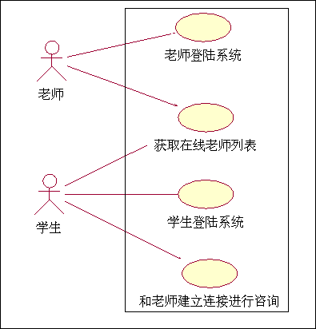
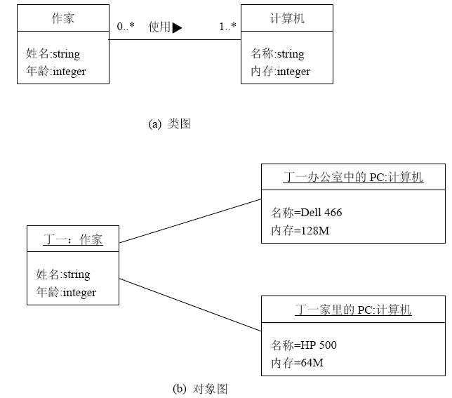
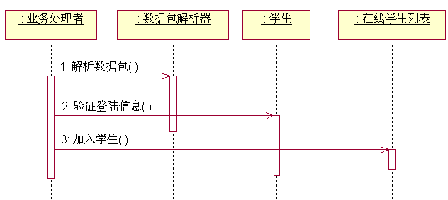
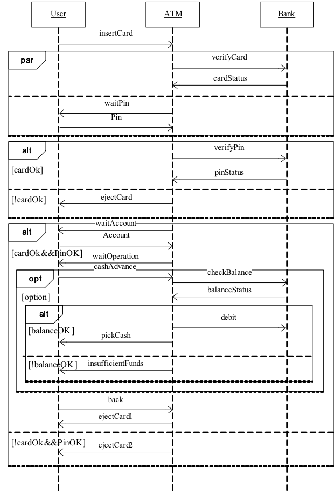
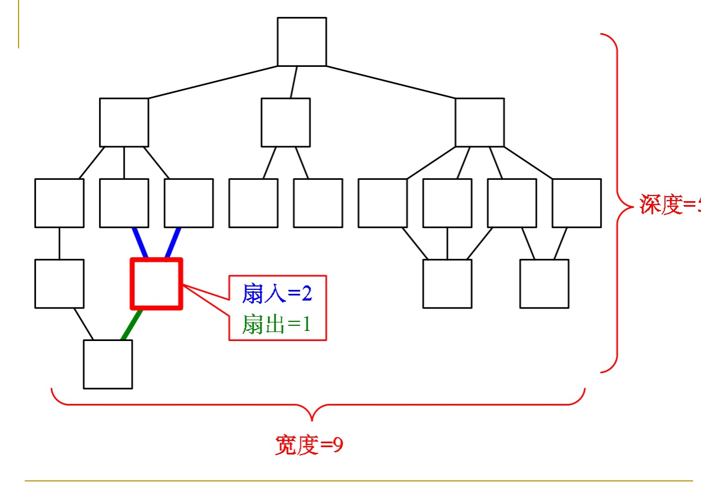

[TOC]

软件工程
=====

## 1、软件工程概念
### 软件工程的定义
《计算机科学技术百科全书》中的定义：软件工程是应用**计算机**科学、**数学**及**管理科学**等原理，开发软件的工程。软件工程借鉴传统工程的原则、方法，以提高质量、降低成本。其中，计算机科学、数学用于构建模型与算法，工程科学用于制定规范、设计范型*paradigm*、评估成本及确定权衡，管理科学用于计划、资源、质量、成本等管理。
### 软件工程的目标
软件工程的目标是：**在给定成本、进度的前提下，开发出具有适用性、有效性、可修改性、可靠性、可理解性、可维护性、可重用性、可移植性、可追踪性、可互操作性和满足用户需求的软件产品**。追求这些目标有助于提高软件产品的质量和开发效率，减少维护的困难。
- 适用性：软件在不同的系统约束条件下，使用户需求得到满足的难易程度。
- 有效性：软件系统能最有效的利用计算机的时间和空间资源。各种软件无不把系统的时/空开销作为衡量软件质量的一项重要技术指标。
- 可修改性：允许对系统进行修改而不增加原系统的复杂性。它支持软件的调试和维护，是一个难以达到的目标
- 可靠性：能防止因概念、设计和结构等方面的不完善造成的软件系统失效，具有挽回因操作不当造成软件系统失效的能力。
- 可理解性：支持软件的维护、移植或重用。
- 可维护性：软件交付使用后，能够对它进行修改，以改正潜伏的错误，改进性能和其它属性，使软件产品适应环境的变化等。软件维护费用在软件开发费用中占有很大的比重。可维护性是软件工程中一项十分重要的目标
- 可重用性：把概念或功能相对独立的一个或一组相关模块定义为一个软部件。可组装在系统的任何位置，降低工作量。
- 可移性：软件从一个计算机系统或环境搬到另一个计算机系统或环境的难易程度。
- 可追踪性：根据软件需求对软件设计、程序进行正向追踪，或根据软件设计、程序对软件需求的逆向追踪能力
- 可互操作性：多个软件元素相互通信并协同完成任务的能力。
### 软件需求包括 3 个不同的层次
- 业务需求：业务需求描述了组织为什么要开发一个系统，即组织希望达到的目标。
- 用户需求：描述的是用户的目标，或用户要求系统必须能完成的任务
- 功能需求：规定开发人员必须在产品中实现的软件功能，用户利用这些功能来完成任务，满足业务需求。
### 软件工程的内容
工程涉及：工序，规范，质量，工具，人(管理)
- 工序：确切的工作步骤
- 规范：描述、表示的标准（图纸），文档规范
- 质量：质量要求，软件质量保证
- 工具：开发、编程工具，集成开发环境
- 人(管理)：项目管理
### 两大类开发方法：
- 一、实用软件工程方法：结构化方法，面向对象方法
- 二、形式化开发方法：采用严格的数学语言，具有精确的数学语义的方法，都称为形式化方法。有限状态机、Petri 网、进程代数、一阶逻辑、时态逻辑、Z方法、VDM、Larch
### 软件危机
它是指在计算机软件开发和维护过程中所遇到的一系列严重问题。概括地讲：
- 怎样满足对软件日益增长的需求（即如何开发软件）
- 如何维护数量不断膨胀的已有软件
#### 产生软件危机有二个方面：
一方面与软件本身的特点有关。
一方面与软件开发与维护的方法不正确有关。
- 客观：软件本身特点
  - 逻辑部件
  - 规模庞大
- 主观：不正确的开发方法
- 忽视需求分析
- 软件开发=程序编写
- 轻视软件维护
#### 软件危机的解决途径
- 组织管理
- 工程项目管理方法
- 技术措施
- 软件开发技术与方法
- 软件工具
### 软件工程的代表性本质特征
- 控制复杂性、
- 总是变化、
- 效率、
- 合作、
- 有效支持用户、
- 不同文化背景
### 软件工程是一门工程性的学科，其目标主要是成功地建造一个大型软件系统。包括：
- 付出较低的开发成本；
- 达到要求的软件功能；
- 取得较好的软件性能；
- 开发的软件易于移植；
- 需要较低的维护费用；
- 能按时完成开发任务，
- 及时交付使用；
- 开发的软件可靠性高。
### 软件工程面临的主要问题是：
- 软件费用
- 软件可靠性
- 软件维护
- 软件生产率
- 软件重用
- 软件安全
## 2、可行性研究
### 可行性研究的任务
可行性研究的目的就是用最小代价在尽可能短的时间内确定问题是否能够解决。

#### 可行性研究应从以下四个方面来分析:
- 技术可行性：使用现有技术能实现这个系统吗？
- 经济可行性：该系统的经济效益能超过他的开发成本吗？
- 操作可行性：系统的操作方式在这个用户组织内行的通吗？
- 法律可行性：系统的使用在法律允许的范围内码？

可行性研究需要的时间长短取决于工程的规模，可行性研究的成本只是预算成本的5%-7%。
### 可行性研究的过程
#### 复查系统规模和目标
该步骤的工作是为确保分析员要解决问题确实是要求他解决的问题。采用的方法是访问关键人员，仔细阅读和分析有关材料。
#### 研究目前正在使用的系统
现有系统是新系统的重要来源，应该仔细阅读分析现有系统，实地考察旧系统，找出旧系统的不足，为新系统的建立提供基础。“**取其精华，去其糟粕**”。但千万不要化费太多时间去了解和描绘现有系统的实现细节。同时应注意了解并记录现有系统和其它系统之间的接口，这是设计新系统的重要约束条件
#### 导出新系统的高层逻辑模型

#### 重新定义问题
新系统的逻辑模型事实上表达了分析员对新系统必须作什麽的看法用户是否认同？因此分析员应与用户一起再次复查问题定义，工程规模和目标。（此次复查应把**数据流图**和**数据字典**作为讨论的基础）。
#### 导出和评价供选择的解法 
- 导出供选择的解法的最简单的途径，是从技术角度出发考虑解决问题的不同方案。
- 当从技术角度提出了一些可能的物理系统之后，应根据技术可行性的考虑，初步排除一些不现实系统。
- 可以考虑操作方面的可行性（根据用户的原则和习惯）。
- 应考虑经济方面的可行性（估计每个开发系统的开发成本和运行费用），另外应根据上述几个方面制定实现进度表，估计生命周期每个阶段的工作量。
#### 推荐行动方针 
部门领导主要根据经济上是否划算决定是否投资于一项工程开发，因此分析员对于所推荐的系统必须进行比较仔细的成本/效益分析
#### 草拟开发计划  
- 工程进度表
- 开发人员及硬件需求情况表
- 开发工期
从而估计系统生命周期每个阶段的成本。草拟开发计划关系到整个系统时是，因此，应尽量准确。
### 2.3 系统流程图
系统流程图是描绘物理系统的传统工具，基本思想是用图形符号以黑盒子的形式描绘系统里面的每个部件（程序，文件，数据库，表格，人工过程）等。
#### 符号
在绘制系统体系结构图时,目前采用了更加贴近现实的符号,而且在制作时,通常调用一种通用软件系统 Visio  4.0.  希望大家能够掌握。
#### 分层
面对复杂的系统，一个比较好的方法是分层次地描绘该系统，这种分层次描绘在后面的内容中给出例子。
### 2.4 数据流图
数据流图描绘系统的逻辑模型，图中没有物理元素，只是描绘信息在系统中流动和处理情况。该图只需考虑系统必须完成的基本逻辑功能，不需要考虑如何具体实现。
#### 符号
- （*）号表示数据流之间是“与”的关系。
- （+）号表示数据流之间是“或”的关系。
- （⊕）号表示只能从中选一个（互斥关系）

数据流图

流图图例

数据流图样例

#### 命名
数据流图中每个成分的命名是否恰当，直接影响数据图的可理解性，给这些成分起名时应该仔细推敲。
##### 为数据流（或数据存贮）命名
- （1）名字应代表整个数据流（或数据存贮）的内容，而不是仅仅反映它的某些成分
- （2）不要用空洞，缺乏具体含义的名字(如“数据”，“信息”，“输入”之 类）
- （3）某个数据流（或数据存储）起名字时遇到了困难，则很可能是因为对数据流图分解不恰当造成，应该重新分解。
##### 为处理起名 
- （1） 通常先为数据流命名，然后再为相关的处理命名。
- （2）名字应该反映整个处理的功能，而不是它的一部分。
- （3）名字最好有一个具体的及物动词，加上一个具体的宾语组成，尽量避免使用“加工”，“处理”等空洞、笼统的动词作名字。
- （4）通常名字中仅包含一个动词，如果必须用两个动词才可能描述整个处理的功能，则把这个处理再分解成两个处理可能更恰当。
- （5）如果在为某个处理命名困难时，则很可能是发现了分解不当的迹象，应当重新分解。
#### 用途
画数据流图的基本目的是利用它作为交流信息的工具，分析员把他对现有系统的认识或对目标系统的设想用数据流图描绘出来，供有关人员审查确认。

一些调查研究表明，如果一张数据流图中包含的处理多于5-9个，人们就难于领会它的含义了。因此数据流图应该分层，也就是把每个主要功能都细化为一张数据流分图，而原有的功能及数据流图用来描绘系统的整体逻辑概貌。
>**数据流图的另一个主要用途是作为分析和设计的工具**  
该图看重描绘系统所完成的功能而不是系统的物理实现方案。当用数据流图辅助物理系统的设计时，以图中不同处理的真实要求为指南。能够在数据流图上画出许多组自动化边界。每组自动化边界可能意味着一个不同的物理系统，因此，可以根据系统的逻辑模型考虑系统的物理实现。  

eg.
家庭安全系统的第1层 DFD

家庭安全系统的第2层 DFD

监控传感器过程细化的第3层 DFD

DFD （data flow diagram）分层数据流图

### 2.5 数据字典（DD，data Dictionary）
数据字典是关于数据的信息的集合，也就是对数据流图中包含的所有元素的定义的集合。

数据流图和数据字典公共构成系统的逻辑模型，没有数据字典，数据流图不严格，反之，没有数据流图数据字典难发挥作用.
#### 数据字典的内容
一般来讲，数据字典由对下列四类元素的定义组成：
- 数据流
- 数据流分量（即：数据元素）
- 数据存储
- 处理  

数据字典的任务是对于数据流图中出现的所有命名元素，包括数据流，加工，数据文件，以及数据的源，终点等，在数据字典中作为一个词条加以定义，假设的每一个图形元素的名字都有一个确切的解释。

数据词典中所有的定义应是严密的，精确的，不可有半点含混，不可有二义性。
- 词条描述对于在数据流图每一个被命名的图形元素，均加以定义，其内容有：
  - 图形元素的名字：某一词条的名字，要求无二义性，为人们所公认；  
  - 别名或编号；
  - 分类：加工，数据流，数据文件，数据元素，数据源，汇点等；
  - 描述：功能，特点；
  - 定义：该词条的组成，数据结构等；
  - 位置：数据流的来源，去处，加工框的编号，输入输出；数据元素在那个数据结构中等。
  - 其他：数据流的数据量，流通量；数据文件的存储方式，存取要求；数据加工的加工顺序，以及外部实体的数量等。
- 数据结构的描述
在数据流图中，数据流和数据文件都具有一定的数据结构。因此必须以一种清晰，准确，无二义的方式描述数据结构。

下表给出在数据词典的定义设中常出现的一些符号
|符号|含义|解释|
|:----:|:----:|----|
|= + […,…] […\|…] {…} m{…}n (…) “…” ..|被定义为 与 或 或 重复 重复 可选 基本数据元素 联结符|例如，x=a+b，表示x由a和b组成 例如，x=[a,b],x=[a\|b],表示x由 a或由b组成 例如，x={a}，表示x由0个或多个a组成 例如，x=3{a}8表示x中至少出现3次a，至多出现8次a 例如，x=(a)，表示a可在x中出现，也可不出现 例如，x=”a”，表示 x为取值为a的数据元素 例如，x=1..9, 表示x可取1到9之中的任意值|
#### 银行取款的数据流图和数据字典
(1)银行取款的数据流图

下边给出了一个银行取款的数据流图。

(2)银行取款的数据字典

    存折 ＝户名＋所号＋开户日＋性质＋ （印密）＋１｛存取行｝５０
    户名 ＝２｛字母｝２４
    所号 ＝“００１”．．“９９９” 
    开户日 ＝年＋月＋日
    性质 ＝“１”．．“６” 
    印密 ＝＂０＂
    存取行 ＝日期＋（摘要）＋支出＋存入＋余额＋操作＋复核
    日期 ＝年＋月＋日   ．．．．．．．．．．
    这表明存折是由６部分组成，第６部分的“存取行”要重复出现多次．如果重复的次数是常数，例如为 50 则可表示为｛存取行｝５０，若存取重复次数是变量，那末要估计其变动范围．例如，存取行从１到５０，则可记为１｛存取行｝５０ ,这种定义方法是自顶向下，逐级给出定义式，直到最后给出基本数据元素为止。
### 2.6 成本／效益分析
#### 2.6.1  成本估计
软件开发成本主要表现为人力消耗（乘以平均工资则得到开发费用）成本估计是精确的科学．下面简单介绍三种估算技术
- １．代码行技术：
一旦估计出源代码行数后，用每行代码的平均成本乘以行数便可确定软件
- ２．任务分解技术：
把软件开发分解为若干个相对独立的任务，再分别估计每个单独的开发任务成本，最后累加起来得出软件开发工程的总成本．估计每个任务的总成本时，通常先估计完成该项任务需要用的人力（以人月为单位），再乘以每人每月的平均工资而得出每个任务的成本．
- ３．自动估计成本技术：
它不太常用，采用这种技术须有长期收集的大量历史数据为基础

简单的成本核算核算方法中应考虑的几个方面：
- １.  硬件投入费用：主要是开发时需投入的硬件购置费用
- ２.  软件人员开发投入费用
- ３.  软件开发平台投入费用
- ４.  调研费用与资料费
- ５.  不可预见费（总经费 5.5 ％）
- ６.  利润 ＊
- ７.  管理费 ＊（总经费 15 ％）
- ８.  运行维护费 ＊ 
- ＊ 表示与对方讨价还价点，是可取舍，是打折的依据．
## 3、需求分析
### 3.1 需求分析概述
需求分析是软件定义时期的最后一个阶段，它的基本任务不是确定系统怎样完成它的工作，而是确定系统必须完成哪些工作，也就是对目标系统提出完整、准确、清晰、具体的要求。并在需求分析阶段结束之前，由系统分析员写出软件需求规格说明书，以书面形式准确地描述软件需求。即： ---- 准确地回答“系统必须做什么?”

在分析软件需求和书写软件需求规格说明书的过程中，分析员和用户都起着关键的、必不可少的作用。    
### 需求分析的基本概念
 1. 什么是软件需求分析？
 2. 软件需求分析的任务是什么？
 3. 需求分析过程/步骤
 4. 软件需求分析方法

- 对系统应该提供的服务和所受到的约束进行理解、分析、建立文档、检验的过程；
- 是系统分析人员和用户共同协商，明确系统的全部功能、性能以及运行规格，并且使用软件开发人员和用户都能理解的语言准确表达出来。

#### 软件需求的重要性
软件需求无疑是当前软件工程中的关键问题，没有需求就没有软件。因而，需求分析是软件开发的基础，所产生的需求规格说明书是以后各阶段开发工作的依据。
#### 需求分析的重要性
- 软件开发的基础和前提
- 最终目标软件系统验收的标准
- 避免或者尽早剔除早期的错误
#### 需求分析的困难
软件需求是软件工程中最复杂的过程之一：
- 应用领域的广泛性，它的实施无疑与各个应用行业的特征密切相关。
- 非功能性需求建模技术的缺乏，及其与功能性需求有着错综复杂的联系，大大增加了需求工程的复杂性。
- 沟通上的困难，由于系统分析员、需求分析员等各方面人员有不同的着眼点和不同的知识背景，给需求工程的实施增加了人为的难度。
#### 需求分析的复杂性和面临的困难
- 片面, 不完全
- 模糊, 不准确
- 不一致, 歧义
- 需求复杂和庞大

>因此必须使用系统的方法、借助于一系列行之有效的技术和工具进行软件需求分析

#### 需求内容一般包括：
- 功能需求
- 性能需求
- 环境需求
- 可靠性需求
- 安全保密要求
- 用户界面需求
- 资源使用需求
- 成本消耗需求
- 开发进度需求
- 预先估计以后系统可能达到的目标

#### 软件需求内容
软件需求
- 用户需求
  - 由客户管理员、用户等提出
- 系统需求
  - 功能需求
    - 它是对系统应该提供的服务、功能以及系统在特定条件下的行为的描述。它与软件系统的类型、使用系统的用户等相关，有时需要详细描述系统的功能、输入/输出、异常等，有时还需要申明系统不应该做什么。 
  - 非功能需求
    - 产品需求
      - 可用性需求
      - 效率需求
        - 性能需求
        - 空间需求
      - 可靠性需求
      - 可移植性需求
    - 机构需求
      - 交付需求
      - 实现需求
      - 标准需求
    - 外部需求
      - 互操作需求
      - 道德需求
      - 立法需求
        - 隐私需求
        - 安全性需求
  - 领域需求
    - 是由软件系统的应用领域所决定的特有的功能需求，或是对功能的约束。

#### 需求分析的任务
- 需求分析的任务
  - 通过对应用问题及其环境的理解和分析，准确、一致和完全地刻划用户需求，形成软件需求规格说明书( SRS: Software Requirement Specification )。
  - 借助于当前系统的逻辑模型导出目标系统的逻辑模型，解决目标系统的 “做什么” 的问题。

#### 需求分析阶段(需求分析过程)的基本活动
- 获取和理解用户需求。深入实际，在充分理解用户需求的基础上，获取系统需求。

- 描述和分析用户需求。进行需求建模、对模型或原型进行分析。

- 对用户需求进行评审。确认需求，进化需求。确保需求说明准确、完整地表达系统的主要特性，且客户的需要总是不断（连续）增长的 ，进化需求是必要的。 

#### 需求分析过程
- 步骤1:获取和理解用户需求阶段
  - 任务
    - 获取并理解用户需求, 清除用户需求的不一致性，模糊性和歧义性，帮助用户发现潜在的需求
  - 原则
    - 和用户进行交流和合作
    - 将对原始问题理解与软件开发经验结合
- 步骤2:描述和分析用户需求阶段
  - 任务
    - 对用户需求进行建模，生成SRS和初步用户手册 
    - SRS:用户需求(功能, 行为, 性能等)
    - 用户手册:如何操作和使用目标软件，界面描述和使用初步构想
  - 原则
    - 确保SRS的完整性、一致性和准确性
    - 鼓励用户参与SRS以及用户手册的制定
    - 尽可能做到SRS结构清晰，措辞准确和简洁
- 步骤3:对用户需求进行评审
  - 任务
    - 多方人员一起对SRS进行复核和评审，以确保用户手册和SRS全面、准确、一致地反映用户需求
  - 原则
    - 支持各方（用户，需求分析人员、设计人员）共同参与评审工作

##### 需求获取(requirements elicitation)
是需求工程的主体。 ——非常困难，主要原因有：
- 缺乏领域知识,应用领域的问题常常是模糊的、不精确的；
- 存在默认的知识,如难以描述的常识问题；
- 存在多个知识源,且多知识源之间可能有冲突；
- 客户可能的偏见，如不能提供或不想告知你所需要了解的事情。
##### 获取需求的方法
- 访谈
- 面向数据流自顶向下求精
- 简易的应用规格说明技术
- 快速建立软件原型

#### 需求分析的方法
- 功能解析法
  - 将一个系统看作由若干功能构成的集合，每个功能又可划分成若干个加工（即子功能），一个加工又进一步可分解成若干个子加工
  - 功能分解法由功能、子加工和功能接口三要素组成
  - 本质是用过程抽象的观点看待系统需求
- 结构化分析法
  - 一种从问题空间到某种表示的映射方法
  - 由数据流图和数据字典组成
  - 适用于数据处理领域的问题
- 信息建模法
  - 从数据角度对现实世界进行建模
  - 基本工具是E-R图，由实体、属性和联系三个基本要素组成
  - E-R图中，数据不封闭，没有继承性和消息传递机制
- 面向对象分析法
  - 是把E-R图中的概念与面向对象程序设计语言中的主要概念结合起来形成的一种分析方法
  - 既采用实体、属性、关系等信息建模方法中的概念，又采用了封闭、类结构和继承性等面向对象程序设计语言中的概念

### 3.2 结构化分析法
- 一种面向数据流的传统软件开发方法
- 以数据流为中心构建软件的分析模型和设计模型
- 分为：
  - 结构化分析(Structured Analysis，SA)
  - 结构化设计(Structured Design，SD)
  - 结构化程序设计(Structured Programming，SP)

#### 结构化分析（SA）概述
1. 自顶向下逐层分解的分析策略
- 基本思想：抽象与自顶向下的逐层分解(控制复杂性的两个基本手段)
    - 抽象：在每个抽象层次上忽略问题的内部复杂性，只关注整个问题与外界的联系
    - 分解：将问题不断分解为较小的问题，直到每个最底层的问题都足够简单为止

结构化分析方法中的抽象与分解
- 抽象：从作为整体的软件系统开始(顶层),每一抽象层次上只关注于系统的输入输出
- 分解：将系统不断分解为子系统、模块……
- 随着分解层次的增加，抽象的级别越来越低，也越接近问题的解(算法和数据结构)

 结构化分析过程
- 理解当前的现实环境，获得当前系统的具体模型(物理模型)
- 从当前系统的具体模型抽象出当前系统的逻辑模型
- 分析目标系统与当前系统逻辑上的差别，建立目标系统的逻辑模型
- 为目标系统的逻辑模型作补充

2. 结构化分析工具
- 数据流图（Data Flow Diagram, DFD）。用于描述系统分解，即描述系统由哪些部分组成，各部分间有什么联系等。
- 数据字典（Data Dictionary, DD）。用于定义数据流图中的数据和加工。
- 加工规格描述（Process Specification, PS）。描述加工逻辑的结构化语言、判定树、判定表等，是描述数据流图中不能被再分解的每一个基本加工的处理逻辑。

- 数据字典是模型的核心，包含软件使用和产生所有数据的描述。
- 数据流图：用于功能建模，描述系统的输入数据流如何经过一系列的加工变换逐步变换成系统的输出数据流。
- ER图：用于数据建模，描述数据字典中数据之间的关系。
- 状态转换图：用于行为建模，描述系统接收哪些外部事件，以及在外部事件的作用下的状态迁移情况。

3. SA分析步骤
- 建立当前系统的物理模型
- 抽象出当前系统的逻辑模型
  - 去掉模型中非本质因素，抽取本质因素（固有的，不依赖运行环境变化而变化的因素）
- 建立目标系统的逻辑模型
  - 分析比较目标系统与当前系统逻辑上的差别，将改变的部分抽象为一个加工
- 作进一步补充和优化
#### 数据流图 DFD
数据流图（Data Flow Diagram，简称DFD）是结构化系统分析的主要工具，它能图形化地显示出系统中数据的使用，表达数据在系统内部的逻辑流向以及系统的逻辑功能和数据的逻辑变换

数据流图有四种基本符号：数据源、数据流、加工和数据存储

数据流的画法示例

#### 数据流图的建立—自顶向下扩展
方法：先用少数几个处理过程高度概括、抽象地描述整个系统的逻辑功能，然后针对处理过程逐步地分解、扩展，从而详细地加以描述。

数据流图可在不同的层次上描述，以表示系统在该层的内容。

建立方法：
- 决定系统或处理过程的范围，即通过输入、输出数据确定系统的边界或处理过程的范围。
- 决定系统或处理过程内部的细节，并加以描述。

#### 分层数据流图的审查
- 检查图中是否存在错误或不合理(不理想)的部分
  - 一致性：分层DFD中不存在矛盾和冲突
  - 完整性：分层DFD本身的完整性，即是否有遗漏的数据流、加工等元素
- 可从分层DFD的一致性和完整性、构造分层DFD时需注意的问题以及分解程度等几个方面来说明如何审查分层DFD的合理性

#### 分层数据流图的一致性
- 父图与子图平衡        
  - 任何一张DFD子图边界上的输入/输出数据流必须与其父图中对应的加工的输入/输出数据流保持一致
- 数据守恒
  - 一个加工所有输出数据流中的数据，必须能从该加工的输入数据流中直接获得，或者能通过该加工的处理而产生
  - 多余的数据流：加工未使用其输入数据流中的某些数据项 
- 局部文件         
- 一个加工的输出数据流不能与该加工的输入数据流同名
#### 分层数据流图的完整性
- 每个加工至少有一个输入数据流和一个输出数据流
- 在整套分层数据流中，每个文件应至少有一个加工读该文件，有另一个加工写该文件
- 分层数据流图中的每个数据流和文件都必须命名(除了流入或流出文件的数据流)，并保持与数据字典的一致 
- 分层DFD中的每个基本加工(即不再分解子图的加工)都应有一个加工规约

## 4、统一建模语言UML
### 建模方法
- OOA (Object Oriented Analysis)
  - 面向对象的分析 
  - 把系统分解为实体及其关系
- OOD (Object Oriented Design)
  - 面向对象的设计 
  - 解决实体与关系如何实现的问题

- 基于UML的建模方法

### UML
- UML中文：统一建模语言；
- UML全称：Unified Modeling Language；
- UML是一种定义良好、易于表达、功能强大的建模语言；
- UML使用图形和文字来传递信息；
- UML是一种对软件系统进行可视化表示、描述、构造和文档化的标准建模语言；
- UML 并不是一种面向对象的开发方法，而是一种可视化的面向对象建模语言；
- UML 把建模语言与开发过程明确进行了分离，专注于建模语言。

### UML能为我们做什么
- UML可用于软件需求分析；
- UML可用于软件开发设计；
- UML可用于系统部署设计；
- UML也适用于非软件领域的系统建模，如企业机构或业务过程，以及处理复杂数据的信息系统、具有实时要求的工业系统或工业过程等。 

### UML中的图
- **用例图**
- 静态图（**类图**，**对象图**，包图）
- 行为图（**状态图**，**活动图**）
- 交互图（**顺序图**，**协作图**）
- 实现图（组件图，部署图）

对于：
- 对需求建模
  - 用例图：从用户角度描述系统的行为
  - 类图：显示一组类、接口、协作及它们之间的关系
  - 对象图：显示一组对象及它们之间的关系
- 对结构建模
  - 组件图：显示一组组件之间的组织和依赖关系
  - 部署图：显示对运行时处理节点以及其中的组件的配置
  - 类图、对象图
- 对行为建模
  - 顺序图：注重于消息的时间次序
  - 协作图：注重于收发消息的对象的结构组织
  - 状态图：注重于由事件驱动的对象状态变化序列
  - 活动图：注重于从活动到活动的控制流程
#### 用例图
用例图描述系统提供的功能单元。
- 参与者
- 用例
- 关联关系
- 包含关系
- 扩展关系
- 泛化关系

用例建模的步骤

#### 类图
类图表示不同的实体（人、事物和数据）之间的关系；换句话说，它显示了系统的静态结构。 
- 类
- 泛化关系
- 实现关系
- 依赖关系
- 关联关系：聚合、组合

通信协议中的数据包定义

老师和学生类的抽象

#### 对象图
UML中对象图与类图具有相同的表示形式。对象图可以看作是类图的一个实例，对象是类的实例；对象之间的链(Link)是类之间关联的实例。对象的图示方法与类的图示方法几乎一样，主要差别在于对象的名字下面要加下划线。链的图形表示与关联相似。对象图常用于表示复杂的类图的一个实例。

对象名有下列三种表示格式：
1. 对象名类名 
2. 类名
3. 对象名 

#### 包图
包图能将复杂系统拆分成多个简单的系统。

- 包
- 依赖

系统的顶层包结构

老师在线答疑系统包结构图

#### 状态图
状态图表示某个类所具有的不同状态和状态转移时的触发条件。 
- 状态（States）
- 转移（Transitions）
- 动作（State Actions）
- 自身转移（Self-Transitions）
- 组合状态（Compound States）
- 进入节点（Entry Point）
- 退出节点（Exit Point）
- 历史状态（History States）
- 并发区域（Concurrent Regions）

老师在线状态图

迁移

#### 活动图
活动图用来描述工作的流程，对并行的工作流程能很好的支持。
1. 活动状态（Activity）                            
2. 动作状态（Actions)                               
3. 动作状态约束（Action Constraints） 
4. 动作流（Control Flow）                       
5. 开始节点（Initial Node）                     
6. 终止节点（Final Node）                      
7. 对象（Objects）    
8. 数据存储对象（DataStore）  
9. 对象流（Object Flows）  
10. 分支与合并                           
11. 分叉与汇合
12. 异常处理
13. 活动中断区域
14. 泳道

老师登陆系统

订单

#### 活动图与流程图的区别 
1. 流程图着重描述处理过程，它的主要控制结构是顺序、分支和循环，各个处理过程之间有严格的顺序和时间关系 活动图描述的是对象活动的顺序关系所遵循的规则，它着重表现的是系统的行为，而非系统的处理过程。 
2. 活动图能够表示并发活动的情形，而流程图不能。 
3. 活动图是面向对象的，而流程图是面向过程的。 

#### 顺序图
顺序图用来描述对象之间动态的交互关系，着重体现对象间消息传递的时间顺序。 

- 生命线
- 对象
- 消息
- 参与者
- 组合片段

学生登陆系统顺序图

ATM顺序图

#### 顺序图与用例图和类图的关系

#### 协作图
协作图用于描述相互合作的对象间的交互关系和链接关系。虽然顺序图和协作图都用来描述对象间的交互关系，但侧重点不一样。顺序图着重体现交互的时间顺序，协作图则着重体现交互对象间的静态链接关系。
- 对象
- 消息
- 链接 

#### 组件图
组件图显示软件组件之间的依赖关系。一般来说，软件组件就是一个实际文件，可以是源代码文件、二进制代码文件和可执行文件等。可以用来显示编译、链接或执行时组件之间的依赖关系。
- 组件
- 依赖 

老师在线答疑系统组件图

#### 部署图
部署图显示系统运行时刻的结构，显示系统不同的组件在何处物理地运行，以及它们将如何彼此通信。

- 结点
- 连接 

老师在线答疑系统部署图

#### 总结
- 在软件需求分析阶段我们可以使用用例图、类图、对象图来表达需求设计；
- 在软件设计阶段可以使用类图，包图、顺序图、协作图、状态图和活动图；
- 在系统的连调和部署阶段可以使用组件图和部署图来进行设计。

## 5、总体设计
### 5.1  设计过程
由两个主要阶段组成：
- 系统设计阶段，确定系统的具体实现方案
  - 设想供选择的方案
  - 选取合理的方案
  - 推荐最佳方案
- 结构设计阶段，确定软件结构
  - 功能分解
  - 设计软件结构
  - 设计数据库
  - 制定测试计划
  - 书写文档
  - 审查和复审

典型的总体设计过程包括下述9个步骤：
1. 设想供选择的方案
根据需求分析阶段得出的数据流图考虑各种可能的实现方案，力求从中选出最佳方案。
2. 选取合理的方案
从前一步得到的一系列供选择的方案中选取若干个合理的方案。对每个合理的方案分析员都应该准备下列4份资料：
- 系统流程图；
- 组成系统的物理元素清单；
- 成本/效益分析；
- 实现这个系统的进度计划。
3. 推荐最佳方案
分析员应该综合分析对比各种合理方案的利弊，推荐一个最佳的方案，并且为推荐的方案制定详细的实现计划。
4. 功能分解
- 首先进行结构设计，然后进行过程设计。
- 结构设计确定程序由哪些模块组成，以及这些模块之间的关系；过程设计确定每个模块的处理过程。
- 结构设计是总体设计阶段的任务，过程设计是详细设计阶段的任务。
5. 设计软件结构
- 通常程序中的一个模块完成一个适当的子功能。应该把模块组织成良好的层次系统。软件结构可以用层次图或结构图来描绘。
- 如果数据流图已经细化到适当的层次，则可以直接从数据流图映射出软件结构，这就是**面向数据流的设计方法**。
6. 设计数据库
对于需要使用数据库的那些应用系统，软件工程师应该在需求分析阶段所确定的系统数据需求的基础上，进一步设计数据库。
7. 制定测试计划
在软件开发的早期阶段考虑测试问题，能促使软件设计人员在设计时注意提高软件的可测试性。
8. 书写文档
应该用正式的文档记录总体设计的结果，在这个阶段应该完成的文档通常有下述几种：
(1) 系统说明； 
(2) 用户手册；
(3) 测试计划； 
(4) 详细的实现计划；
(5) 数据库设计结果。
9. 审查和复审
最后应该对总体设计的结果进行严格的技术审查和管理复审。 

### 5.2  设计原理
#### 5.2.1  模块化
- 模块：是由边界元素限定的相邻程序元素的序列，而且有一个总体标识符代表它。
- 模块化：就是把程序划分成独立命名且可独立访问的模块，每个模块完成一个子功能，把这些模块集成起来构成一个整体，可以完成指定的功能满足用户的需求。 

为什么要模块化？
- 模块化是为了使一个复杂的大型程序能被人的智力所管理，软件应该具备的惟一属性。
- 如果一个大型程序仅由一个模块组成，它将很难被人所理解。 

模块化的根据： 
- 如果$C(P1)>C(P2)$，显然$E(P1)>E(P2)$
- 根据人类解决一般问题的经验，$$C(P1+P2)>C(P1)+C(P2)$$
- 综上所述得到下面的不等式:$$E(P1+P2)>E(P1)+E(P2)$$
- 每个程序都相应地有一个最适当的模块数目M，使得系统的开发成本最小。 

评价一种设计方法定义模块能力的五条标准：
- 模块可分解性
- 模块可组装性 
- 模块可理解性
- 模块连续性 
- 模块保护性

模块化的作用：
- 采用模块化原理可以使软件结构清晰，不仅容易设计也容易阅读和理解。
- 模块化使软件容易测试和调试，因而有助于提高软件的可靠性。
- 模块化能够提高软件的可修改性。
- 模块化也有助于软件开发工程的组织管理。 

#### 5.2.2 抽象
- 抽象：现实世界中一定事物、状态或过程之间总存在着某些相似的方面(共性)。把这些相似的方面集中和概括起来，暂时忽略它们之间的差异，这就是抽象。
- 抽象就是抽出事物本质特性而暂时不考虑细节。
- “抽象是人类处理复杂问题的基本方法之一。” ——Grady Boach

一般抽象过程：
- 处理复杂系统的惟一有效的方法是用层次的方式构造和分析它。
- 一个复杂的动态系统首先可以用一些高级的抽象概念构造和理解，这些-高级概念又可以用一些较低级的概念构造和理解，如此进行下去，直至最低层次的具体元素。 
- 例：过程抽象、数据抽象

软件工程抽象过程：
- 软件工程过程的每一步都是对软件解法的抽象层次的一次精化。
- 在可行性研究阶段，软件作为系统的一个完整部件；
- 在需求分析期间，软件解法是使用在问题环境内熟悉的方式描述的；
- 当由总体设计向详细设计过渡时，抽象的程度也就随之减少了；
- 最后，当源程序写出来以后，也就达到了抽象的最低层。 

#### 5.2.3  逐步求精
- 逐步求精：为了能集中精力解决主要问题而尽量推迟对问题细节的考虑。逐步求精是人类解决复杂问题时采用的基本方法，也是许多软件工程技术的基础。
- Miller法则：一个人在任何时候都只能把注意力集中在（7±2）个知识块上。 

逐步求精的作用：
- 它能帮助软件工程师把精力集中在与当前开发阶段最相关的那些方面上，而忽略那些对整体解决方案来说虽然是必要的，然而目前还不需要考虑的细节。
- 逐步求精方法确保每个问题都将被解决，而且每个问题都将在适当的时候被解决，但是，在任何时候一个人都不需要同时处理7个以上知识块。 

Wirth本人对逐步求精策略的概括说明：
- 我们对付复杂问题的最重要的办法是抽象，因此，对一个复杂的问题不应该立刻用计算机指令、数字和逻辑符号来表示，而应该用较自然的抽象语句来表示，从而得出抽象程序。
- 抽象程序对抽象的数据进行某些特定的运算并用某些合适的记号（可能是自然语言）来表示。对抽象程序做进一步的分解，并进入下一个抽象层次，这样的精细化过程一直进行下去，直到程序能被计算机接受为止。这时的程序可能是用某种高级语言或机器指令书写的。

#### 5.2.4  信息隐藏和局部化
- 信息隐藏：应该这样设计和确定模块，使得一个模块内包含的信息(过程和数据)对于不需要这些信息的模块来说，是不能访问的。
- 局部化：局部化的概念和信息隐藏概念是密切相关的。所谓局部化是指把一些关系密切的软件元素物理地放得彼此靠近。显然，局部化有助于实现信息隐藏。 

信息隐藏和局部化的作用：
- “隐藏”意味着有效的模块化可以通过定义一组独立的模块而实现，这些独立的模块彼此间仅仅交换那些为了完成系统功能而必须交换的信息。
- 使用信息隐藏原理作为模块化系统设计的标准就会带来极大好处。因为绝大多数数据和过程对于软件的其他部分而言是隐藏的，在修改期间由于疏忽而引入的错误就很少可能传播到软件的其他部分。 

#### 5.2.5  模块独立
模块独立：
- 模块独立的概念是模块化、抽象、信息隐藏和局部化概念的直接结果。
- 希望这样设计软件结构，使得每个模块完成一个相对独立的特定子功能，并且和其他模块之间的关系很简单。 

模块独立的重要性：
- 有效的模块化(即具有独立的模块)的软件比较容易开发出来。这是由于能够分割功能而且接口可以简化，当许多人分工合作开发同一个软件时，这个优点尤其重要。
- 独立的模块比较容易测试和维护。这是因为相对说来，修改设计和程序需要的工作量比较小，错误传播范围小，需要扩充功能时能够“插入”模块。

模块独立程度的两个定性标准度量：
- 耦合衡量不同模块彼此间互相依赖(连接)的紧密程度。耦合要低，即每个模块和其他模块之间的关系要简单；
- 内聚衡量一个模块内部各个元素彼此结合的紧密程度。内聚要高，每个模块完成一个相对独立的特定子功能。 

1. 耦合
- 耦合：是对一个软件结构内不同模块之间互连程度的度量。
- 要求：在软件设计中应该追求尽可能松散耦合的系统。
- 可以研究、测试或维护任何一个模块，而不需要对系统的其他模块有很多了解；
- 模块间联系简单，发生在一处的错误传播到整个系统的可能性就很小；
- 模块间的耦合程度强烈影响系统的可理解性、可测试性、可靠性和可维护性。 

耦合程度的度量：
- 非直接耦合/完全独立(no direct coupling)
  - 如果两个模块中的每一个都能独立地工作而不需要另一个模块的存在，那么它们完全独立。
  - 在一个软件系统中不可能所有模块之间都没有任何连接。

- 数据耦合(data coupling)
  - 如果两个模块彼此间通过参数交换信息，而且交换的信息仅仅是数据，那么这种耦合称为数据耦合。

评价：
- 系统中至少必须存在这种耦合。一般说来，一个系统内可以只包含数据耦合。
- 数据耦合是理想的目标。
维护更容易，对一个模块的修改不会是另一个模块产生退化错误。 

- 控制耦合(control coupling)
  - 如果两个模块彼此间传递的信息中有控制信息，这种耦合称为控制耦合。 

评价：
- 控制耦合往往是多余的，把模块适当分解之后通常可以用数据耦合代替它。
- 被调用的模块需知道调用模块的内部结构和逻辑，降低了重用的可能性 。

- 特征耦合(stamp coupling)
  - 当把整个数据结构作为参数传递而被调用的模块只需要使用其中一部分数据元素时，就出现了特征耦合。

评价：
- 被调用的模块可使用的数据多于它确实需要的数据，这将导致对数据的访问失去控制，从而给计算机犯罪提供了机会。
- 无论何时把指针作为参数进行传递，都应该仔细检查该耦合。

- 公共环境耦合(common coupling)
- 当两个或多个模块通过一个公共数据环境相互作用时，它们之间的耦合称为公共环境耦合。公共环境可以是全程变量、共享的通信区、内存的公共覆盖区、任何存储介质上的文件、物理设备等等。

公共环境耦合的类型： 
- 一个模块往公共环境送数据，另一个模块从公共环境取数据。数据耦合的一种形式，是比较松散的耦合。
- 两个模块都既往公共环境送数据又从里面取数据，这种耦合比较紧密，介于数据耦合和控制耦合之间。

评价：
- 与结构化编程矛盾，生成的代码完全不可读。
- 如果在一个模块中对一个全局变量的声明进行修改，必须修改能够访问该全局变量的每一个模块。
- 公共环境耦合的模块难于重用，必须提供一个全局变量的清单。
- 即使模块本身不改变，它和产品中其他模块之间公共环境耦合的实例数也会变化非常大。
- 潜在危险很大。模块暴露出必需要更多的数据，难以控制数据存取，而且会导致计算机犯罪。
- 有些情况下公共环境耦合更好。 

内容耦合(content coupling)
- 最高程度的耦合是内容耦合。如果出现下列情况之一，两个模块间就发生了内容耦合：
  - 一个模块访问另一个模块的内部数据；
  - 一个模块不通过正常入口转到另一个模块的内部；
  - 两个模块有一部分程序代码重叠；
  - 一个模块有多个入口。 

##### 耦合是影响软件复杂程度的一个重要因素。
- 尽量使用数据耦合，
- 少用控制耦合和特征耦合，
- 限制公共环境耦合的范围，       
- 完全不用内容耦合。 

2. 内聚
- 内聚：标志一个模块内各个元素彼此结合的紧密程度，它是信息隐藏和局部化概念的自然扩展。简单地说，理想内聚的模块只做一件事情。
- 要求：设计时应该力求做到高内聚，通常中等程度的内聚也是可以采用的，而且效果和高内聚相差不多；但是，低内聚不要使用。
- 内聚和耦合是密切相关的，模块内的高内聚往往意味着模块间的松耦合。实践表明内聚更重要，应该把更多注意力集中到提高模块的内聚程度上。 

内聚程度的度量：

(1) 偶然内聚(coincidental cohesion)

如果一个模块完成一组任务，这些任务彼此间即使有关系，关系也是很松散的，就叫做偶然内聚。

评价：
- 模块内各元素之间没有实质性联系，很可能在一种应用场合需要修改这个模块，在另一种应用场合又不允许这种修改，从而陷入困境；
- 可理解性差，可维护性产生退化；
- 模块是不可重用的。

解决方案：
- 将模块分成更小的模块，每个小模块执行一个操作。

(2) 逻辑内聚(logical cohesion)

如果一个模块完成的任务在逻辑上属于相同或相似的一类，则称为逻辑内聚。

评价：
- 接口难以理解，造成整体上不易理解；
完成多个操作的代码互相纠缠在一起，即使局部功能的修改有时也会影响全局，导致严重的维护问题；
- 难以重用。

解决方案：
- 模块分解。 

(3) 时间内聚(temporal cohesion)

如果一个模块包含的任务必须在同一段时间内执行，就叫时间内聚。

评价：
- 时间关系在一定程度上反映了程序某些实质，所以时间内聚比逻辑内聚好一些。
- 模块内操作之间的关系很弱，与其他模块的操作却有很强的关联。
- 时间内聚的模块不太可能重用。 

(4) 过程内聚(procedural cohesion)

- 如果一个模块内的处理元素是相关的，而且必须以特定次序执行，则称为过程内聚。
- 使用程序流程图作为工具设计软件时，常常通过研究流程图确定模块的划分，这样得到的往往是过程内聚的模块。 

评价：
- 比时间内聚好，至少操作之间是过程关联的。
- 仍是弱连接，不太可能重用模块。

解决方案：
- 分割为单独的模块，每个模块执行一个操作。

(5) 通信内聚(communicational cohesion)
- 如果模块中所有元素都使用同一个输入数据和(或)产生同一个输出数据，则称为通信内聚。即在同一个数据结构上操作。

评价：
- 模块中各操作紧密相连，比过程内聚更好。
- 不能重用。

解决方案：
- 分成多个模块，每个模块执行一个操作。

(6) 顺序内聚(sequential cohesion)
- 如果一个模块内的处理元素和同一个功能密切相关，而且这些处理必须顺序执行，则称为顺序内聚。

评价：
- 根据数据流图划分模块时，通常得到顺序内聚的模块，这种模块彼此间的连接往往比较简单。 

(7) 功能内聚(functional cohesion)
- 如果模块内所有处理元素属于一个整体，完成一个单一的功能，则称为功能内聚。功能内聚是最高程度的内聚。
评价：
- 模块可重用，应尽可能重用；
- 可隔离错误，维护更容易；
- 扩充产品功能时更容易。

七种内聚的优劣评分结果：
- 高内聚：
  - 功能内聚     10分
  - 顺序内聚	  9分		
- 中内聚：
  - 通信内聚	    7分		
  - 过程内聚	    5分
- 低内聚：
  - 时间内聚	    3分
  - 逻辑内聚	    1分
  - 偶然内聚	    0分

设计时力争做到高内聚，并且能够辨认出低内聚的模块。 

### 5.3  启发规则
1. 改进软件结构提高模块独立性
- 通过模块分解或合并，降低耦合提高内聚。
- 两个方面： 
  - 模块功能完善化。一个完整的模块包含：
    - 执行规定的功能的部分
    - 出错处理的部分
    - 返回一个“结束标志”
  - 消除重复功能，改善软件结构。
    - 完全相似
    - 局部相似
  

2. 模块规模应该适中
- 经验表明，一个模块的规模不应过大，最好能写在一页纸内。通常规定50~100行语句，最多不超过500行。数字只能作为参考，根本问题是要保证模块的独立性。
- 过大的模块往往是由于分解不充分，但是进一步分解必须符合问题结构，一般说来，分解后不应该降低模块独立性。
- 过小的模块开销大于有效操作，而且模块数目过多将使系统接口复杂。

3. 深度、宽度、扇出和扇入都应适当
- 深度：软件结构中控制的层数，它往往能粗略地标志一个系统的大小和复杂程度。
- 宽度：软件结构内同一个层次上的模块总数的最大值。
- 扇出：一个模块直接控制(调用)的模块数目。
- 扇入：有多少个上级模块直接调用它。

4. 模块的作用域应该在控制域之内
- **模块的作用域**：定义为受该模块内一个判定影响的所有模块的集合。
- **模块的控制域**：是这个模块本身以及所有直接或间接从属于它的模块的集合。 
- 在一个设计得很好的系统中，所有受判定影响的模块应该都从属于做出判定的那个模块，最好局限于做出判定的那个模块本身及它的直属下级模块。

解决方案：
- 把模块A中的判定移到模块M中；
- 把模块G移到模块A下面，作为他的下级模块。 

5. 力争降低模块接口的复杂程度
模块接口复杂是软件发生错误的一个主要原因。应该仔细设计模块接口，使得信息传递简单并且和模块的功能一致。
例：解一元二次方程的函数
- QUAD_ROOT(TBL,X)----X
  - 其中数组TBL传送方程的系数
  - 数组X送回求得的根
- QUAD_ROOT(A,B,C,ROOT1,ROOT2)-----J

6. 设计单入口单出口的模块
- 警告软件工程师不要使模块间出现内容耦合。当从顶部进入模块并且从底部退出来时，软件是比较容易理解的，因此也是比较容易维护的。

1. 模块功能应该可以预测
- 模块的功能应该能够预测，但也要防止模块功能过分局限。
- 功能可预测：如果一个模块可以当做一个黑盒子，只要输入的数据相同就产生同样的输出，这个模块的功能就是可以预测的。

### 5.4  描绘软件结构的图形工具
#### 5.4.1  层次图和HIPO图
1. 层次图(H图)
层次图用来描绘软件的层次结构。很适于在自顶向下设计软件的过程中使用。

2. HIPO图
- HIPO图是美国IBM公司发明的“层次图+输入/处理/输出图”的英文缩写。
- 为了能使HIPO图具有可追踪性，在H图(层次图)里除了最顶层的方框之外，每个方框都加了编号。

和H图中每个方框相对应，应该有一张IPO图描绘这个方框代表的模块的处理过程。模块在H图中的编号便于追踪了解这个模块在软件结构中的位置。

#### 5.4.2  结构图
- Yourdon提出的结构图是进行软件结构设计的另一个有力工具。结构图和层次图类似，也是描绘软件结构的图形工具。

基本符号：
- 方框代表一个模块；
- 方框之间的直线表示模块的调用关系；
- 尾部是空心圆箭头表示传递的是数据；
- 尾部实心圆箭头表示传递的是控制信息。 

注意：
- 层次图和结构图并不严格表示模块的调用次序，多数人习惯按调用次序从左到右画模块；
- 层次图和结构图并不指明何时调用下层模块；
- 层次图和结构图只表明一个模块调用哪些模块，没有表示模块内还有没有其他成分；
- 通常用层次图作为描绘软件结构的文档；
- 由层次图导出结构图的过程，可以作为检查设计正确性和评价模块独立性的好方法。

### 5.5  面向数据流的设计方法

- 面向数据流的设计方法定义了一些不同的“映射”，利用这些映射可以把数据流图变换成软件结构。
- 因为任何软件系统都可以用数据流图表示，所以面向数据流的设计方法理论上可以设计任何软件的结构。通常所说的结构化设计方法(简称SD方法)，也就是基于数据流的设计方法。 

#### 5.5.1  概念
- 面向数据流的设计方法把信息流映射成软件结构，信息流的类型决定了映射的方法。
- 信息流有两种类型：
  - 变换流
  - 事务流

1. 变换流
信息沿输入通路进入系统，同时由外部形式变换成内部形式，进入系统的信息通过变换中心，经加工处理以后再沿输出通路变换成外部形式离开软件系统。

2. 事务流
- 数据沿输入通路到达一个处理T，T根据输入数据的类型在若干个动作序列中选出一个来执行。处理T称为事务中心，它完成下述任务：
  - 接收输入数据；
  - 分析每个事务以确定它的类型；
  - 根据事务类型选取一条活动通路。 

3. 设计过程 

#### 5.5.2  变换分析
变换分析是一系列设计步骤的总称，经过这些步骤把具有变换流特点的数据流图按预先确定的模式映射成软件结构。

设计步骤：

- (1) 复查基本系统模型
确保系统的输入数据和输出数据符合实际。
- (2) 复查并精化数据流图
对需求分析阶段得出的数据流图认真复查，并且在必要时进行精化。
不仅要确保数据流图给出了目标系统的正确的逻辑模型，而且应该使数据流图中每个处理都代表一个规模适中相对独立的子功能。 
- (3) 确定数据流图具有变换特性还是事务特性
一个系统中的所有信息流都可以认为是变换流，但是，当遇到有明显事务特性的信息流时，建议采用事务分析方法进行设计。确定数据流的全局特性和局部特性。
- (4) 确定输入流和输出流的边界，从而孤立出变换中心
输入流和输出流的边界和对它们的解释有关，不同设计人员可能会在流内选取稍微不同的点作为边界的位置。
- (5) 完成“第一级分解”。
  - 位于软件结构最顶层的控制模块Cm协调下述从属的控制功能：
    - 输入信息处理控制模块Ca,协调对所有输入数据的接收；
    - 变换中心控制模块Ct,管理对内部形式的数据的所有操作；
    - 输出信息处理控制模块Ce，协调输出信息的产生过程。 

第一级分解方法

- (6) 完成“第二级分解”
  - 处理映射成软件结构中一个适当的模块。完成第二级分解的方法是：
    - 从变换中心的边界开始沿着输入通路向外移动，把输入通路中每个处理映射成软件结构中Ca控制下的一个低层模块；
    - 然后沿输出通路向外移动，把输出通路中每个处理映射成直接或间接受模块Ce控制的一个低层模块；
    - 最后把变换中心内的每个处理映射成受Ct控制的一个模块。

- (7) 使用设计度量和启发式规则对第一次分割得到的软件结构进一步精化
  - 为了产生合理的分解，得到尽可能高的内聚、尽可能松散的耦合，为了得到一个易于实现、易于测试和易于维护的软件结构，应该对初步分割得到的模块进行再分解或合并。

#### 5.5.3  事务分析
- 虽然在任何情况下都可以使用变换分析方法设计软件结构，但是在数据流具有明显的事务特点时，也就是有一个明显的“发射中心”(事务中心)时，还是以采用事务分析方法为宜。 
- 事务分析的设计步骤和变换分析的设计步骤大部分相同或类似，主要差别仅在于由数据流图到软件结构的映射方法不同：
  - 由事务流映射成的软件结构包括一个接收分支和一个发送分支；
  - 映射出接收分支结构的方法和变换分析映射出输入结构的方法很相像，即从事务中心的边界开始，把沿着接收流通路的处理映射成模块；
  - 发送分支的结构包含一个调度模块，它控制下层的所有活动模块；然后把数据流图中的每个活动流通路映射成与它的流特征相对应的结构

## 6、详细设计
### 6.1  结构程序设计
### 6.2  人机界面设计
### 6.3  过程设计的工具
### 6.4  面向数据结构的设计方法
### 6.5  程序复杂程度的定量度量

## 4、软件测试、维护
## 5、软件过程：CMM简介
## 6、软件工具、平台与环境
## 7、项目管理